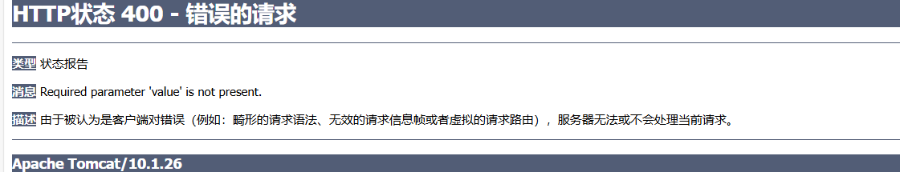

# @RequestParam和@RequestBody

## form-data和x-www-form-urlencoded

### form-data

- `form-data`通常用于发送文件或包含**二进制数据**的表单。
- 使用`form-data`时，表单的每个部分都由一个`Content-Disposition`头部和一个`Content-Type`头部描述，然后是数据本身。
- 在APIPost中，当你选择`form-data`时，**你可以上传文件**，并且可以设置每个表单字段的类型（如文本、文件等）。
- 举例来说，在发送带有文件的表单时，会使用`multipart/form-data`作为`Content-Type`。

### x-www-form-urlencoded

- `x-www-form-urlencoded`是标准的编码格式，用于提交简单的键值对数据，**不包含文件**。
- 在使用这种编码方式时，表单数据会被编码成URL编码格式（key=value&key2=value2），并且发送的数据是纯文本形式。
- **这种方式适用于大多数表单提交，尤其是当没有文件上传需求时。**
- `Content-Type`设置为`application/x-www-form-urlencoded`。

## @RequestBody

- 注意这个RequestBody是只接收原生(raw)的json(就是你用apipost那里body里选择raw就是了)

- 然后这个RequestBody是接收不了表单类型的,就比如常用的application/x-www-form-urlencoded

  

  ```xml
  如果要用(@RequestBody接收前端传来的请求体里的json数据,需要引入下面依赖
  <dependency>
      <groupId>com.fasterxml.jackson.core</groupId>
      <artifactId>jackson-databind</artifactId>
      <version>2.9.9</version>
  </dependency>
  <dependency>
      <groupId>com.fasterxml.jackson.core</groupId>
      <artifactId>jackson-core</artifactId>
      <version>2.9.9</version>
  </dependency>
  <dependency>
      <groupId>com.fasterxml.jackson.core</groupId>
      <artifactId>jackson-annotations</artifactId>
      <version>2.9.9</version>
  </dependency>
  ```

  

- ```java
  
  
  @PostMapping("/register")
  //默认是必须传,不然报错400
  //也可以设置required属性
  public RestBean<Void> register(@RequestBody @Valid EmailRegisterVO vo) {
      return this.messageHandle(() -> accountService.registerEmailAccount(vo));
  }
  
  @PostMapping("/register")
  //假设Student类内是有id,name,age属性的
  //这时候前端传来的属性只有name也可以
  //那么就其他属性是null
  //甚至可以传个空的json{}也不所谓,那么所有字段都是null
  //但是不可以没有请求体,那么就报错
  public RestBean<Void> test(@RequestBody Student stud) {
      return null;
  }
  
  
  //这里不用@RequestBody的话挺有意思的
  //如果MyUser里的属性是username,password,id的话
  //你可以用路径参数?username=1&password=2
  //可以不写全，也可以不写，不是强制的
  //而我如果数据放请求体里,反而接收不到
  @ResponseBody
  @RequestMapping("/c")
  public String c(MyUser value){
      System.out.println(value);
      return "a!";
  }
  ```


## @RequestParam的一些注意点

```java

//拿到查询参数?value,没有也不会报错
@RequestMapping("/a")
public String addString(String value){
    return value;
}

//拿到查询参数?value
//但是如果没有则报错,如果需要的是基本数据类型(int,char那些)则报错,这个跟@RequestParam的处理有关
//其实我们什么都不写,也是用@RequestParam处理,具体这个看下springmvc
@RequestMapping("/a")
public String addString(int value){
    return value;
}


//拿到查询参数?value,一定要有
//没有页面报错400如下图
@RequestMapping("/a")
public String addString(@RequestParam String value){
    return value;
}

//拿到查询参数?name,一定要有
//没有页面报错400如下图
@RequestMapping("/a")
public String addString(@RequestParam("name") String value){
    return value;
}

//页面访问/a?name=aa&b=111
//没事
//这也就是说,只要没@RequestParam这些注解,你给不给我都无所谓,同样我接不接收也无所谓
@RequestMapping("/a")
public String addString(){
    return value;
}
//拿到查询参数?value,没有也行
//设置required可以没有也行,但是我感觉还不如直接不写这个注解
@RequestMapping("/a")
public String addString(@RequestParam(required = false) String value){
    return value;
}
```




```java
@ResponseBody
//@RequestMapping("/a")
@GetMapping("/a")
//还有这种可以如果MyUser有username,password,id的话
//可以用请求参数,?username=1这样传参
//而且不强制要传
//而放在请求体里接收不到
public String a(MyUser value){
    System.out.println(value);
    return "a!";
}
```

# 设置CORS

**全称是"跨域资源共享"（Cross-origin resource sharing)**

## 什么是同源

简单来说同源即三个相同：

- 协议相同

- 域名相同

- 端口相同

  如下图所示


## CORS错误

现在假设从源 https://localhost:3000 请求 https://exampleapi.com/ 的服务器上的资源，此时将收到 CORS 错误，因为浏览器具有同源策略，不能从不同来源的服务器请求（数据、图像等）。


## 解决方法

### 使用SpringSecurity配置

```java
  	@Bean
    public SecurityFilterChain filterChain(HttpSecurity http,PersistentTokenRepository tokenRepository) throws Exception {
        return http.
					//省略其他内容
                    .cors(cors -> cors.configurationSource(corsConfigurationSource()))
            	    .build()
    }
    @Bean
    public CorsConfigurationSource corsConfigurationSource() {
        CorsConfiguration corsConfig = new CorsConfiguration();
        corsConfig.addAllowedOriginPattern("*"); // 允许任何源,可以配置自己的前端服务器源
        corsConfig.addAllowedMethod("*"); // 允许任何HTTP方法
        corsConfig.addAllowedHeader("*"); // 允许任何HTTP头
        corsConfig.setAllowCredentials(true); // 允许证书（cookies）

        UrlBasedCorsConfigurationSource source = new UrlBasedCorsConfigurationSource();
        source.registerCorsConfiguration("/**", corsConfig); // 对所有路径应用这个配置
        return source;
    }
```


### 自己配置filter处理

因为 你可能会写其他用于限流的filter,而cors的处理应该放在前面更前面（因为你想想如果不是,一些请求本来就是应该被提前cors掉的,现在先走了限流的filter,再走cors的filter,就白白损失了性能）

```JAVA
//注意不再是security的虚拟filter
@Component
//需要放在security前
//security的filter默认是-100
//我这个项目写了个用于限流的filter为-101,所以cors写成了-102
//数字越小,filter越前
@Order(-102)
//注意不能命名成CorsFilter
public class AjaxCorsFilter extends HttpFilter {
    @Override
    protected void doFilter(HttpServletRequest request, HttpServletResponse response, FilterChain chain) throws IOException, ServletException {
        this.addCorsHeader(request, response);
        chain.doFilter(request, response);
    }
    private void addCorsHeader(HttpServletRequest request, HttpServletResponse response) {
        //request.getHeader("Origin")是获得发请求的原始站点
        //这一步操作就是让所有地方的请求都可以通过
        response.addHeader("Access-Control-Allow-Origin", request.getHeader("Origin"));
        //可以自己限制源
//        response.addHeader("Access-Control-Allow-Origin", "http://localhost:5173");
        //运行跨域的方法
        response.addHeader("Access-Control-Allow-Methods","GET, POST, PUT, DELETE");
        response.addHeader("Access-Control-Allow-Headers", "Authorization, Content-Type");
    }
}
```


# 使用Filter进行简单的限流

```java
public class Const {
    //限流filter
    public static final int ORDER_LIMIT = -101;
    //短时间内请求的次数，用于限流
    public static final String FLOW_LIMIT_COUNTER = "flow:counter";
    //短时间请求过多,限流的标志
    public static final String FLOW_LIMIT_BLOCK = "flow:block";
}
```

```java
//用于限流用户的恶意压测等操作
//用redis保存用户3s内请求的次数,保存到Const.FLOW_LIMIT_COUNTER + ip里
//若次数超过10次,用redis存放限流的黑名单(Const.FLOW_LIMIT_BLOCK + ip)30s
//在黑名单里的ip直接返回数据
@Component
@Order(Const.ORDER_LIMIT)
public class FlowLimitFilter extends HttpFilter {
    @Resource
    StringRedisTemplate stringRedisTemplate;
    @Override
    protected void doFilter(HttpServletRequest request, HttpServletResponse response, FilterChain chain) throws IOException, ServletException {
        String ip = request.getRemoteAddr();
        if(this.tryCount(ip)){
            chain.doFilter(request,response);
        } else {
            this.writeBlockMessage(response);
        }
    }
    //尝试计算ip请求的次数
    private boolean tryCount(String ip) {
        //依旧是要加把锁,因为如果不加锁,用户1s内请求1000次
        //而这1000次又都同时操作的话。
        //你想想就知道,这1000次肯定都通过了,而我们的目的是只能最多3s内访问10次,就没了呗
        synchronized (ip.intern()){
            //在黑名单里直接返回false
            if(Boolean.TRUE.equals(stringRedisTemplate.hasKey(Const.FLOW_LIMIT_BLOCK + ip))){
                return false;
            }
            return this.limitPeriodCheck(ip);
        }
    }
    private boolean limitPeriodCheck(String ip){
        String key = Const.FLOW_LIMIT_COUNTER + ip;
        //判断是否已经在redis里计数了
        if (Boolean.TRUE.equals(stringRedisTemplate.hasKey(key))) {
            //增加计数
            //有可能redis里刚好到期返回null,就用Optional包裹就行了,orElse就是如果是空就返回0,不是就原样返回
            Long increment = Optional.ofNullable(stringRedisTemplate.opsForValue().increment(key)).orElse(0L);
            if(increment > 10){
                //计数大于10,放到黑名单里
                stringRedisTemplate.opsForValue().set(Const.FLOW_LIMIT_BLOCK + ip, "",30,TimeUnit.SECONDS);
                return false;
            }
        } else {
            stringRedisTemplate.opsForValue().set(key, "1",3, TimeUnit.SECONDS);
        }
        return true;
    }
    private void writeBlockMessage(HttpServletResponse response) throws IOException {
        response.setStatus(HttpServletResponse.SC_FORBIDDEN);
        response.setContentType("application/json;charset=utf-8");
        //直接返回数据即可,这个RestBean是这个项目自己写的返回类型
        response.getWriter().write(RestBean.forbidden("操作频繁").asJsonString());
    }
}


```

# validation

SpringBoot常用的用来检验的依赖

```xml
<dependency>
    <groupId>org.springframework.boot</groupId>
    <artifactId>spring-boot-starter-validation</artifactId>
</dependency>
```

## 在参数上校验

```java
//开启校验
@Validated
@RestController
@RequestMapping("/api/auth")
public class AuthorizeController {

    @Resource
    AccountService accountService;

    @GetMapping("/ask-code")
    //@Email代表,要求email参数是电子邮件格式
    //@Pattern(regexp = 正则表达式)要求参数满足正则表达式
    public RestBean<Void> askVerifyCode(@RequestParam @Email String email,
                                        @RequestParam @Pattern(regexp = "(register|reset)") String type,
                                        HttpServletRequest request){
        return this.messageHandle(() ->
                accountService.registerEmailVerifyCode(type, email, request.getRemoteAddr()));
    }
}
```

## 在类定义上加校验

```java
@Data
public class EmailRegisterVO {
    @Email
    @Length(min = 4)
    String email;
    @Length(max = 6, min = 6)
    String code;
    @Pattern(regexp = "^[A-Za-z0-9\\u4e00-\\u9fa5]+$")
    @Length(min = 1, max = 10)
    String username;
    @Length(min = 6, max = 20)
    String password;
}
```

```java
@PostMapping("/register")
//在使用的时候加上@Valid即会对参数进行检验
public RestBean<Void> register(@RequestBody @Valid EmailRegisterVO vo) {
    return this.messageHandle(() -> accountService.registerEmailAccount(vo));
}
```