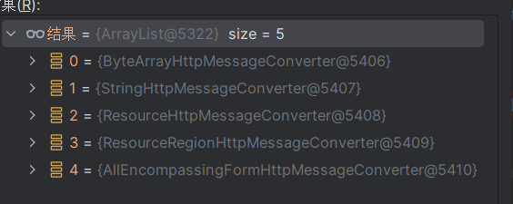

## **IDEA调用栈使用**

先来看个IDEA调试的调用栈，还是特别有用的

这里可以看到我调试到了151行,也就是看到中间黄色的调用栈的第一行是在init方法而且在151行(有时候会发现不在对应行,是因为你没下载源代码,少了注释)。

然后你注意下面还有很多，什么init143,init121啥的

这些就是之前调用过的函数,就有点像栈，这个越底下的就是越早调用的函数

这图我完整解释下

从loadServlet:794开始解释,这一行就是说在StandardWrapper类中的loadServlet方法里,代码行第794行调用了了initServlet方法

接着initServlet:837的意思就是,在StandardWrapper类中的initServlet方法里,代码行第837行调用了HttpServlet类的init方法

再接着init :121就是说在HttpServlet的init方法里,代码行第121行调用了GenericServlet类的init方法

再接着就是init:143,就是说在GenericServlet类的init方法里,代码行143行,调用了HttpServletBean的init的方法

最后到第一行,不用我解释了吧，就是运行到了HttpServletBean的init的方法,代码行151。

接着可以看到箭头指向的地方有个像回车一样的符号，点击就是把当前调用栈删了,返回上一个调用栈

比如我点了第一行的回车,就是回到了GenericServlet类的init方法,代码行在143行


来看个更加有用的,我们在调试的时候可以用,但是更重要的是,我们还可以在报错的时候用

这是一个调用栈的报错显示

是不是很熟悉

我解释下这个表示什么,其实就上面的意思

发生了空指针异常,具体在在ZipHelper类的prepareToCheckHeader方法的223行发生的

然后之后就是跟以前一样的意思了第二行: prepareToCheckHeader方法具体是在ZipHelper类的openZipStream方法中调用的,在代码行240行

而唯一可能不知道的就是这个~[poi-ooxml-3.16.jar:3.16]是啥意思,感觉不是很重要

我问了chatgpt就是指

**`poi-ooxml-3.16.jar`**：表示发生异常的类来自`poi-ooxml`库的`3.16`版本。Apache POI（POI是"Poor Obfuscation Implementation"的缩写）是一个处理Microsoft Office格式文件的Java库。在这里，`poi-ooxml`特指处理Office Open XML格式（如`.xlsx`文件）的部分。

**`:3.16`**：这个部分表示库的版本号为`3.16`。在某些情况下，版本号用于标识使用的特定版本的库，便于开发人员识别可能的错误源，特别是当错误可能与特定版本相关时。

我们自己写的类就是显示~[classes/:na]：

**`classes/`**：表示类文件所在的目录。在许多Java项目中（特别是使用Maven或Gradle等构建工具时），编译后的字节码文件通常会放在 `target/classes` 或 `build/classes` 目录下。因此，`classes/` 表示的是一个默认的输出目录。

**`:na`**：`na` 代表 “not available”，意思是没有可用的版本信息。对于你自己写的类，因为这些类并没有像外部依赖库那样附带明确的版本信息，所以这里显示为`na`。


## 大概的一个架子


tomcat的web.xml配置文件

```xml
<?xml version="1.0" encoding="UTF-8"?>
<web-app xmlns="https://jakarta.ee/xml/ns/jakartaee"
         xmlns:xsi="http://www.w3.org/2001/XMLSchema-instance"
         xsi:schemaLocation="https://jakarta.ee/xml/ns/jakartaee https://jakarta.ee/xml/ns/jakartaee/web-app_5_0.xsd"
         version="5.0">
    <servlet>
        <servlet-name>mvc</servlet-name>
        <servlet-class>org.springframework.web.servlet.DispatcherServlet</servlet-class>
        <init-param>
            <!--     指定我们刚刚创建在类路径下的XML配置文件       -->
            <param-name>contextConfigLocation</param-name>
            <param-value>classpath:application.xml</param-value>
        </init-param>
<!--        1表示Tomcat启动的时候就生成DispatcherServlet-->
<!--        0表示Tomcat接收到请求才生成DispatcherServlet-->
<!--        0的话也就说如果第一个请求来了会等一些时间去生成DispatcherServlet-->
<!--        也可以自己去DispatcherServlet的init上打个断点,如果是0发现只有请求来了才会走断点-->
        <load-on-startup>1</load-on-startup>
    </servlet>
    <servlet-mapping>
        <servlet-name>mvc</servlet-name>
        <url-pattern>/app/* </url-pattern>
    </servlet-mapping>
</web-app>
```

application.xml

```xml
<?xml version="1.0" encoding="UTF-8"?>
<beans xmlns="http://www.springframework.org/schema/beans"
       xmlns:xsi="http://www.w3.org/2001/XMLSchema-instance"
       xmlns:context="http://www.springframework.org/schema/context"
       xsi:schemaLocation="http://www.springframework.org/schema/beans
        https://www.springframework.org/schema/beans/spring-beans.xsd http://www.springframework.org/schema/context https://www.springframework.org/schema/context/spring-context.xsd">

    <context:component-scan base-package="com.example"/>
</beans>
```

```java
@Controller
public class HelloController {
    @ResponseBody
    @RequestMapping("/a")
    public String hello(){
        return "HelloWorld!";
    }
}
```

以上面两个配置可以画出大概的一个架子图


## DispatcherServlet

### 创建Spring容器

如果web.xml设置的是 <load-on-startup>1</load-on-startup>

那么启动Tomcat服务器就会创建DispatcherServlet,会执行其init方法

```java
//暂时不用看
public final void init() throws ServletException {

    // Set bean properties from init parameters.
    PropertyValues pvs = new ServletConfigPropertyValues(getServletConfig(), this.requiredProperties);
    if (!pvs.isEmpty()) {
       try {
          BeanWrapper bw = PropertyAccessorFactory.forBeanPropertyAccess(this);
          ResourceLoader resourceLoader = new ServletContextResourceLoader(getServletContext());
          bw.registerCustomEditor(Resource.class, new ResourceEditor(resourceLoader, getEnvironment()));
          initBeanWrapper(bw);
          bw.setPropertyValues(pvs, true);
       }
       catch (BeansException ex) {
          if (logger.isErrorEnabled()) {
             logger.error("Failed to set bean properties on servlet '" + getServletName() + "'", ex);
          }
          throw ex;
       }
    }
	//直接看这个
    // Let subclasses do whatever initialization they like.
    initServletBean();
}
```

```java
protected final void initServletBean() throws ServletException {
    getServletContext().log("Initializing Spring " + getClass().getSimpleName() + " '" + getServletName() + "'");
    if (logger.isInfoEnabled()) {
       logger.info("Initializing Servlet '" + getServletName() + "'");
    }
    long startTime = System.currentTimeMillis();

    try {
        //这里就会初始化我们DispatcherServlet内部的spring容器
       this.webApplicationContext = initWebApplicationContext();
        //空的
       initFrameworkServlet();
    }
    catch (ServletException | RuntimeException ex) {
       logger.error("Context initialization failed", ex);
       throw ex;
    }

    if (logger.isDebugEnabled()) {
       String value = this.enableLoggingRequestDetails ?
             "shown which may lead to unsafe logging of potentially sensitive data" :
             "masked to prevent unsafe logging of potentially sensitive data";
       logger.debug("enableLoggingRequestDetails='" + this.enableLoggingRequestDetails +
             "': request parameters and headers will be " + value);
    }

    if (logger.isInfoEnabled()) {
       logger.info("Completed initialization in " + (System.currentTimeMillis() - startTime) + " ms");
    }
}
```

```java
//如果安装上面的配置,会发现都是空的
protected WebApplicationContext initWebApplicationContext() {
 	//获得父容器,可以设置DispatcherServlet容器的父容器,以后说 
    WebApplicationContext rootContext =
          WebApplicationContextUtils.getWebApplicationContext(getServletContext());
    WebApplicationContext wac = null;
    if (this.webApplicationContext != null) {
       // A context instance was injected at construction time -> use it
       wac = this.webApplicationContext;
       if (wac instanceof ConfigurableWebApplicationContext cwac && !cwac.isActive()) {
          // The context has not yet been refreshed -> provide services such as
          // setting the parent context, setting the application context id, etc
          if (cwac.getParent() == null) {
             // The context instance was injected without an explicit parent -> set
             // the root application context (if any; may be null) as the parent
             cwac.setParent(rootContext);
          }
          configureAndRefreshWebApplicationContext(cwac);
       }
    }
    if (wac == null) {
       // No context instance was injected at construction time -> see if one
       // has been registered in the servlet context. If one exists, it is assumed
       // that the parent context (if any) has already been set and that the
       // user has performed any initialization such as setting the context id
       wac = findWebApplicationContext();
    }
    if (wac == null) {
       // No context instance is defined for this servlet -> create a local one
       wac = createWebApplicationContext(rootContext);
    }

    if (!this.refreshEventReceived) {
       // Either the context is not a ConfigurableApplicationContext with refresh
       // support or the context injected at construction time had already been
       // refreshed -> trigger initial onRefresh manually here.
       synchronized (this.onRefreshMonitor) {
          onRefresh(wac);
       }
    }

    if (this.publishContext) {
       // Publish the context as a servlet context attribute.
       String attrName = getServletContextAttributeName();
       getServletContext().setAttribute(attrName, wac);
    }

    return wac;
}
```

看下默认创建的spring容器

```java
protected WebApplicationContext createWebApplicationContext(@Nullable ApplicationContext parent) {
    //点进去看会发现默认创建的容器是XmlWebApplicationContext
    Class<?> contextClass = getContextClass();
    if (!ConfigurableWebApplicationContext.class.isAssignableFrom(contextClass)) {
       throw new ApplicationContextException(
             "Fatal initialization error in servlet with name '" + getServletName() +
             "': custom WebApplicationContext class [" + contextClass.getName() +
             "] is not of type ConfigurableWebApplicationContext");
    }
    //创建XmlWebApplicationContext并且添加到bean
    ConfigurableWebApplicationContext wac =
          (ConfigurableWebApplicationContext) BeanUtils.instantiateClass(contextClass);

    wac.setEnvironment(getEnvironment());
    wac.setParent(parent);
    //单纯创建容器肯定没用,你的bean定义哪些呢,所以肯定要配置
    //这个configLocation就是前面web.xml配置的            
    //<param-name>contextConfigLocation</param-name>
    //<param-value>classpath:application.xml</param-value>
    String configLocation = getContextConfigLocation();
    if (configLocation != null) {
       wac.setConfigLocation(configLocation);
    }
    //refresh spring容器,并且添加了一个listener,下面来看看
    configureAndRefreshWebApplicationContext(wac);

    return wac;
}
```

```java
protected void configureAndRefreshWebApplicationContext(ConfigurableWebApplicationContext wac) {
	...
    //添加了ContextRefreshListener到spring容器里
    wac.addApplicationListener(new SourceFilteringListener(wac, new ContextRefreshListener()));

    ConfigurableEnvironment env = wac.getEnvironment();
    if (env instanceof ConfigurableWebEnvironment cwe) {
       cwe.initPropertySources(getServletContext(), getServletConfig());
    }

    postProcessWebApplicationContext(wac);
    applyInitializers(wac);
    //refresh spring容器
    wac.refresh();
}
```

看下这个监听器,这个监听器也就是添加了一个会在spring容器创建刷新完成了执行的事件

```java
private class ContextRefreshListener implements ApplicationListener<ContextRefreshedEvent> {

    @Override
    public void onApplicationEvent(ContextRefreshedEvent event) {
        //点进去看你会发现就是会执行DispatcherServlet的onRefresh方法(DispatcherServlet的spring容器作为参数，虽然看上去就是说spring容器是DispatcherServlet,其实是DispatcherServlet的父类的私有属性,DispatcherServlet访问不了,得传参)
       FrameworkServlet.this.onApplicationEvent(event);
    }
}
```

### OnRefresh

点进去看会发现是

```java
protected void initStrategies(ApplicationContext context) {
    //这个初始化基本都一个套路,问你有没有自己的,没就用默认的
    //初始化解析器
    initMultipartResolver(context);
    initLocaleResolver(context);
    initThemeResolver(context);
    //这些下面说
    initHandlerMappings(context);
    initHandlerAdapters(context);
    initHandlerExceptionResolvers(context);
    initRequestToViewNameTranslator(context);
    initViewResolvers(context);
    initFlashMapManager(context);
}
```

#### initHandlerMappings

#### 拿initHandlerMappings举例子

```java
private void initHandlerMappings(ApplicationContext context) {
    this.handlerMappings = null;
	//看看你自己有没有HandlerMapping
    //HandlerMapping就一个接口,其实就是找它的实现类，然后注册成bean
    //分两种情况,一个是用类型找(多个),一个是用bean名字找(单个)
    //默认是true,也就是用类型找
    if (this.detectAllHandlerMappings) {
       //从spring容器里找是否有HandlerMapping.class类型的bean,包括父容器
       Map<String, HandlerMapping> matchingBeans =
             BeanFactoryUtils.beansOfTypeIncludingAncestors(context, HandlerMapping.class, true, false);
        //不是空，顺便排个序
       if (!matchingBeans.isEmpty()) {
          this.handlerMappings = new ArrayList<>(matchingBeans.values());
          // We keep HandlerMappings in sorted order.
          AnnotationAwareOrderComparator.sort(this.handlerMappings);
       }
    }
    else {
       try {
           //只从当前DisPatcherServlet的容器里找
           //单个用bean名字找有没有叫handlerMapping的bean,HANDLER_MAPPING_BEAN_NAME值为"handlerMapping"
          HandlerMapping hm =· context.getBean(HANDLER_MAPPING_BEAN_NAME, HandlerMapping.class);
          this.handlerMappings = Collections.singletonList(hm);
       }
       catch (NoSuchBeanDefinitionException ex) {
          // Ignore, we'll add a default HandlerMapping later.
       }
    }

    //一般都是没的,用默认的
    if (this.handlerMappings == null) {
        //看看默认咋搞的
       this.handlerMappings = getDefaultStrategies(context, HandlerMapping.class);
       if (logger.isTraceEnabled()) {
          logger.trace("No HandlerMappings declared for servlet '" + getServletName() +
                "': using default strategies from DispatcherServlet.properties");
       }
    }

    for (HandlerMapping mapping : this.handlerMappings) {
       if (mapping.usesPathPatterns()) {
          this.parseRequestPath = true;
          break;
       }
    }
}
```

```java
//这个方法你看到很后面的时候,你他妈会发现,这玩意大家都是公用的,你想要默认的啥,你就第二个参数不一样就是了
protected <T> List<T> getDefaultStrategies(ApplicationContext context, Class<T> strategyInterface) {
    if (defaultStrategies == null) {
       try {
		//一般都会进来
       	//从配置文件里,感觉有点像springboot的那个
        //DEFAULT_STRATEGIES_PATH的值是"DispatcherServlet.properties"
        //下面有发可以看看DispatcherServlet.properties是啥文件
        //其实就是告诉你啥啥接口有啥啥默认的实现类
          ClassPathResource resource = new ClassPathResource(DEFAULT_STRATEGIES_PATH, DispatcherServlet.class);
          defaultStrategies = PropertiesLoaderUtils.loadProperties(resource);
       }
       catch (IOException ex) {
          throw new IllegalStateException("Could not load '" + DEFAULT_STRATEGIES_PATH + "': " + ex.getMessage());
       }
    }
	//下面操作其实就是
    //你都知道实现类是啥了,就是创建他们,然后返回
    String key = strategyInterface.getName();
    //拿到DispatcherServlet.properties里的东西,比如这里HandlerMapping不就有3个默认的吗
    //这里的话每个类名是用,分隔的
    String value = defaultStrategies.getProperty(key);
    if (value != null) {
        //把value（,分隔）中的东西解析成String[]，comma的意思就是逗号
       String[] classNames = StringUtils.commaDelimitedListToStringArray(value);
       List<T> strategies = new ArrayList<>(classNames.length);
       for (String className : classNames) {
          try {
              //加载类对象
             Class<?> clazz = ClassUtils.forName(className, DispatcherServlet.class.getClassLoader());
              //就是创建对象
             Object strategy = createDefaultStrategy(context, clazz);
             strategies.add((T) strategy);
          }
          catch (ClassNotFoundException ex) {
             throw new BeanInitializationException(
                   "Could not find DispatcherServlet's default strategy class [" + className +
                   "] for interface [" + key + "]", ex);
          }
          catch (LinkageError err) {
             throw new BeanInitializationException(
                   "Unresolvable class definition for DispatcherServlet's default strategy class [" +
                   className + "] for interface [" + key + "]", err);
          }
       }
       return strategies;
    }
    else {
       return Collections.emptyList();
    }
}
```

```properties
# Default implementation classes for DispatcherServlet's strategy interfaces.
# Used as fallback when no matching beans are found in the DispatcherServlet context.
# Not meant to be customized by application developers.

org.springframework.web.servlet.LocaleResolver=org.springframework.web.servlet.i18n.AcceptHeaderLocaleResolver

org.springframework.web.servlet.ThemeResolver=org.springframework.web.servlet.theme.FixedThemeResolver

org.springframework.web.servlet.HandlerMapping=org.springframework.web.servlet.handler.BeanNameUrlHandlerMapping,\
    org.springframework.web.servlet.mvc.method.annotation.RequestMappingHandlerMapping,\
    org.springframework.web.servlet.function.support.RouterFunctionMapping

org.springframework.web.servlet.HandlerAdapter=org.springframework.web.servlet.mvc.HttpRequestHandlerAdapter,\
    org.springframework.web.servlet.mvc.SimpleControllerHandlerAdapter,\
    org.springframework.web.servlet.mvc.method.annotation.RequestMappingHandlerAdapter,\
    org.springframework.web.servlet.function.support.HandlerFunctionAdapter


org.springframework.web.servlet.HandlerExceptionResolver=org.springframework.web.servlet.mvc.method.annotation.ExceptionHandlerExceptionResolver,\
    org.springframework.web.servlet.mvc.annotation.ResponseStatusExceptionResolver,\
    org.springframework.web.servlet.mvc.support.DefaultHandlerExceptionResolver

org.springframework.web.servlet.RequestToViewNameTranslator=org.springframework.web.servlet.view.DefaultRequestToViewNameTranslator

org.springframework.web.servlet.ViewResolver=org.springframework.web.servlet.view.InternalResourceViewResolver

org.springframework.web.servlet.FlashMapManager=org.springframework.web.servlet.support.SessionFlashMapManager
```

## HandlerMapping

我们从上面的配置文件可以知道HandlerMapping有3个默认实现类,来看看

### RequestMappingHandlerMapping

这个类实现了InitializingBean接口，bean属性初始化后会执行

以前也没学过,具体可以看看[Spring中的InitializingBean的使用详解-CSDN博客](https://blog.csdn.net/TreeShu321/article/details/108180366)

我们靠DispatcherServlet创建了3个HandlerMapping实现类，并且注册成了bean

现在先说下handleMapping就是用来根据你的请求 **/路径 找你对应 的处理的一个方法**，就是个差不多个map啊

我这里说的处理的方法不是单纯指java的方法，还有类。

换句话说，之后一直在说的**handle就是用来处理/路径请求的一个java方法或者类**

再换句话来说第一句话，就是handleMapping就是用来根据你的请求 **/路径 找你对应 的处理的一个handle**

而现在我们还没建立这个关系，那么就是用afterPropertiesSet来建立

```java
public interface InitializingBean {

    void afterPropertiesSet() throws Exception;

}
```

点进去看是initHandlerMethods

```java
protected void initHandlerMethods() {
    //获得所有的bean
    for (String beanName : getCandidateBeanNames()) {
       if (!beanName.startsWith(SCOPED_TARGET_NAME_PREFIX)) {
          processCandidateBean(beanName);
       }
    }
    handlerMethodsInitialized(getHandlerMethods());
}
```

```java
    protected void processCandidateBean(String beanName) {
    Class<?> beanType = null;
    try {
        //获得对应的bean类型
       beanType = obtainApplicationContext().getType(beanName);
    }
    catch (Throwable ex) {
       // An unresolvable bean type, probably from a lazy bean - let's ignore it.
       if (logger.isTraceEnabled()) {
          logger.trace("Could not resolve type for bean '" + beanName + "'", ex);
       }
    }
    //isHandle处理判断你这个bean类型是否有@Controller这个注解
    if (beanType != null && isHandler(beanType)) {
        //继续看
       detectHandlerMethods(beanName);
    }
}
```

```java
protected void detectHandlerMethods(Object handler) {
    //拿到对应的类型
    Class<?> handlerType = (handler instanceof String beanName ?
          obtainApplicationContext().getType(beanName) : handler.getClass());

    if (handlerType != null) {
       Class<?> userType = ClassUtils.getUserClass(handlerType);
        //methods就是拿到了方法以及对应@RequestMapping上的信息(/路径啥的属性啊)
   		//也就是<method,@RequestMapping的属性信息>
       Map<Method, T> methods = MethodIntrospector.selectMethods(userType,
             (MethodIntrospector.MetadataLookup<T>) method -> {
                try {
                   return getMappingForMethod(method, userType);
                }
                catch (Throwable ex) {
                   throw new IllegalStateException("Invalid mapping on handler class [" +
                         userType.getName() + "]: " + method, ex);
                }
             });
       if (logger.isTraceEnabled()) {
          logger.trace(formatMappings(userType, methods));
       }
       else if (mappingsLogger.isDebugEnabled()) {
          mappingsLogger.debug(formatMappings(userType, methods));
       }
        //遍历所有@RequestMapping方法,将方法注册到this.mappingRegistry
        //mappingRegistry后面也会用到
       methods.forEach((method, mapping) -> {
          Method invocableMethod = AopUtils.selectInvocableMethod(method, userType);
          registerHandlerMethod(handler, invocableMethod, mapping);
       });
    }
}
```

### BeanNameUrlHandlerMapping

跟RequestMappingHandlerMapping不一样

它实现的是ApplicationContextAware

反正就是会执行setApplicationContext，我心态炸了，白写了没保存

自己网上看吧，我也不想了解了

```java
public interface ApplicationContextAware extends Aware {
    
    void setApplicationContext(ApplicationContext applicationContext) throws BeansException;

}
```

一直点进去看

```java
//AbstractHandlerMapping类内的
@Override
protected void initApplicationContext() throws BeansException {
    extendInterceptors(this.interceptors);
    detectMappedInterceptors(this.adaptedInterceptors);
    initInterceptors();
}
```

```java
protected void detectHandlers() throws BeansException {
    ApplicationContext applicationContext = obtainApplicationContext();
    //获得所有的bean
    String[] beanNames = (this.detectHandlersInAncestorContexts ?
          BeanFactoryUtils.beanNamesForTypeIncludingAncestors(applicationContext, Object.class) :
          applicationContext.getBeanNamesForType(Object.class));

    for (String beanName : beanNames) {
        //判断是否这个bean的名字是否是/开头
        //这个也就是我之前说的了handle除了是有@RequestMapping的方法,也可以是类,平时用的少而已,下面会说
       String[] urls = determineUrlsForHandler(beanName);
       if (!ObjectUtils.isEmpty(urls)) {
          //注册
          //点进去看也就会发现是放到了Map<String, Object> handlerMap里
          //也就是<路径,处理类>
          registerHandler(urls, beanName);
       }
    }

    if (mappingsLogger.isDebugEnabled()) {
       mappingsLogger.debug(formatMappingName() + " " + getHandlerMap());
    }
    else if ((logger.isDebugEnabled() && !getHandlerMap().isEmpty()) || logger.isTraceEnabled()) {
       logger.debug("Detected " + getHandlerMap().size() + " mappings in " + formatMappingName());
    }
}
```

```java
//直接放一起了,刚刚说的handle除了是有@RequestMapping的方法,也可以是类
//这个类需要bean的名字是/开头,也就是跟上面的判断一样了
//然后需要实现Controller接口，注意不是@Controller注解
//或者实现HttpRequestHandler接口,即可


//@Component("/test")
//public class TestController implements Controller {
//    @Override
//    public ModelAndView handleRequest(HttpServletRequest request, HttpServletResponse response) throws Exception {
//        System.out.println("56666");
//        return null;
//    }
//}
@Component("/test")
public class TestController implements HttpRequestHandler {

    @Override
    public void handleRequest(HttpServletRequest request, HttpServletResponse response) throws ServletException, IOException {
        System.out.println("56666");
    }
}
```


## 父子容器

我们改下我们web.xml

改成兄弟容器,我也不知道有没有这种叫法哈

```xml
<?xml version="1.0" encoding="UTF-8"?>
<web-app xmlns="https://jakarta.ee/xml/ns/jakartaee"
         xmlns:xsi="http://www.w3.org/2001/XMLSchema-instance"
         xsi:schemaLocation="https://jakarta.ee/xml/ns/jakartaee https://jakarta.ee/xml/ns/jakartaee/web-app_5_0.xsd"
         version="5.0">
    <!-- 把一开始就一个DispatcherServlet改成两个-->
    <!--而一个DispatcherServlet对应一个spring容器-->
    <!--所以我说是兄弟-->
    <servlet>
        <servlet-name>servlet1</servlet-name>
        <servlet-class>org.springframework.web.servlet.DispatcherServlet</servlet-class>
        <init-param>
            <param-name>contextConfigLocation</param-name>
            <!--你两个DispatcherServlet用一样的配置文件也行的-->
            <!--配置文件不同,bean扫描的路径可以不同,来配置不同的bean,当然也可以一样-->
            <!--相同的bean在不同的spring容器是可以的,不是同一个东西-->
            <param-value>classpath:application1.xml</param-value>
        </init-param>
        <load-on-startup>1</load-on-startup>
    </servlet>
    <servlet-mapping>
        <servlet-name>servlet1</servlet-name>
        <!--分别配置对应的访问路径,访问/app1就是servlet1这个DispatcherServlet处理-->
        <url-pattern>/app1/* </url-pattern>
    </servlet-mapping>

    <servlet>
        <servlet-name>servlet2</servlet-name>
        <servlet-class>org.springframework.web.servlet.DispatcherServlet</servlet-class>
        <init-param>
            <param-name>contextConfigLocation</param-name>
            <param-value>classpath:application2.xml</param-value>
        </init-param>
        <load-on-startup>1</load-on-startup>
    </servlet>
    <servlet-mapping>
        <servlet-name>servlet2</servlet-name>
        <url-pattern>/app2/* </url-pattern>
    </servlet-mapping>
</web-app>
```

差不多是这样

但是我们发现(没给图) 这两个spring配置文件里都配置了一个相同的bean，Student1。

那么可不可以就是有一个spring的父容器去管理相同的呢


```xml
<?xml version="1.0" encoding="UTF-8"?>
<web-app xmlns="https://jakarta.ee/xml/ns/jakartaee"
         xmlns:xsi="http://www.w3.org/2001/XMLSchema-instance"
         xsi:schemaLocation="https://jakarta.ee/xml/ns/jakartaee https://jakarta.ee/xml/ns/jakartaee/web-app_5_0.xsd"
         version="5.0">
<!--    创建父容器 ,这个ContextLoaderListener类不是spring容器,但是创建容器需要-->
    <listener>
        <listener-class>org.springframework.web.context.ContextLoaderListener</listener-class>
    </listener>
<!--    父容器的spring配置文件-->
<!--    可以存放子容器公用的bean-->
    <context-param>
        <param-name>contextConfigLocation</param-name>
        <param-value>classpath:application3.xml</param-value>
    </context-param>

    <servlet>
        <servlet-name>servlet1</servlet-name>
        <servlet-class>org.springframework.web.servlet.DispatcherServlet</servlet-class>
        <init-param>
            <param-name>contextConfigLocation</param-name>
            <!--你两个DispatcherServlet用一样的配置文件也行的-->
            <!--配置文件不同,bean扫描的路径可以不同,来配置不同的bean,当然也可以一样-->
            <!--相同的bean在不同的spring容器是可以的,不是同一个东西-->
            <param-value>classpath:application1.xml</param-value>
        </init-param>
        <load-on-startup>1</load-on-startup>
    </servlet>
    <servlet-mapping>
        <servlet-name>servlet1</servlet-name>
        <!--分别配置对应的访问路径,访问/app1就是servlet1这个DispatcherServlet处理-->
        <url-pattern>/app1/* </url-pattern>
    </servlet-mapping>

    <servlet>
        <servlet-name>servlet2</servlet-name>
        <servlet-class>org.springframework.web.servlet.DispatcherServlet</servlet-class>
        <init-param>
            <param-name>contextConfigLocation</param-name>
            <param-value>classpath:application2.xml</param-value>
        </init-param>
        <load-on-startup>1</load-on-startup>
    </servlet>
    <servlet-mapping>
        <servlet-name>servlet2</servlet-name>
        <url-pattern>/app2/* </url-pattern>
    </servlet-mapping>
</web-app>
```

差不多这样,我想用箭头的,没用,画了太乱了,你应该看得懂


## 不用配置文件配置SpringMVC

### WebApplicationInitializer

```java
public interface WebApplicationInitializer {
	//我们不用管
    //反正就是tomcat启动完了会调用这个
    void onStartup(ServletContext servletContext) throws ServletException;
}
```


```java
public class MyWebApplicationInitializer implements WebApplicationInitializer {
	
	@Override
	public void onStartup(ServletContext servletContext) {
		//我们就按配置文件的思路弄
		//我们需要一个DispatcherServlet,DispatcherServlet需要设置spring容器
        //还要设置DispatcherServlet的访问路径
        
        //创建spring容器
		AnnotationConfigWebApplicationContext context = new AnnotationConfigWebApplicationContext();
        //设置spring容器的配置类
        //比如我们在之前的spring的xml配置文件里写过
        //<context:component-scan base-package="com.example"/>
        //那么这个配置类不也可以加个@ComponentScan包扫描
		context.register(AppConfig.class);

		//创建DispatcherServlet,并且把spring容器设置进去
		DispatcherServlet servlet = new DispatcherServlet(context);
        //把DispatcherServlet设置到servletContext里
        //servletContext的意思具体可以看
        //https://blog.csdn.net/qq_21484461/article/details/134193155
        //大概就是Tomcat的每个应用都有一个上下文,比如我们的这个应用就是/mvc
        //然后servletContext里的内容可以被所有的Servlet共享，可以看成全局存储区
		ServletRegistration.Dynamic registration = servletContext.addServlet("app", servlet);
        
        //设置tomcat完成就初始化DispatcherServlet
		registration.setLoadOnStartup(1);
        //添加这个DispatcherServlet的访问路径
		registration.addMapping("/app/*");
	}
}
```

### AbstractAnnotationConfigDispatcherServletInitializer

来看看我们以前学的SSM学的AbstractAnnotationConfigDispatcherServletInitializer就可以理解了

```java
public class MainInitializer extends AbstractAnnotationConfigDispatcherServletInitializer{
    @Override
    protected Class<?>[] getRootConfigClasses() {
        return new Class[]{MainConfiguration.class,SecurityConfiguration.class};
    }
    @Override
    protected Class<?>[] getServletConfigClasses() {
        return new Class[]{WebConfiguration.class};
    }

    @Override
    protected String[] getServletMappings() {
        return new String[]{"/"};
    }
}
```

很容易想到AbstractAnnotationConfigDispatcherServletInitializer是实现了刚刚说的WebApplicationInitializer的onStartup接口

当然了你自己看会发现是个很长的继承链


我就不说具体是啥类了

```java
//AbstractDispatcherServletInitializer类
@Override
public void onStartup(ServletContext servletContext) throws ServletException {
    //先创建根容器
    super.onStartup(servletContext);
    //创建DispatcherServlet,DispatcherServlet里的容器会指定根容器为父容器
    registerDispatcherServlet(servletContext);
}
```

```java
//AbstractContextLoaderInitializer类
@Override
public void onStartup(ServletContext servletContext) throws ServletException {
    registerContextLoaderListener(servletContext);
}
```

```java
protected void registerContextLoaderListener(ServletContext servletContext) {
    //创建根容器,就可以理解成我们说的父容器
    //看看怎么创建的父容器
    WebApplicationContext rootAppContext = createRootApplicationContext();
    if (rootAppContext != null) {
       ContextLoaderListener listener = new ContextLoaderListener(rootAppContext);
       listener.setContextInitializers(getRootApplicationContextInitializers());
       servletContext.addListener(listener);
    }
    else {
       logger.debug("No ContextLoaderListener registered, as " +
             "createRootApplicationContext() did not return an application context");
    }
}
```

看看怎么创建的父容器

```java
protected WebApplicationContext createRootApplicationContext() {
    //getRootConfigClasses就是AbstractAnnotationConfigDispatcherServletInitializer的方法，然后我们实现了它
    Class<?>[] configClasses = getRootConfigClasses();
    //不是空,说明我们实现了getRootConfigClasses,而且传了值,这里传的就是{MainConfiguration.class,SecurityConfiguration.class}
    if (!ObjectUtils.isEmpty(configClasses)) {
       AnnotationConfigWebApplicationContext context = new AnnotationConfigWebApplicationContext();
       context.register(configClasses);
       return context;
    }
    else {
       return null;
    }
}
```

再看看创建DispatcherServlet

```java
protected void registerDispatcherServlet(ServletContext servletContext) {
    //默认servlet默认名字DispatcherServlet
    String servletName = getServletName();
    Assert.state(StringUtils.hasLength(servletName), "getServletName() must not return null or empty");

    //创建DispatcherServlet内的spring容器,下面看看怎么创建的,你应该也猜到了
    WebApplicationContext servletAppContext = createServletApplicationContext();
    Assert.state(servletAppContext != null, "createServletApplicationContext() must not return null");

    //创建DispatcherServlet,并且设置刚刚创建的spring容器
    FrameworkServlet dispatcherServlet = createDispatcherServlet(servletAppContext);
    Assert.state(dispatcherServlet != null, "createDispatcherServlet(WebApplicationContext) must not return null");
    dispatcherServlet.setContextInitializers(getServletApplicationContextInitializers());
	//把DispatcherServlet设置到servletContext里,就跟一开始说的一样了
    ServletRegistration.Dynamic registration = servletContext.addServlet(servletName, dispatcherServlet);
    if (registration == null) {
       throw new IllegalStateException("Failed to register servlet with name '" + servletName + "'. " +
             "Check if there is another servlet registered under the same name.");
    }
	//这个不用我说了把
    registration.setLoadOnStartup(1);
    //设置DispatcherServlet访问路径
    //这个getServletMappings是不是很熟,就是我们实现的getServletMappings啊
    registration.addMapping(getServletMappings());
    registration.setAsyncSupported(isAsyncSupported());

    //这个getServletFilters其实也是在AbstractAnnotationConfigDispatcherServletInitializer里的
    //默认是空,等着我们实现,实现了有就注册
    Filter[] filters = getServletFilters();
    if (!ObjectUtils.isEmpty(filters)) {
       for (Filter filter : filters) {
          registerServletFilter(servletContext, filter);
       }
    }
	//也是空,我们也可以继承实现这个方法
    customizeRegistration(registration);
}
```

```java
//跟刚刚创建根容器基本一样
//只不过那个创建根容器的,没有配置类就不创建spring容器
//而DispatcherServlet的容器,肯定是会创建的啊
@Override
protected WebApplicationContext createServletApplicationContext() {
    AnnotationConfigWebApplicationContext context = new AnnotationConfigWebApplicationContext();
    //这个getServletConfigClasses就是刚刚我们实现的方法,这里返回的就是WebConfiguration.class
    Class<?>[] configClasses = getServletConfigClasses();
    if (!ObjectUtils.isEmpty(configClasses)) {
       context.register(configClasses);
    }
    return context;
}
```


## 以前的SecurityConfiguration配置问题解决

```java
//这里的配置类里都啥都没写,引入了SpringSecurity依赖
//这里会报错,日志里打印No bean named 'springSecurityFilterChain' available
//先说下报错原因,不用理解
//只要有父容器,那么SecurityConfiguration.class一定要配置到父容器里
public class MainInitializer extends AbstractAnnotationConfigDispatcherServletInitializer{
    @Override
    protected Class<?>[] getRootConfigClasses() {
        return new Class[]{MainConfiguration.class};
    }
    @Override
    protected Class<?>[] getServletConfigClasses() {
       return new Class[]{SecurityConfiguration.class};
    }

    @Override
    protected String[] getServletMappings() {
        return new String[]{"/"};
    }
}
```

我们看下SpringSecurity的抽象的初始化器AbstractSecurityWebApplicationInitializer

AbstractSecurityWebApplicationInitializer你点进去看会发现其实也是实现了WebApplicationInitializer接口

也就是说会执行onStartup()，我打过断电试过了，是先执行DispatcherServletInitializer的onStartup，再执行这个

```java
public class SecurityInitializer extends AbstractSecurityWebApplicationInitializer {

}
```

额,其实就是白马的那个，绕回来了

```java
public final void onStartup(ServletContext servletContext) {
    this.beforeSpringSecurityFilterChain(servletContext);
    if (this.configurationClasses != null) {
        AnnotationConfigWebApplicationContext rootAppContext = new AnnotationConfigWebApplicationContext();
        rootAppContext.register(this.configurationClasses);
        servletContext.addListener(new ContextLoaderListener(rootAppContext));
    }

    if (this.enableHttpSessionEventPublisher()) {
        servletContext.addListener("org.springframework.security.web.session.HttpSessionEventPublisher");
    }

    servletContext.setSessionTrackingModes(this.getSessionTrackingModes());
    //注册SpringSecurity的过滤器链
    this.insertSpringSecurityFilterChain(servletContext);
    this.afterSpringSecurityFilterChain(servletContext);
}
```

```java
private void insertSpringSecurityFilterChain(ServletContext servletContext) {
    //这里就看到了就是这个"springSecurityFilterChain" bean没找到
    String filterName = "springSecurityFilterChain";
    //分发的那个过滤器,内部有过滤器链
    //实际我看了,DelegatingFilterProxy会注册成bean,内部的过滤器链好像也会注册成bean
    DelegatingFilterProxy springSecurityFilterChain = new DelegatingFilterProxy(filterName);
    String contextAttribute = this.getWebApplicationContextAttribute();
    if (contextAttribute != null) {
        springSecurityFilterChain.setContextAttribute(contextAttribute);
    }
	//注册
    this.registerFilter(servletContext, true, filterName, springSecurityFilterChain);
}
```

又回到这里新学的了DelegatingFilterProxu实现了InitializingBean，也就是说会执行它的afterPropertiesSet

这里不仔细看了，一直点进去就是

```java
@Override
protected void initFilterBean() throws ServletException {
    synchronized (this.delegateMonitor) {
        //提前说这个就是内部的虚拟过滤器链 也就是报错的springSecurityFilterChain bean
       if (this.delegate == null) {
          if (this.targetBeanName == null) {
             this.targetBeanName = getFilterName();
          }
		//找到spring容器,这里就是重点,到底找的是哪个容器?
          WebApplicationContext wac = findWebApplicationContext();
          if (wac != null) {
             this.delegate = initDelegate(wac);
          }
       }
    }
}
```

```java
protected WebApplicationContext findWebApplicationContext() {
    //暂时没有spring容器,不走
    if (this.webApplicationContext != null) {
       // The user has injected a context at construction time -> use it...
       if (this.webApplicationContext instanceof ConfigurableApplicationContext cac && !cac.isActive()) {
          // The context has not yet been refreshed -> do so before returning it...
          cac.refresh();
       }
       return this.webApplicationContext;
    }
    //这个是你指定的spring容器的名字，没指定不走
    String attrName = getContextAttribute();
    if (attrName != null) {
       return WebApplicationContextUtils.getWebApplicationContext(getServletContext(), attrName);
    }
    else {
        //没指定名字 ，走这个
       return WebApplicationContextUtils.findWebApplicationContext(getServletContext());
    }
}
```

```java
//重点来了
public static WebApplicationContext findWebApplicationContext(ServletContext sc) {
    //这个第一句话就是获得根容器
    //你自己点进去看就知道是从ServletContext获得很熟的属性ROOT_WEB_APPLICATION_CONTEXT_ATTRIBUTE
    WebApplicationContext wac = getWebApplicationContext(sc);
    //有根容器就直接不走了
    //这里也就说明了为什么报错了,如果有根容器,而且你还没指定springsecurity的配置类
    //那么之后你要getBean(springSecurityFilterChain),也就拿不到对应的bean了。
    if (wac == null) {
        //没有根容器,遍历ServletContext,找到其他spring容器
	   //这里有个没搞懂的问题,就是第一次初始化执行到这里的时候是找不到DispatcherServlet内部的那个spring容器的
       //需要发起请求后到doFilter里会再走一次这个方法,这次就可以找到
       Enumeration<String> attrNames = sc.getAttributeNames();
       while (attrNames.hasMoreElements()) {
          String attrName = attrNames.nextElement();
          Object attrValue = sc.getAttribute(attrName);
          if (attrValue instanceof WebApplicationContext currentWac) {
             if (wac != null) {
                throw new IllegalStateException("No unique WebApplicationContext found: more than one " +
                      "DispatcherServlet registered with publishContext=true?");
             }
             wac = currentWac;
          }
       }
    }
    return wac;
}
```

```java
//回到上文,如果有了spring容器,不为空,就走这个
protected Filter initDelegate(WebApplicationContext wac) throws ServletException {
    //targetBeanName就是springSecurityFilterChain
    String targetBeanName = getTargetBeanName();
    Assert.state(targetBeanName != null, "No target bean name set");
    //就是这里报错
    //如果有根容器,而且没指定springSecurity的配置类,则找不到bean报错
    Filter delegate = wac.getBean(targetBeanName, Filter.class);
    if (isTargetFilterLifecycle()) {
       delegate.init(getFilterConfig());
    }
    return delegate;
}
```


## DispatcherServlet处理流程

DispatcherServlet肯定是实现了Servlet的service接口来处理请求的

所以我们可以根据一直往下找到doService

```java
protected void doService(HttpServletRequest request, HttpServletResponse response) throws Exception {
	....

    // 把相关的对象存到http请求里
    //其实你会发现这个很多不是都是DispatcherServlet的onRefresh方法里创建的东西
    request.setAttribute(WEB_APPLICATION_CONTEXT_ATTRIBUTE, getWebApplicationContext());
    request.setAttribute(LOCALE_RESOLVER_ATTRIBUTE, this.localeResolver);
    request.setAttribute(THEME_RESOLVER_ATTRIBUTE, this.themeResolver);
    request.setAttribute(THEME_SOURCE_ATTRIBUTE, getThemeSource());

    //根重定向转发有关,以后说
    if (this.flashMapManager != null) {
       FlashMap inputFlashMap = this.flashMapManager.retrieveAndUpdate(request, response);
       if (inputFlashMap != null) {
          request.setAttribute(INPUT_FLASH_MAP_ATTRIBUTE, Collections.unmodifiableMap(inputFlashMap));
       }
       request.setAttribute(OUTPUT_FLASH_MAP_ATTRIBUTE, new FlashMap());
       request.setAttribute(FLASH_MAP_MANAGER_ATTRIBUTE, this.flashMapManager);
    }

    RequestPath previousRequestPath = null;
    if (this.parseRequestPath) {
       previousRequestPath = (RequestPath) request.getAttribute(ServletRequestPathUtils.PATH_ATTRIBUTE);
       ServletRequestPathUtils.parseAndCache(request);
    }

    try {
        //直接看核心
       doDispatch(request, response);
    }
    finally {
       if (!WebAsyncUtils.getAsyncManager(request).isConcurrentHandlingStarted()) {
          // Restore the original attribute snapshot, in case of an include.
          if (attributesSnapshot != null) {
             restoreAttributesAfterInclude(request, attributesSnapshot);
          }
       }
       if (this.parseRequestPath) {
          ServletRequestPathUtils.setParsedRequestPath(previousRequestPath, request);
       }
    }
}
```

```java
//核心
protected void doDispatch(HttpServletRequest request, HttpServletResponse response) throws Exception {
    HttpServletRequest processedRequest = request;
    HandlerExecutionChain mappedHandler = null;
    boolean multipartRequestParsed = false;

    WebAsyncManager asyncManager = WebAsyncUtils.getAsyncManager(request);

    try {
       ModelAndView mv = null;
       Exception dispatchException = null;

       try {
          processedRequest = checkMultipart(request);
          multipartRequestParsed = (processedRequest != request);

          // 根据请求路径找到我们之前说的handle,就是有@RequestMapping的方法或者是处理类(就是bean名字是/开头,以及实现了HttpRequestHandler或者Controller接口的类)
           //下面说说getHandler
          mappedHandler = getHandler(processedRequest);
          if (mappedHandler == null) {
              //没找到处理请求的handle,报错404
             noHandlerFound(processedRequest, response);
             return;
          }

          // 这个HandlerAdapter之前没说过
          // 其实Adapter翻译过来就是适配的意思
          // 其实你想想 我的handle有很太多种了,我怎么知道怎么去运行handle呢?
          // 这时候就要HandlerAdapter
          // 而HandlerAdapter也是再OnReFresh里就创建好了
          // 根据HandlerMethod找到最匹配的HandlerAdapter
          // 如果是@Controller中的某个方法，那么对应的就是RequestMappingHandlerAdapter
          // 如果是一个HttpRequestHandler对象，那么对应的就是HttpRequestHandlerAdapter
          // 如果是一个接口Controller对象，那么对应的就是SimpleControllerHandlerAdapter
          // 如果是是一个HandlerFunction对象，那么对应的就是HandlerFunctionAdapter,以后说
          // 下面具体说
          HandlerAdapter ha = getHandlerAdapter(mappedHandler.getHandler());

          String method = request.getMethod();
          boolean isGet = HttpMethod.GET.matches(method);
          if (isGet || HttpMethod.HEAD.matches(method)) {
             long lastModified = ha.getLastModified(request, mappedHandler.getHandler());
             if (new ServletWebRequest(request, response).checkNotModified(lastModified) && isGet) {
                return;
             }
          }
		//刚刚说了HandlerExecutionChain是封装了拦截器和handle的类
         //执行拦截器的preHandle,这里就把以前学的知识绕回来了
         //点进去看就知道
         //就是for循环遍历拦截器,执行拦截器的preHandle
         //而且最重要的是如果执行失败,还会执行afterCompletion。当然是倒叙执行afterCompletion
         //很简单的代码,自己去看就完了
          if (!mappedHandler.applyPreHandle(processedRequest, response)) {
             return;
          }

          // 真正执行handle了,而且用HandlerAdapter做适配，其实感觉也有点像代理
          //比如你看如果你的handle是个方法 ，就是那个HandleMethod
          //这个方法返回的是String,而其实你会发现通过HandlerAdapter会对handle的结果进行处理成ModelAndView
          mv = ha.handle(processedRequest, response, mappedHandler.getHandler());

          if (asyncManager.isConcurrentHandlingStarted()) {
             return;
          }
		 //设置默认视图,只是设置名字
          applyDefaultViewName(processedRequest, mv);
          //执行拦截器的后置处理postHandle方法
          mappedHandler.applyPostHandle(processedRequest, response, mv);
       }
       catch (Exception ex) {
          dispatchException = ex;
       }
       catch (Throwable err) {
          // As of 4.3, we're processing Errors thrown from handler methods as well,
          // making them available for @ExceptionHandler methods and other scenarios.
          dispatchException = new ServletException("Handler dispatch failed: " + err, err);
       }
        //先渲染视图,然后这里面还会调用拦截器的afterCompletion,后面再详细看内部
       processDispatchResult(processedRequest, response, mappedHandler, mv, dispatchException);
    }
    catch (Exception ex) {
       triggerAfterCompletion(processedRequest, response, mappedHandler, ex);
    }
    catch (Throwable err) {
       triggerAfterCompletion(processedRequest, response, mappedHandler,
             new ServletException("Handler processing failed: " + err, err));
    }
    finally {
       if (asyncManager.isConcurrentHandlingStarted()) {
          // Instead of postHandle and afterCompletion
          if (mappedHandler != null) {
             mappedHandler.applyAfterConcurrentHandlingStarted(processedRequest, response);
          }
       }
       else {
          // Clean up any resources used by a multipart request.
          if (multipartRequestParsed) {
             cleanupMultipart(processedRequest);
          }
       }
    }
}
```

### getHandler

```java

protected HandlerExecutionChain getHandler(HttpServletRequest request) throws Exception {
    //就是之前说的onRefresh里创建的3个HandleMapping
    if (this.handlerMappings != null) {
        //顺序是BeanNameUrlHandlerMapping>RequestMappingHandlerMapping>RouterFunctionMapping
        //换句话说如果项目里同时有处理/test的方法和类的话,优先执行处理类
       for (HandlerMapping mapping : this.handlerMappings) {
           //根据handleMapping找到handle,这个HandlerExecutionChain是封装了拦截器和handle
           //随便说一下你点进去看,会发现获得handle是用的getHandlerInternal()
           //getHandlerInternal是AbstractHandlerMapping抽象类的方法
           //当然你很容易就能想到AbstractHandlerMapping就是我们创建的3个handleMapping的父类
           //他们3个肯定就各自实现各自的
           //然后说下BeanNameUrlHandlerMapping的getHandlerInternal返回的就是处理类
           //而RequestMappingHandlerMapping返回的是HandlerMethod类
          HandlerExecutionChain handler = mapping.getHandler(request);
          if (handler != null) {
             return handler;
          }
       }
    }
    return null;
}
```

### getHandlerAdapter

```java
protected HandlerAdapter getHandlerAdapter(Object handler) throws ServletException {
    if (this.handlerAdapters != null) {
       for (HandlerAdapter adapter : this.handlerAdapters) {
          //判断当前适配器是否支持这个handle
          if (adapter.supports(handler)) {
             return adapter;
          }
       }
    }
    throw new ServletException("No adapter for handler [" + handler +
          "]: The DispatcherServlet configuration needs to include a HandlerAdapter that supports this handler");
}
```

### 简单的两个类的HandlerAdapter

#### HttpRequestHandlerAdapter

```java
public class HttpRequestHandlerAdapter implements HandlerAdapter {

    //就上面判断这个handle是否是实现了HttpRequestHandler接口的处理类
    @Override
    public boolean supports(Object handler) {
       return (handler instanceof HttpRequestHandler);
    }

    @Override
    @Nullable
    public ModelAndView handle(HttpServletRequest request, HttpServletResponse response, Object handler)
          throws Exception {
		//这个就是待会上面执行的时候就会调用我们重写的handleRequest
       ((HttpRequestHandler) handler).handleRequest(request, response);
       return null;
    }

    //先不看
    @Override
    @SuppressWarnings("deprecation")
    public long getLastModified(HttpServletRequest request, Object handler) {
       if (handler instanceof LastModified lastModified) {
          return lastModified.getLastModified(request);
       }
       return -1L;
    }

}
```

#### SimpleControllerHandlerAdapter

同理

```java
public class SimpleControllerHandlerAdapter implements HandlerAdapter {

    @Override
    public boolean supports(Object handler) {
       return (handler instanceof Controller);
    }

    @Override
    @Nullable
    public ModelAndView handle(HttpServletRequest request, HttpServletResponse response, Object handler)
          throws Exception {

       return ((Controller) handler).handleRequest(request, response);
    }

    @Override
    @SuppressWarnings("deprecation")
    public long getLastModified(HttpServletRequest request, Object handler) {
       if (handler instanceof LastModified lastModified) {
          return lastModified.getLastModified(request);
       }
       return -1L;
    }

}
```


## RequestMappingHandlerAdapter

那么就来说说最难的这个HandlerAdapter,也就是用来处理HandleMethod 的适配器

一直深入处理的handle函数

关键就是handleInternal方法了

```java
protected ModelAndView handleInternal(HttpServletRequest request,
       HttpServletResponse response, HandlerMethod handlerMethod) throws Exception {

    ModelAndView mav;
    //预先对request做一些检查,一般不用,下面简单说说
    checkRequest(request);

   	//session同步锁,同一个session请求做同步处理,默认为false,就是异步
    if (this.synchronizeOnSession) {
       HttpSession session = request.getSession(false);
       if (session != null) {
          Object mutex = WebUtils.getSessionMutex(session);
          synchronized (mutex) {
              //真正处理
             mav = invokeHandlerMethod(request, response, handlerMethod);
          }
       }
       else {
          // 真正处理
          mav = invokeHandlerMethod(request, response, handlerMethod);
       }
    }
    else {
       // 真正处理
       mav = invokeHandlerMethod(request, response, handlerMethod);
    }

    if (!response.containsHeader(HEADER_CACHE_CONTROL)) {
       if (getSessionAttributesHandler(handlerMethod).hasSessionAttributes()) {
          applyCacheSeconds(response, this.cacheSecondsForSessionAttributeHandlers);
       }
       else {
          prepareResponse(response);
       }
    }

    return mav;
}
```

### checkRequest方法和synchronizeOnSession,不是很重要

```java
protected final void checkRequest(HttpServletRequest request) throws ServletException {
    // 可以通过自定义RequestMappingHandlerAdapter这个Bean来设置supportedMethods，默认是null
    // 表示全局限制请求方法，就算Controller层面支持get，但是如果supportedMethods中没有get，也是访问不了的
    String method = request.getMethod();
    if (this.supportedMethods != null && !this.supportedMethods.contains(method)) {
       throw new HttpRequestMethodNotSupportedException(method, this.supportedMethods);
    }

    //也可以通过自定义RequestMappingHandlerAdapter这个Bean来设置requireSession，默认为false
	//表示请求中一定要有session
    if (this.requireSession && request.getSession(false) == null) {
       throw new HttpSessionRequiredException("Pre-existing session required but none found");
    }
}
```

举个例子

```java
//比如这里的配置类创建了自定义的RequestMappingHandlerAdapter,之后DispatcherServlet的OnRefresh就是用我们创建的Adapter了
public class AppConfig {
    @Bean
    public RequestMappingHandlerAdapter requestMappingHandlerAdapter(){
        RequestMappingHandlerAdapter requestMappingHandlerAdapter = new RequestMappingHandlerAdapter();
        //设置HandleMethod只支持Post请求
        //如果此时项目里有处理/test的@RequestMapping注解的方法
        //而你此时用除了Post以外的方法访问/test,就会报405禁止
        requestMappingHandlerAdapter.setSupportedMethods(HttpMethod.POST.name());
        //如果设置了这个,如果此时请求不携带session也一样不行
        //requestMappingHandlerAdapter.setRequireSession(true);
        //设置是否同步处理同一个浏览器的请求
        //requestMappingHandlerAdapter.setSynchronizeOnSession(true);
        return requestMappingHandlerAdapter;
    }
}
```

### Adapter真正处理请求

```java
protected ModelAndView invokeHandlerMethod(HttpServletRequest request,
       HttpServletResponse response, HandlerMethod handlerMethod) throws Exception {
	//封装了下请求和响应
    ServletWebRequest webRequest = new ServletWebRequest(request, response);
    //找出@InitBinder方法(方法还没执行),下面说说
    WebDataBinderFactory binderFactory = getDataBinderFactory(handlerMethod);
    //ModelFactory表示用来创建的Model对象,比如Model中有哪些attribute,都会由ModelFactory来控制
    //解释不清楚,下面会具体说说(Model也就是那种可以存key value的东西)
    //如果你看完了下面的解释
    //这个getModelFactory就是拿到类上@SessionAttributes,以及这个类,全局的@ControllerAdvice类的@ModelAttribute方法中配置的model属性
    ModelFactory modelFactory = getModelFactory(handlerMethod, binderFactory);

    //又封装了一些handlemethod
    ServletInvocableHandlerMethod invocableMethod = createInvocableHandlerMethod(handlerMethod);
    //设置参数解析器,比如处理参数前的@RequestBody,@PathVariable,@RequestParam等等注解
    //比如就是处理@RequestParam的参数解析器RequestParamMethodArgumentResolver
    //这些都是默认的,在RequestMappingHandlerAdapter的afterPropertiesSet方法中会初始化
    //以后说
    if (this.argumentResolvers != null) {
       invocableMethod.setHandlerMethodArgumentResolvers(this.argumentResolvers);
    }
    //设置返回值解析器
    //也是同理,比如你返回值是ModelAndView,也有ModelAndViewMethodReturnValueHandler解析器去处理
    if (this.returnValueHandlers != null) {
       invocableMethod.setHandlerMethodReturnValueHandlers(this.returnValueHandlers);
    }
    //执行方法时,需要利用WebDataBinderFactory进行参数类型转换
    invocableMethod.setDataBinderFactory(binderFactory);
    //就是Spring中的,解析方法参数的名字用的,利用ASM解析
    invocableMethod.setParameterNameDiscoverer(this.parameterNameDiscoverer);

    //每执行一个HandleMethod,都会生成一个mavContainer,每个mavContainer都会对应一个ModelMap
    //里面有model
    //也会有view
    ModelAndViewContainer mavContainer = new ModelAndViewContainer();
    // 把inputFlashMap中的attribute添加到model中
    mavContainer.addAllAttributes(RequestContextUtils.getInputFlashMap(request));
    
    // mavContainer中已经有model对象了，现在进行初始化
    // 比如执行@ModeLAttribute的方法，把attribute添加到model中
    // 比如从session获取某些attribute添加到model中 (@SessionAttributes)
    // 注意:并没有把request parameter、request attribute添加到model中
    modelFactory.initModel(webRequest, mavContainer, invocableMethod);
    mavContainer.setIgnoreDefaultModelOnRedirect(this.ignoreDefaultModelOnRedirect);

    AsyncWebRequest asyncWebRequest = WebAsyncUtils.createAsyncWebRequest(request, response);
    asyncWebRequest.setTimeout(this.asyncRequestTimeout);

    WebAsyncManager asyncManager = WebAsyncUtils.getAsyncManager(request);
    asyncManager.setTaskExecutor(this.taskExecutor);
    asyncManager.setAsyncWebRequest(asyncWebRequest);
    asyncManager.registerCallableInterceptors(this.callableInterceptors);
    asyncManager.registerDeferredResultInterceptors(this.deferredResultInterceptors);

    if (asyncManager.hasConcurrentResult()) {
       Object result = asyncManager.getConcurrentResult();
       mavContainer = (ModelAndViewContainer) asyncManager.getConcurrentResultContext()[0];
       asyncManager.clearConcurrentResult();
       LogFormatUtils.traceDebug(logger, traceOn -> {
          String formatted = LogFormatUtils.formatValue(result, !traceOn);
          return "Resume with async result [" + formatted + "]";
       });
       invocableMethod = invocableMethod.wrapConcurrentResult(result);
    }
	
    //真正执行方法了,下面会说
    //而且会设置mavContainer里的view了
    invocableMethod.invokeAndHandle(webRequest, mavContainer);
    if (asyncManager.isConcurrentHandlingStarted()) {
       return null;
    }
	// 对封装的ModelAndView进行处理，主要是判断当前请求是否进行了重定向，如果进行了重定向.
    // 还会判断是否需要将FLashAttributes封装到新的请求中
    return getModelAndView(mavContainer, modelFactory, webRequest);
}
```

#### @InitBinder

```java
@Controller
public class TestController {
    
    @InitBinder
    public void initBinder(WebDataBinder binder) {
        SimpleDateFormat dateFormat = new SimpleDateFormat("yyyy-MM-dd");
        dateFormat.setLenient(false);
        binder.registerCustomEditor(Date.class, new CustomDateEditor(dateFormat, false));
    }

    //先不说@InitBinder是干什么的
    //如果没有上面的initBinder()
    //当我们请求是/baa?date=2000-11-1时
    //浏览器即报错400，如下图
    //因为springmvc不知道怎么把String(浏览器路径上的东西啊肯定是String)转成Date
    //这时候就要有@InitBinder来处理
    //比如这里需要转成Date,那么springmvc就会找你是否配置了可以转成Date的@InitBinder
    @RequestMapping("/baa")
    @ResponseBody
    public String test(Date date){
        System.out.println(date);
        return "aa";
    }
}
```


```java
//上面配置的 @InitBinder只会在对应配置地方的controller生效
//想要所有Controller都生效的话配置到@ControllerAdvice里即可
@ControllerAdvice
public class GlobalControllerAdvice {
    @InitBinder
    public void initBinder(WebDataBinder binder) {
        SimpleDateFormat dateFormat = new SimpleDateFormat("yyyy-MM-dd");
        dateFormat.setLenient(false);
        binder.registerCustomEditor(Date.class, new CustomDateEditor(dateFormat, false));
    }
}
```

回到一开始的,看看是如何获得那些Binder的

```java
private WebDataBinderFactory getDataBinderFactory(HandlerMethod handlerMethod) throws Exception {
    //找到这个@RequestMapping的handler对应的@Controller类
    Class<?> handlerType = handlerMethod.getBeanType();
    //默认空
    Set<Method> methods = this.initBinderCache.get(handlerType);
    if (methods == null) {
        //找这个类里所有@InitBinder注解的方法
       methods = MethodIntrospector.selectMethods(handlerType, INIT_BINDER_METHODS);
       this.initBinderCache.put(handlerType, methods);
    }
    List<InvocableHandlerMethod> initBinderMethods = new ArrayList<>();
    // 找所有@ControllerAdvice下的@InitBinder方法
    this.initBinderAdviceCache.forEach((controllerAdviceBean, methodSet) -> {
       if (controllerAdviceBean.isApplicableToBeanType(handlerType)) {
          Object bean = controllerAdviceBean.resolveBean();
          for (Method method : methodSet) {
             initBinderMethods.add(createInitBinderMethod(bean, method));
          }
       }
    });
    for (Method method : methods) {
       Object bean = handlerMethod.getBean();
       initBinderMethods.add(createInitBinderMethod(bean, method));
    }
    //封装所有的@InitBinder方法
    return createDataBinderFactory(initBinderMethods);
}
```

#### @SessionAttributes和@ModelAttribute处理Model

```java
@RestController
//SessionAttributes注解的意思就是把session里user属性设置到handle的Model里(这里写的是user)
//我试了下,我发现就是如果你是Model里添加属性,你的session里也会被添加,这两个貌似是互相影响的
//这东西我试了设置到全局的@ControllerAdvice里,没用
@SessionAttributes("user")
public class ModelController {

    @GetMapping("/testSession")
    public String testSession(HttpServletRequest httpServletRequest){
        //测试的用来设置下session
        httpServletRequest.getSession().setAttribute("user","eeeee");
        return null;
    }
	
    @GetMapping("/test")
    public String test(Model model) {
        //即可获得刚刚设置的session属性
        System.out.println(model.getAttribute("user"));
        return null;
    }
}
```

```java
@RestController
public class ModelController {
	//可以写在某个方法上，@ModelAttribute可以定义在一个Controller中
    //当请求这个Controller中的方法时，会先调用@ModelAttribute所修饰的方法，方法返回的值会添加到model中
    //这里key就是user,value就是返回值
    @ModelAttribute("user")
    public String addString(@RequestParam("user") String value){
        return value;
    }
	//请求来了,会先调用addString,把得到的key,value设置到model里
    @GetMapping("/testModelAttribute")
    public String testModelAttribute(Model model){
        return (String) model.getAttribute("user");
    }
}
```

### 最后一层执行方法

```java
public void invokeAndHandle(ServletWebRequest webRequest, ModelAndViewContainer mavContainer,
       Object... providedArgs) throws Exception {

    // 执行方法，并得到方法返回值(这里就是你实现的handleMethod的方法值)，就是我们方法中的返回值，没有额外的处理，所以后面是要处理的
    //但是这个方法中就涉及到参数绑定，比如要判断方法需要哪些参数，分别该传什么值，也是比较复杂的
    //下面说说
    Object returnValue = invokeForRequest(webRequest, mavContainer, providedArgs);
    setResponseStatus(webRequest);

    if (returnValue == null) {
       if (isRequestNotModified(webRequest) || getResponseStatus() != null || mavContainer.isRequestHandled()) {
          disableContentCachingIfNecessary(webRequest);
          mavContainer.setRequestHandled(true);
          return;
       }
    }
    else if (StringUtils.hasText(getResponseStatusReason())) {
       mavContainer.setRequestHandled(true);
       return;
    }

    mavContainer.setRequestHandled(false);
    Assert.state(this.returnValueHandlers != null, "No return value handlers");
    try {
        // 就刚刚说的处理返回值的
        // 如果返回类型的是Map，那就用MapMethodProcessor处理
        // 如果返回类型的是ModelAndView，那就用ModelAndViewMethodReturnValueHandler处理
        // 如果返回类型上有@ResponseBody，那就用RequestResponseBodyMethodProcessor处理，重点
        // 如果返回类型是String，那就用ViewNameMethodReturnValueHandler处理，重点
        // 大概内容就是跟handler找handlerAdapter很像,就是找谁能处理这种类型的返回值
        // 找到了就让它处理,具体怎么处理以后说
       this.returnValueHandlers.handleReturnValue(
             returnValue, getReturnValueType(returnValue), mavContainer, webRequest);
    }
    catch (Exception ex) {
       if (logger.isTraceEnabled()) {
          logger.trace(formatErrorForReturnValue(returnValue), ex);
       }
       throw ex;
    }
}
```

```java
@Nullable
public Object invokeForRequest(NativeWebRequest request, @Nullable ModelAndViewContainer mavContainer,
       Object... providedArgs) throws Exception {
	// 拿到方法的参数
    // 获取参数下面说
    Object[] args = getMethodArgumentValues(request, mavContainer, providedArgs);
    if (logger.isTraceEnabled()) {
       logger.trace("Arguments: " + Arrays.toString(args));
    }
    
    // 最后执行自己写的方法,有参数了,而你也有method了,就直接method.invoke了里面
    return doInvoke(args);
}
```

```java
//看看怎么拿到参数的
protected Object[] getMethodArgumentValues(NativeWebRequest request, @Nullable ModelAndViewContainer mavContainer,
       Object... providedArgs) throws Exception {
	// 获得我们自己写的方法上的参数
    // 这里呢获得了有几个重要,第一个参数的类型,
    // 第二个就是参数的名字,但是注意这个名字还是未修饰的,就是你方法上写的是String a就是a
    // 而比如一些@RequestParam上写的别名,现在还没弄进去,要之后
    MethodParameter[] parameters = getMethodParameters();
    if (ObjectUtils.isEmpty(parameters)) {
       return EMPTY_ARGS;
    }

    Object[] args = new Object[parameters.length];
    for (int i = 0; i < parameters.length; i++) {
       MethodParameter parameter = parameters[i];
       parameter.initParameterNameDiscovery(this.parameterNameDiscoverer);
       args[i] = findProvidedArgument(parameter, providedArgs);
       if (args[i] != null) {
          continue;
       }
        // 看是否有HandlerMethodArgumentResolver能不能解析当前参数
        // 就是解析参数类型，参数名字，参数前的那些@RequestBody那些注解
        // 只要有一个HandlerMethodArgumentResolver能解析，能就用它来解析
        // 就是跟之前讲的handle找handleAdapter一样的套路就不说
       if (!this.resolvers.supportsParameter(parameter)) {
          throw new IllegalStateException(formatArgumentError(parameter, "No suitable resolver"));
       }
       try {
           //解析方法参数
           //从请求里拿到对应的值
           //貌似我看里面这里才是挑选用哪个resolver
          args[i] = this.resolvers.resolveArgument(parameter, mavContainer, request, this.dataBinderFactory);
       }
       catch (Exception ex) {
          // Leave stack trace for later, exception may actually be resolved and handled...
          if (logger.isDebugEnabled()) {
             String exMsg = ex.getMessage();
             if (exMsg != null && !exMsg.contains(parameter.getExecutable().toGenericString())) {
                logger.debug(formatArgumentError(parameter, exMsg));
             }
          }
          throw ex;
       }
    }
    return args;
}
```

## HandlerMethodArgumentResolver

用于处理handle的方法的参数,拿到参数在请求中的值，上面应该也体会到了

一般是用默认的HandlerMethodArgumentResolver

在RequestMappingHandlerAdapter的afterPropertiesSet里初始化

点进去看

```java
@Override
public void afterPropertiesSet() {
    // Do this first, it may add ResponseBody advice beans
    initControllerAdviceCache();
    initMessageConverters();

    //参数解析器
    if (this.argumentResolvers == null) {
       List<HandlerMethodArgumentResolver> resolvers = getDefaultArgumentResolvers();
       this.argumentResolvers = new HandlerMethodArgumentResolverComposite().addResolvers(resolvers);
    }
    //数据绑定解析器
    if (this.initBinderArgumentResolvers == null) {
       List<HandlerMethodArgumentResolver> resolvers = getDefaultInitBinderArgumentResolvers();
       this.initBinderArgumentResolvers = new HandlerMethodArgumentResolverComposite().addResolvers(resolvers);
    }
    //返回值解析器
    if (this.returnValueHandlers == null) {
       List<HandlerMethodReturnValueHandler> handlers = getDefaultReturnValueHandlers();
       this.returnValueHandlers = new HandlerMethodReturnValueHandlerComposite().addHandlers(handlers);
    }
}
```

```java
private List<HandlerMethodArgumentResolver> getDefaultArgumentResolvers() {
    List<HandlerMethodArgumentResolver> resolvers = new ArrayList<>(30);
    
    // 具体怎么看参数用哪个HandlerMethodArgumentResolver,其实你应该也知道了,之前在我们最后执行handle前，需要获得方法参数
    // 而从请求中解析出方法参数的值需要HandlerMethodArgumentResolver
    // 这么多,用啥呢,如果你之前点进去看了,会发现用的就是HandlerMethodArgumentResolver的supportsParameter方法判断是否可以用这个HandlerMethodArgumentResolver来处理这个参数
    // 而supportsParameter内容很简单，你自己看就会明白
    
     // 处理带有@RequestParam注解的参数,注意这个false参数
    resolvers.add(new RequestParamMethodArgumentResolver(getBeanFactory(), false));
    // 处理带有@RequestParam注解,而且参数类型是map的
    resolvers.add(new RequestParamMapMethodArgumentResolver());
    //处理带有@PathVariable注解的参数
    resolvers.add(new PathVariableMethodArgumentResolver());
    //处理带有@PathVariable注解,而且参数类型是map的
    resolvers.add(new PathVariableMapMethodArgumentResolver());
    resolvers.add(new MatrixVariableMethodArgumentResolver());
    resolvers.add(new MatrixVariableMapMethodArgumentResolver());
    resolvers.add(new ServletModelAttributeMethodProcessor(false));
    resolvers.add(new RequestResponseBodyMethodProcessor(getMessageConverters(), this.requestResponseBodyAdvice));
    resolvers.add(new RequestPartMethodArgumentResolver(getMessageConverters(), this.requestResponseBodyAdvice));
    resolvers.add(new RequestHeaderMethodArgumentResolver(getBeanFactory()));
    resolvers.add(new RequestHeaderMapMethodArgumentResolver());
    resolvers.add(new ServletCookieValueMethodArgumentResolver(getBeanFactory()));
    resolvers.add(new ExpressionValueMethodArgumentResolver(getBeanFactory()));
    resolvers.add(new SessionAttributeMethodArgumentResolver());
    resolvers.add(new RequestAttributeMethodArgumentResolver());

    // Type-based argument resolution
    resolvers.add(new ServletRequestMethodArgumentResolver());
    resolvers.add(new ServletResponseMethodArgumentResolver());
    resolvers.add(new HttpEntityMethodProcessor(getMessageConverters(), this.requestResponseBodyAdvice));
    resolvers.add(new RedirectAttributesMethodArgumentResolver());
    resolvers.add(new ModelMethodProcessor());
    resolvers.add(new MapMethodProcessor());
    resolvers.add(new ErrorsMethodArgumentResolver());
    resolvers.add(new SessionStatusMethodArgumentResolver());
    resolvers.add(new UriComponentsBuilderMethodArgumentResolver());
    if (KotlinDetector.isKotlinPresent()) {
       resolvers.add(new ContinuationHandlerMethodArgumentResolver());
    }

    // Custom arguments
    if (getCustomArgumentResolvers() != null) {
       resolvers.addAll(getCustomArgumentResolvers());
    }

    // Catch-all
    resolvers.add(new PrincipalMethodArgumentResolver());
   	//这里会惊奇的会发现又加了一次RequestParamMethodArgumentResolver,而这次的参数是false
    //其实就是赋值里面的一个属性useDefaultResolution
    //而这个RequestParamMethodArgumentResolver也是同样处理什么都不带,但是参数类型是普通类型的解析器
    //在supportsParameter的最后判断,会判断useDefaultResolution的值,如果是true而且参数类型是String,Integer,int那些普通类型的话,也会用这个解析器。
    //当然还有常用的Date,Enum,Number,Class也会走,具体可以看BeanUtils类的isSimpleValueType方法
    //这也就是为什么我们平时写不写@RequestParam的差别不大的原因,因为都是同一个解析器去请求中拿到方法参数的值
    resolvers.add(new RequestParamMethodArgumentResolver(getBeanFactory(), true));
    resolvers.add(new ServletModelAttributeMethodProcessor(true));

    return resolvers;
}
```

### RequestParamMethodArgumentResolver

​	就来先说说,可以处理带有@RequestParam注解的参数,以及什么都不带的普通类型的参数的这个解析器

回到之前的adapter最后执行方法前,会发现HandlerMethodArgumentResolver 拿到参数的值使用的是resolveArgument方法

会发现先执行父类的resolveArgument

```java
//父类AbstractNamedValueMethodArgumentResolver
public final Object resolveArgument(MethodParameter parameter, @Nullable ModelAndViewContainer mavContainer,
                                    NativeWebRequest webRequest, @Nullable WebDataBinderFactory binderFactory) throws Exception {
    
	// 拿到参数的名字比如
    //@ResponseBody
    //@RequestMapping("/")
    //public String hello(String a){
    //     return "HelloWorld!";
    //}
    //getNamedValueInfo这里拿到就是拿到a这个名字
    //而且如果有@RequestParam,还会用@@RequestParam里的名字
    //具体怎么获得的,自己可以看
    NamedValueInfo namedValueInfo = getNamedValueInfo(parameter);
    
    MethodParameter nestedParameter = parameter.nestedIfOptional();

    // 占位符的填充和SpEL表达式解析得到最后要去http里拿属性的名字
    Object resolvedName = resolveEmbeddedValuesAndExpressions(namedValueInfo.name);
    if (resolvedName == null) {
        throw new IllegalArgumentException(
            "Specified name must not resolve to null: [" + namedValueInfo.name + "]");
    }
	//最后去拿属性名字对应的值
    //子类RequestParamMethodArgumentResolver实现,下面说
    Object arg = resolveName(resolvedName.toString(), nestedParameter, webRequest);
    if (arg == null) {
        //等于空,拿默认值
        if (namedValueInfo.defaultValue != null) {
            arg = resolveEmbeddedValuesAndExpressions(namedValueInfo.defaultValue);
        }
        else if (namedValueInfo.required && !nestedParameter.isOptional()) {
            handleMissingValue(namedValueInfo.name, nestedParameter, webRequest);
        }
        //这个可以解决一个之前的问题,你自己点进去看吧,很简单的
        //如果还是空,如果参数类型是Boolean就是false
        //而如果你的参数类型是基本类型就是int,char那些(不是包装类),就抛异常报错
        //其余就是空
        arg = handleNullValue(namedValueInfo.name, arg, nestedParameter.getNestedParameterType());
    }
    else if ("".equals(arg) && namedValueInfo.defaultValue != null) {
        arg = resolveEmbeddedValuesAndExpressions(namedValueInfo.defaultValue);
    }

    if (binderFactory != null) {
        //这个就是之前说的用于binder
        //这里就开始了类型转换了
        //我就口头举例子了
        //加入我们的参数是这样(Date a)
        //我们发起的请求是  省略?a=2004-1-1
        //在binder处理之前,arg就是个普通的字符串"2004-1-1"
        //如果我们配置了String转成Date的binder,这里就会起作用了
        //binder处理之后arg就会变成Date类型的对象了
        
        //获取binder
        WebDataBinder binder = binderFactory.createBinder(webRequest, null, namedValueInfo.name);
        try {
            //进行binder处理
            //把arg转成parameter.getParameterType()类型,也就是你的参数类型
            arg = binder.convertIfNecessary(arg, parameter.getParameterType(), parameter);
        }
        catch (ConversionNotSupportedException ex) {
            throw new MethodArgumentConversionNotSupportedException(arg, ex.getRequiredType(),
                                                                    namedValueInfo.name, parameter, ex.getCause());
        }
        catch (TypeMismatchException ex) {
            throw new MethodArgumentTypeMismatchException(arg, ex.getRequiredType(),
                                                          namedValueInfo.name, parameter, ex.getCause());
        }
        // 还是啥都没,就抛异常
        if (arg == null && namedValueInfo.defaultValue == null &&
            namedValueInfo.required && !nestedParameter.isOptional()) {
            handleMissingValueAfterConversion(namedValueInfo.name, nestedParameter, webRequest);
        }
    }

    handleResolvedValue(arg, namedValueInfo.name, parameter, mavContainer, webRequest);

    return arg;
}
```

```java
protected Object resolveName(String name, MethodParameter parameter, NativeWebRequest request) throws Exception {
    //拿到http请求
    HttpServletRequest servletRequest = request.getNativeRequest(HttpServletRequest.class);

    //判断是不是文件上传的,不管
    if (servletRequest != null) {
       Object mpArg = MultipartResolutionDelegate.resolveMultipartArgument(name, parameter, servletRequest);
       if (mpArg != MultipartResolutionDelegate.UNRESOLVABLE) {
          return mpArg;
       }
    }

    Object arg = null;
    MultipartRequest multipartRequest = request.getNativeRequest(MultipartRequest.class);
    if (multipartRequest != null) {
       List<MultipartFile> files = multipartRequest.getFiles(name);
       if (!files.isEmpty()) {
          arg = (files.size() == 1 ? files.get(0) : files);
       }
    }
    //真正拿到属性值
    if (arg == null) {
        //朴实无华的getParameterValues拿到最后的值
       String[] paramValues = request.getParameterValues(name);
       if (paramValues != null) {
          arg = (paramValues.length == 1 ? paramValues[0] : paramValues);
       }
    }
    return arg;
}
```

### PathVariableMethodArgumentResolver

处理@PathVariable注解的参数的解析器,跟RequestParamMethodArgumentResolver的父类一样都是AbstractNamedValueMethodArgumentResolver

那么就是各自实现的resolveName不一样了

先回忆下@PathVariable,就是拿路径参数

```java
@RequestMapping("/test/{id}")
@ResponseBody
public String b(@PathVariable("id") String id){
    return id;
}
```

```java
//十分的简单
protected Object resolveName(String name, MethodParameter parameter, NativeWebRequest request) throws Exception {
   //先从请求中拿到一个map,这个map就存储了参数,以及对应请求中具体的路径参数值
   //比如上图的,就是id:值
   //而这个map其实是在寻找对应的handler的时候就弄好了
   //因为寻找对应的handle的时候,那么肯定会解析当前的请求的
    Map<String, String> uriTemplateVars = (Map<String, String>) request.getAttribute(
          HandlerMapping.URI_TEMPLATE_VARIABLES_ATTRIBUTE, RequestAttributes.SCOPE_REQUEST);
    //直接拿值
    return (uriTemplateVars != null ? uriTemplateVars.get(name) : null);
}
```

其实也就是差不多的套路了，继续说些其他比较常用的

### 其他常用的解析器

#### RequestHeaderMethodArgumentResolver

就是处理@RequestHeader用的,拿请求头里的数据

```java
protected Object resolveName(String name, MethodParameter parameter, NativeWebRequest request) throws Exception {
	//很好懂吧   
    String[] headerValues = request.getHeaderValues(name);
    if (headerValues != null) {
       return (headerValues.length == 1 ? headerValues[0] : headerValues);
    }
    else {
       return null;
    }
}
```

**SessionAttributeMethodArgumentResolver**

处理@SessionAttribute注解的

就是从session里拿数据

```java
protected Object resolveName(String name, MethodParameter parameter, NativeWebRequest request) {
    //这个 RequestAttributes.SCOPE_SESSION我问了下chatgpt
    //应该就是作用域,就是本次会话,还有SCOPE_REQUEST等等,这个本次请求
    //不太理解有啥用
    return request.getAttribute(name, RequestAttributes.SCOPE_SESSION);
}
```

#### RequestAttributeMethodArgumentResolver

处理@RequestAttribute注解的

就是从请求中拿数据

```java
//都挺直接的
protected Object resolveName(String name, MethodParameter parameter, NativeWebRequest request){
    return request.getAttribute(name, RequestAttributes.SCOPE_REQUEST);
}
```

#### ServletRequestMethodArgumentResolver

这个就是解决以前可能困扰你的问题的了


```java
@ResponseBody
@RequestMapping("/b")
//怎么得到httpServletRequest的??
public String b(HttpServletRequest httpServletRequest){
    httpServletRequest.getSession();
    System.out.println(httpServletRequest);
    return "a!";
}
```

看看他支持的参数类型,你应该就悟了

```java
public boolean supportsParameter(MethodParameter parameter) {
    Class<?> paramType = parameter.getParameterType();
    return (WebRequest.class.isAssignableFrom(paramType) ||
          //这不就是请求
          //别忘了isAssignableFrom的作用,a.isAssignableFrom(b),那么真就是a==b,或者a是b的父类或者父接口
          //那么HttpServletRequest也可以啊
          ServletRequest.class.isAssignableFrom(paramType) ||
          MultipartRequest.class.isAssignableFrom(paramType) ||
          //还有session
          HttpSession.class.isAssignableFrom(paramType) ||
          (pushBuilder != null && pushBuilder.isAssignableFrom(paramType)) ||
          (Principal.class.isAssignableFrom(paramType) && !parameter.hasParameterAnnotations()) ||
          //这两个字节流和字符流就是request里的啊
          InputStream.class.isAssignableFrom(paramType) ||
          Reader.class.isAssignableFrom(paramType) ||
            
          HttpMethod.class == paramType ||
          Locale.class == paramType ||
          TimeZone.class == paramType ||
          ZoneId.class == paramType);
}
```

```java
//就是拿到各种值然后返回
//自己想看自己看去
public Object resolveArgument(MethodParameter parameter, @Nullable ModelAndViewContainer mavContainer,
       NativeWebRequest webRequest, @Nullable WebDataBinderFactory binderFactory) throws Exception {

    Class<?> paramType = parameter.getParameterType();

    // WebRequest / NativeWebRequest / ServletWebRequest
    if (WebRequest.class.isAssignableFrom(paramType)) {
       if (!paramType.isInstance(webRequest)) {
          throw new IllegalStateException(
                "Current request is not of type [" + paramType.getName() + "]: " + webRequest);
       }
       return webRequest;
    }

    // ServletRequest / HttpServletRequest / MultipartRequest / MultipartHttpServletRequest
    if (ServletRequest.class.isAssignableFrom(paramType) || MultipartRequest.class.isAssignableFrom(paramType)) {
       return resolveNativeRequest(webRequest, paramType);
    }

    // HttpServletRequest required for all further argument types
    return resolveArgument(paramType, resolveNativeRequest(webRequest, HttpServletRequest.class));
}
```

#### ServletResponseMethodArgumentResolver

这个不用说了,看看支持的参数类型，你就悟了

```java
@Override
public boolean supportsParameter(MethodParameter parameter) {
    Class<?> paramType = parameter.getParameterType();
    return (ServletResponse.class.isAssignableFrom(paramType) ||
          OutputStream.class.isAssignableFrom(paramType) ||
          Writer.class.isAssignableFrom(paramType));
}
```

#### ModelMethodProcessor

就是拿到Model

```java
@RequestMapping("/testmodel")
@ResponseBody
public String testModel(Model model){
    return (String) model.getAttribute("user");
}
```

```java
//支持的参数类型
public boolean supportsParameter(MethodParameter parameter) {
    return Model.class.isAssignableFrom(parameter.getParameterType());
}
```

```java
public Object resolveArgument(MethodParameter parameter, @Nullable ModelAndViewContainer mavContainer,
       NativeWebRequest webRequest, @Nullable WebDataBinderFactory binderFactory) throws Exception {

    Assert.state(mavContainer != null, "ModelAndViewContainer is required for model exposure");
    //ModelAndViewContainer,这个就是Adapter处理请求的时候创建的,忘了可以去看看
    //简单说一下关系
    //ModelAndViewContainer 里有 一个BindingAwareModelMap,他是一个继承了ModelMap和Model，而ModelMap就是个HashMap
    //返回的其实就是BindingAwareModelMap
    //参数是Model(当然可以接收啊,父接口指向子类啊)
    return mavContainer.getModel();
}
```

**MapMethodProcessor**

了解就行了,这个其实都没啥用

```java
@Override
public boolean supportsParameter(MethodParameter parameter) {
    return (Map.class.isAssignableFrom(parameter.getParameterType()) &&
          parameter.getParameterAnnotations().length == 0);
}
```

```java
//刚上面的几乎一样,就是你不用Model接收了,改用成Map
public Object resolveArgument(MethodParameter parameter, @Nullable ModelAndViewContainer mavContainer,
       NativeWebRequest webRequest, @Nullable WebDataBinderFactory binderFactory) throws Exception {

    Assert.state(mavContainer != null, "ModelAndViewContainer is required for model exposure");
    return mavContainer.getModel();
}
```

其实还有一个特别重要的解析器,就是处理@RequestBody的,这个后面说,是因为它这个解析器也同时是处理返回值的解析器


## HandlerMethodReturnValueHandler

用于处理返回值的解析器

跟HandlerMethodArgumentResolver一样都是

在RequestMappingHandlerAdapter的afterPropertiesSet里初始化


```java
@Override
public void afterPropertiesSet() {
    //这里面会做些之前binder和ModelAttribute的缓存,好像是
    //但是有一个东西下面就会说,就是会找全局的@ControllerAdvice类而且实现了RequestBodyAdvice或者ResponseBodyAdvice接口的方法！
    initControllerAdviceCache();
    //初始化转换器!记住一下,里面就是赋值
    initMessageConverters();
    //参数解析器
    if (this.argumentResolvers == null) {
       List<HandlerMethodArgumentResolver> resolvers = getDefaultArgumentResolvers();
       this.argumentResolvers = new HandlerMethodArgumentResolverComposite().addResolvers(resolvers);
    }
    //数据绑定解析器
    if (this.initBinderArgumentResolvers == null) {
       List<HandlerMethodArgumentResolver> resolvers = getDefaultInitBinderArgumentResolvers();
       this.initBinderArgumentResolvers = new HandlerMethodArgumentResolverComposite().addResolvers(resolvers);
    }
    //返回值解析器
    if (this.returnValueHandlers == null) {
       List<HandlerMethodReturnValueHandler> handlers = getDefaultReturnValueHandlers();
       this.returnValueHandlers = new HandlerMethodReturnValueHandlerComposite().addHandlers(handlers);
    }
}
```


一样的套路看看默认的

```java
private List<HandlerMethodReturnValueHandler> getDefaultReturnValueHandlers() {
    List<HandlerMethodReturnValueHandler> handlers = new ArrayList<>(20);

    // 处理ModelAndView返回值的
    handlers.add(new ModelAndViewMethodReturnValueHandler());
    handlers.add(new ModelMethodProcessor());
    handlers.add(new ViewMethodReturnValueHandler());
    handlers.add(new ResponseBodyEmitterReturnValueHandler(getMessageConverters(),
          this.reactiveAdapterRegistry, this.taskExecutor, this.contentNegotiationManager));
    handlers.add(new StreamingResponseBodyReturnValueHandler());
    handlers.add(new HttpEntityMethodProcessor(getMessageConverters(),
          this.contentNegotiationManager, this.requestResponseBodyAdvice));
    handlers.add(new HttpHeadersReturnValueHandler());
    handlers.add(new CallableMethodReturnValueHandler());
    handlers.add(new DeferredResultMethodReturnValueHandler());
    handlers.add(new AsyncTaskMethodReturnValueHandler(this.beanFactory));

    // Annotation-based return value types
    handlers.add(new ServletModelAttributeMethodProcessor(false));
    //现在前后端分离用的最多的
    //对应处理的就是你类(别忘了handle也可以是类)或者方法上有@RequestResponse
    handlers.add(new RequestResponseBodyMethodProcessor(getMessageConverters(),
          this.contentNegotiationManager, this.requestResponseBodyAdvice));

    // Multi-purpose return value types
    handlers.add(new ViewNameMethodReturnValueHandler());
    handlers.add(new MapMethodProcessor());

    // Custom return value types
    if (getCustomReturnValueHandlers() != null) {
       handlers.addAll(getCustomReturnValueHandlers());
    }

    // Catch-all
    if (!CollectionUtils.isEmpty(getModelAndViewResolvers())) {
       handlers.add(new ModelAndViewResolverMethodReturnValueHandler(getModelAndViewResolvers()));
    }
    else {
       handlers.add(new ServletModelAttributeMethodProcessor(true));
    }

    return handlers;
}
```

回到前头看看哪里使用的

```java
public void invokeAndHandle(ServletWebRequest webRequest, ModelAndViewContainer mavContainer,
       Object... providedArgs) throws Exception {
	//得到原始的返回值,这时候就是你的定义的handle的返回值,是什么就是什么
    Object returnValue = invokeForRequest(webRequest, mavContainer, providedArgs);
    setResponseStatus(webRequest);

    if (returnValue == null) {
       if (isRequestNotModified(webRequest) || getResponseStatus() != null || mavContainer.isRequestHandled()) {
          disableContentCachingIfNecessary(webRequest);
          mavContainer.setRequestHandled(true);
          return;
       }
    }
    else if (StringUtils.hasText(getResponseStatusReason())) {
       mavContainer.setRequestHandled(true);
       return;
    }
	//这里你记一下,以后你就知道是干啥的了,就设置默认是false了
    //就是设置为true大概就是告诉你我就是单纯返回字符串
    //如果不是,那么意味着这个字符串可能是要解析成你后端放的一个页面
    //其实true的意思就是 表示该请求已经被处理过，没有进一步的视图渲染或处理是必要的。
    mavContainer.setRequestHandled(false);
    Assert.state(this.returnValueHandlers != null, "No return value handlers");
    try {
        //处理返回值
        //这里自己去看吧
        //就是跟HandlerMethodArgumentResolver一样的套路了
        //根据返回值的类型找出对应的解析器(supportsReturnType方法)
        //用对应解析器处理(handleReturnValue方法)
       this.returnValueHandlers.handleReturnValue(
             returnValue, getReturnValueType(returnValue), mavContainer, webRequest);
    }
    catch (Exception ex) {
       if (logger.isTraceEnabled()) {
          logger.trace(formatErrorForReturnValue(returnValue), ex);
       }
       throw ex;
    }
}
```

### RequestResponseBodyMethodProcessor

处理类(别忘了handle也可以是类)或者方法上有@RequestResponse的返回值解析器

```java
//看看怎么处理的
public void handleReturnValue(@Nullable Object returnValue, MethodParameter returnType,
       ModelAndViewContainer mavContainer, NativeWebRequest webRequest)
       throws IOException, HttpMediaTypeNotAcceptableException, HttpMessageNotWritableException {

    //设置是否已经处理,直接返回
    //就是比如你没加@RequestResponse,而你返回的是字符串
    //那么在走它那边的返回值处理器的时候,它那个处理器肯定是不会有这个setRequestHandled(true)操作的
    //因为后面它还要根据这个字符串渲染成对应的页面
    //而你是@RequestResponse,到时候就是直接返回
    mavContainer.setRequestHandled(true);
    
    ServletServerHttpRequest inputMessage = createInputMessage(webRequest);
    ServletServerHttpResponse outputMessage = createOutputMessage(webRequest);

    if (returnValue instanceof ProblemDetail detail) {
       outputMessage.setStatusCode(HttpStatusCode.valueOf(detail.getStatus()));
       if (detail.getInstance() == null) {
          URI path = URI.create(inputMessage.getServletRequest().getRequestURI());
          detail.setInstance(path);
       }
    }

    // 通过MessageConverters写数据
    writeWithMessageConverters(returnValue, returnType, inputMessage, outputMessage);
}
```

```java
//看看具体是怎么做的
//这里是父类AbstractMessageConverterMethodProcessor里
protected <T> void writeWithMessageConverters(@Nullable T value, MethodParameter returnType,
       ServletServerHttpRequest inputMessage, ServletServerHttpResponse outputMessage)
       throws IOException, HttpMediaTypeNotAcceptableException, HttpMessageNotWritableException {

    Object body;
    Class<?> valueType;
    Type targetType;
	//判断是不是字符串
    if (value instanceof CharSequence) {
       body = value.toString();
       valueType = String.class;
       targetType = String.class;
    }
    else {
       body = value;
       valueType = getReturnValueType(body, returnType);
       targetType = GenericTypeResolver.resolveType(getGenericType(returnType), returnType.getContainingClass());
    }

    //判断返回的类型是不是Resource,不用管
    if (isResourceType(value, returnType)) {
       outputMessage.getHeaders().set(HttpHeaders.ACCEPT_RANGES, "bytes");
       if (value != null && inputMessage.getHeaders().getFirst(HttpHeaders.RANGE) != null &&
             outputMessage.getServletResponse().getStatus() == 200) {
          Resource resource = (Resource) value;
          try {
             List<HttpRange> httpRanges = inputMessage.getHeaders().getRange();
             outputMessage.getServletResponse().setStatus(HttpStatus.PARTIAL_CONTENT.value());
             body = HttpRange.toResourceRegions(httpRanges, resource);
             valueType = body.getClass();
             targetType = RESOURCE_REGION_LIST_TYPE;
          }
          catch (IllegalArgumentException ex) {
             outputMessage.getHeaders().set(HttpHeaders.CONTENT_RANGE, "bytes */" + resource.contentLength());
             outputMessage.getServletResponse().setStatus(HttpStatus.REQUESTED_RANGE_NOT_SATISFIABLE.value());
          }
       }
    }
    //这个也不管
    MediaType selectedMediaType = null;
    MediaType contentType = outputMessage.getHeaders().getContentType();
    boolean isContentTypePreset = contentType != null && contentType.isConcrete();
    if (isContentTypePreset) {
        if (logger.isDebugEnabled()) {
            logger.debug("Found 'Content-Type:" + contentType + "' in response");
        }
        selectedMediaType = contentType;
    }
    else {
        HttpServletRequest request = inputMessage.getServletRequest();
        List<MediaType> acceptableTypes;
        try {
            //获得浏览器可以接收的返回类型
            //就是你随便f12看一个http请求,请求头里有个Accept,这里面就是浏览器可以接收的返回类型
            //比如text/html,application/xml,等等
            acceptableTypes = getAcceptableMediaTypes(request);
        }
        catch (HttpMediaTypeNotAcceptableException ex) {
            int series = outputMessage.getServletResponse().getStatus() / 100;
            if (body == null || series == 4 || series == 5) {
                if (logger.isDebugEnabled()) {
                    logger.debug("Ignoring error response content (if any). " + ex);
                }
                return;
            }
            throw ex;
        }
        // 通过HttpMessageConverter来判断要返回的结果Response类型
        // 遍历Spring容器种所有的HttpMessageConverter，通过canWriter()方法来进行判断，如果支持返回值的类型那么就取出这个转换器可以支持的浏览器返回类型(就是如果我们返回的是String,它这个转换器如果支持String,那么就拿出它可以把这个String转换成哪些浏览器返回类型,就是text/html,application/xml那些)
        //有一点就是如果没有任何HttpMessageConverter支持这个返回值类型,那么就会直接返回*/*,支持所有返回值类型
        //好像一下没咋看懂是吧,后面说为什么
        //比如如果返回的是String，对应的是StringHttpMessageConverter，那么MediaType为text/plain、*/*
        //简单说说为什么要获得这个
        // 你知道了浏览器可以支持的返回的浏览器类型是哪些
        // 但还不够,你这个项目可以支持返回给浏览器的类型有哪些呢?
        // 为什么我说是项目呢,因为你可以你可以自定义Adapter,而返回值解析器是在Adapter里的,而转换器是在返回值解析器里的(其实也是在Adapter,只是Adapter new返回值解析器的时候会传参啊，把转换器转过去赋值),也就是说你也可以自定义转换器(有默认的)
        // 所以就是拿到你这个项目里的转换器可以支持把你的方法的返回值转换成哪些浏览器类型返回值(text/plain、*/*那些)
        List<MediaType> producibleTypes = getProducibleMediaTypes(request, valueType, targetType);
        if (body != null && producibleTypes.isEmpty()) {
            throw new HttpMessageNotWritableException(
                "No converter found for return value of type: " + valueType);
        }
		
        //判断请求要求的媒体类型与返回的媒体类型，是否匹配，默认情况下我们的producibleTypes是可以转换成所有浏览器返回类型的,就是*/*类型,如果你看了getProducibleMediaTypes里面的具体,会发现都会返回个MediaType.ALL,就是*/*可以支持所有的
        //所以默认compatibleMediaTypes 就等于 acceptableTypes(浏览器支持的返回值类型)
        //说说上面的getProducibleMediaTypes为什么没有任何HttpMessageConverter支持这个返回值类型就返回*/*
        //其实也有点别扭,就是你没个转换器可以支持,那么返回*/*,这里和acceptableTypes匹配完，compatibleMediaTypes也支持所有浏览器返回值类型,之后下面就尽可能得转换返回
        //而你都有特定的可以支持的转换器,那么肯定范围越小越好
        List<MediaType> compatibleMediaTypes = new ArrayList<>();
        determineCompatibleMediaTypes(acceptableTypes, producibleTypes, compatibleMediaTypes);

        // For ProblemDetail, fall back on RFC 7807 format
        if (compatibleMediaTypes.isEmpty() && ProblemDetail.class.isAssignableFrom(valueType)) {
            determineCompatibleMediaTypes(this.problemMediaTypes, producibleTypes, compatibleMediaTypes);
        }

        if (compatibleMediaTypes.isEmpty()) {
            if (logger.isDebugEnabled()) {
                logger.debug("No match for " + acceptableTypes + ", supported: " + producibleTypes);
            }
            if (body != null) {
                throw new HttpMediaTypeNotAcceptableException(producibleTypes);
            }
            return;
        }

        MimeTypeUtils.sortBySpecificity(compatibleMediaTypes);
		
        //拿到最想要的格式,(之前没有说这个,之前写的不都是 List<MediaType>类型吗,越前面的就是越想要的)
        for (MediaType mediaType : compatibleMediaTypes) {
            if (mediaType.isConcrete()) {
                selectedMediaType = mediaType;
                break;
            }
            else if (mediaType.isPresentIn(ALL_APPLICATION_MEDIA_TYPES)) {
                selectedMediaType = MediaType.APPLICATION_OCTET_STREAM;
                break;
            }
        }

        if (logger.isDebugEnabled()) {
            logger.debug("Using '" + selectedMediaType + "', given " +
                         acceptableTypes + " and supported " + producibleTypes);
        }
    }

    if (selectedMediaType != null) {
        selectedMediaType = selectedMediaType.removeQualityValue();
        for (HttpMessageConverter<?> converter : this.messageConverters) {
            GenericHttpMessageConverter genericConverter =
                (converter instanceof GenericHttpMessageConverter ghmc ? ghmc : null);
            //还是之前一样判断这个转换器是否可以处理这个类型,而且是否可以转换成对应的浏览器类型
            if (genericConverter != null ?
                ((GenericHttpMessageConverter) converter).canWrite(targetType, valueType, selectedMediaType) :
                converter.canWrite(valueType, selectedMediaType)) {
                //在写入请求体之前
                //springmvc内部的apo
                //很少写的东西可能,在这个二级标题的一开始提了
                //就是全局的@ControlelrAdvice里(我忘了需不需要这个),实现ResponseBodyAdvice接口,会去走这个类实现的beforeBodyWrite方法,就是对返回值提前做一些额外的处理
                body = getAdvice().beforeBodyWrite(body, returnType, selectedMediaType,
                                                   (Class<? extends HttpMessageConverter<?>>) converter.getClass(),
                                                   inputMessage, outputMessage);
                if (body != null) {
                    Object theBody = body;
                    LogFormatUtils.traceDebug(logger, traceOn ->
                                              "Writing [" + LogFormatUtils.formatValue(theBody, !traceOn) + "]");
                    addContentDispositionHeader(inputMessage, outputMessage);
                    //真正利用HttpConverter写请求体
                    if (genericConverter != null) {
                        genericConverter.write(body, targetType, selectedMediaType, outputMessage);
                    }
                    else {
                        //String类型的返回值走StringHttpMessageConverter
                        //待会看下这个例子
                        ((HttpMessageConverter) converter).write(body, selectedMediaType, outputMessage);
                    }
                }
                else {
                    if (logger.isDebugEnabled()) {
                        logger.debug("Nothing to write: null body");
                    }
                }
                return;
            }
        }
    }

    if (body != null) {
        Set<MediaType> producibleMediaTypes =
            (Set<MediaType>) inputMessage.getServletRequest()
            .getAttribute(HandlerMapping.PRODUCIBLE_MEDIA_TYPES_ATTRIBUTE);

        if (isContentTypePreset || !CollectionUtils.isEmpty(producibleMediaTypes)) {
            throw new HttpMessageNotWritableException(
                "No converter for [" + valueType + "] with preset Content-Type '" + contentType + "'");
        }
        throw new HttpMediaTypeNotAcceptableException(getSupportedMediaTypes(body.getClass()));
    }
}
```

getProducibleMediaTypes()

```java
//拿到你这个项目,对于当前的返回值类型可以转换成的浏览器类型的种类
protected List<MediaType> getProducibleMediaTypes(
       HttpServletRequest request, Class<?> valueClass, @Nullable Type targetType) {

    Set<MediaType> mediaTypes =
          (Set<MediaType>) request.getAttribute(HandlerMapping.PRODUCIBLE_MEDIA_TYPES_ATTRIBUTE);
    if (!CollectionUtils.isEmpty(mediaTypes)) {
       return new ArrayList<>(mediaTypes);
    }
    Set<MediaType> result = new LinkedHashSet<>();
    for (HttpMessageConverter<?> converter : this.messageConverters) {
       if (converter instanceof GenericHttpMessageConverter<?> ghmc && targetType != null) {
          if (ghmc.canWrite(targetType, valueClass, null)) {
             result.addAll(converter.getSupportedMediaTypes(valueClass));
          }
       }
        //自己可以点进去看看,还是好理解的,就是以前差不多的support的套路,看看是不是这个类型啥
       else if (converter.canWrite(valueClass, null)) {
           //一般走这个
           //返回可以转换成的浏览器类型
           //太多了,但是很简单的,自己看就行了,实在懒得写了,就是一直套娃
          result.addAll(converter.getSupportedMediaTypes(valueClass));
       }
    }
    return (result.isEmpty() ? Collections.singletonList(MediaType.ALL) : new ArrayList<>(result));
}
```

```java
//StringHttpMessageConverter
public final void write(final T t, @Nullable MediaType contentType, HttpOutputMessage outputMessage)
       throws IOException, HttpMessageNotWritableException {

    final HttpHeaders headers = outputMessage.getHeaders();
    addDefaultHeaders(headers, t, contentType);

    if (outputMessage instanceof StreamingHttpOutputMessage streamingOutputMessage) {
       streamingOutputMessage.setBody(outputStream -> writeInternal(t, new HttpOutputMessage() {
          @Override
          public OutputStream getBody() {
             return outputStream;
          }
          @Override
          public HttpHeaders getHeaders() {
             return headers;
          }
       }));
    }
    else {
        //核心在这,把返回值写回
        //整个DispatcherServlet结束了,因为你也不用渲染啥的了
        //会用对应的编码编码成字节	
       writeInternal(t, outputMessage);
       outputMessage.getBody().flush();
    }
}
```

### 自定义转换器

可能这转换器还是太抽象了,看看具体例子

​	

```java
//加了@ResponseBody注解,所以用的返回值解析器是RequestResponseBodyMethodProcessor
//然后返回值是Map,那么用哪个转换器呢
//先不管,运行下报错406
@RequestMapping("/test")
@ResponseBody
public Map<String, String> p(){
    HashMap<String, String> map = new HashMap<>();
    map.put("username","waa");
    map.put("student","wangming");
    map.put("eee","2134");
    return map;
}
```


在RequestResponseBodyMethodProcessor处理中打断点,会发现根本没有转换器可以处理它

那么就报错了(你返回之前的代码看看就知道,没有经过转换器处理,就是抛异常)

默认的转换器这些个



那么想当然我们就要添加对应的转换器

```java
public class WebConfiguration implements WebMvcConfigurer {
    @Override
    public void configureMessageConverters(List<HttpMessageConverter<?>> converters) {
        //写了之后,只有一个MappingJackson2HttpMessageConverter转换器,会覆盖
        converters.add(new MappingJackson2HttpMessageConverter());
    }
}
```

```xml
<!--我是真无语了,视频上是没加的-->
<!-- 报错Error creating bean with name 'routerFunctionMapping' defined -->
<!--如果加了这个,就算没上面的也行-->
<!--加了这个的话是有6个默认转换器的,其中就包括了MappingJackson2HttpMessageConverter-->
<dependency>
    <groupId>com.fasterxml.jackson.core</groupId>
    <artifactId>jackson-databind</artifactId>
    <version>2.9.9</version>
</dependency>
<dependency>
    <groupId>com.fasterxml.jackson.core</groupId>
    <artifactId>jackson-core</artifactId>
    <version>2.9.9</version>
</dependency>
<dependency>
    <groupId>com.fasterxml.jackson.core</groupId>
    <artifactId>jackson-annotations</artifactId>
    <version>2.9.9</version>
</dependency>
```

加了之后是转换器是,但是注意我这个图是只有pom.xml文件的,如果你实现上图的configureMessageConverters方法那么就只有一个MappingJackson2HttpMessageConverter,这个覆盖


这里我就不看MappingJackson2HttpMessageConverter,就是它转换器自己做的事情了

但是注意下它实现了GenericHttpMessageConverter父接口

是不是很熟,之前的StringHttpMessageConverter就不是GenericHttpMessageConverter

所以你回去看看返回值解析器，有很多两条路的处理，就是依据你是不是GenericHttpMessageConverter,来分开处理

### ViewNameMethodReturnValueHandler

刚刚只介绍了现在基本都用RequestResponseBodyMethodProcessor的返回值处理器

毕竟基本都是前后端分离项目

而肯定还可能返回值是个String,但其实是个要解析的页面

那么现在就要用ViewNameMethodReturnValueHandler这个处理器了

```java
//看看处理器,会发现就是返回值是字符串,或者Void类型就会被这个处理器处理
public boolean supportsReturnType(MethodParameter returnType) {
    Class<?> paramType = returnType.getParameterType();
    return (void.class == paramType || CharSequence.class.isAssignableFrom(paramType));
}
```

```java
//看看咋处理的
public void handleReturnValue(@Nullable Object returnValue, MethodParameter returnType,
       ModelAndViewContainer mavContainer, NativeWebRequest webRequest) throws Exception {
	
    if (returnValue instanceof CharSequence) {
       //看看是不是字符串
       String viewName = returnValue.toString();
        //把要请求的页面名字或者要重定向的路径设置到mavContainer里
        //如果你返回去看RequestMappingHandlerAdapter的处理,你会发现,handle执行完
        //在一开始的disPatcherServlet的处理流程里就会得到ModelAndView了
        //然后下面之后就是渲染视图的操作
        //之后再仔细说
       mavContainer.setViewName(viewName);
        //是不是要重定向
       if (isRedirectViewName(viewName)) {
          mavContainer.setRedirectModelScenario(true);
       }
    }
    else if (returnValue != null) {
       // should not happen
       throw new UnsupportedOperationException("Unexpected return type: " +
             returnType.getParameterType().getName() + " in method: " + returnType.getMethod());
    }
}
```

```java
protected boolean isRedirectViewName(String viewName) {
    //判断你就会发现就是看你的返回值是不是以redirect:开头
    return (PatternMatchUtils.simpleMatch(this.redirectPatterns, viewName) || viewName.startsWith("redirect:"));
}
```

### ModelAndViewMethodReturnValueHandler

这个返回值处理器可能也是很少用的

```java
public boolean supportsReturnType(MethodParameter returnType) {
    //返回值类型是ModelAndView就会被这个处理器处理
    return ModelAndView.class.isAssignableFrom(returnType.getParameterType());
}
```

```java
public void handleReturnValue(@Nullable Object returnValue, MethodParameter returnType,
       ModelAndViewContainer mavContainer, NativeWebRequest webRequest) throws Exception {

    if (returnValue == null) {
        //设置为true了,那么就没有进一步的视图渲染或处理的必要了
       mavContainer.setRequestHandled(true);
       return;
    }

    ModelAndView mav = (ModelAndView) returnValue;
    //我没仔细看,但是isReference说明就是引用,这个里面的判断就是单纯的 return (this.view instanceof String);
    //而this.view是Object类型,也就是说明你设置的ModelAndView单纯只设置了视图的名字
    //就差不多是我们返回了String类型的视图名
    if (mav.isReference()) {
       String viewName = mav.getViewName();
       mavContainer.setViewName(viewName);
        //判断是否是重定向
       if (viewName != null && isRedirectViewName(viewName)) {
          mavContainer.setRedirectModelScenario(true);
       }
    }
    else {
        //反之,这个this.view就不是单纯的视图名,而是真的View对象类型的视图
        //那么就设置视图就完事了
       View view = mav.getView();
       mavContainer.setView(view);
        //这个我也不懂,反正也差不多是设置重定向
       if (view instanceof SmartView smartView && smartView.isRedirectView()) {
          mavContainer.setRedirectModelScenario(true);
       }
    }
    //设置其他的一些属性
    mavContainer.setStatus(mav.getStatus());
    //把返回值的ModelAndView里的Model也设置进去
    mavContainer.addAllAttributes(mav.getModel());
}
```


### ModelMethodProcessor

也是比较少用的.....那为什么还说

就这个用来处理Model和ModelAnd,反应了什么

就是用来页面渲染的啊,连接上下文啊

```java
//处理返回值是Model
public boolean supportsParameter(MethodParameter parameter) {
    return Model.class.isAssignableFrom(parameter.getParameterType());
}
```

```java
public void handleReturnValue(@Nullable Object returnValue, MethodParameter returnType,
       ModelAndViewContainer mavContainer, NativeWebRequest webRequest) throws Exception {

    if (returnValue == null) {
       return;
    }
    else if (returnValue instanceof Model model) {
        //没什么好说的,把你返回值的Model设置进去
       mavContainer.addAllAttributes(model.asMap());
    }
    else {
       // should not happen
       throw new UnsupportedOperationException("Unexpected return type [" +
             returnType.getParameterType().getName() + "] in method: " + returnType.getMethod());
    }
}
```

## 页面渲染

我懒得搞了就直接复制过来

```JAVA
//又回到了RequestMappingHandlerAdapter
//别忘了一件事,我们执行在DispatcherServlet里使用adapter适配handle来处理请求,最后的返回值就是ModelAndView
//那么现在看看是怎么获得ModelAndView的,以前的注释都没删,也当复习了
//主要你看有Model的地方
protected ModelAndView invokeHandlerMethod(HttpServletRequest request,
       HttpServletResponse response, HandlerMethod handlerMethod) throws Exception {
	//封装了下请求和响应
    ServletWebRequest webRequest = new ServletWebRequest(request, response);
    //找出@InitBinder方法(方法还没执行),下面说说
    WebDataBinderFactory binderFactory = getDataBinderFactory(handlerMethod);
    //ModelFactory表示用来创建的Model对象,比如Model中有哪些attribute,都会由ModelFactory来控制
    //解释不清楚,下面会具体说说(Model也就是那种可以存key value的东西)
    //如果你看完了下面的解释
    //这个getModelFactory就是拿到类上@SessionAttributes,以及这个类,全局的@ControllerAdvice类的@ModelAttribute方法中配置的model属性
    ModelFactory modelFactory = getModelFactory(handlerMethod, binderFactory);

    //又封装了一些handlemethod
    ServletInvocableHandlerMethod invocableMethod = createInvocableHandlerMethod(handlerMethod);
    //设置参数解析器,比如处理参数前的@RequestBody,@PathVariable,@RequestParam等等注解
    //比如就是处理@RequestParam的参数解析器RequestParamMethodArgumentResolver
    //这些都是默认的,在RequestMappingHandlerAdapter的afterPropertiesSet方法中会初始化
    //以后说
    if (this.argumentResolvers != null) {
       invocableMethod.setHandlerMethodArgumentResolvers(this.argumentResolvers);
    }
    //设置返回值解析器
    //也是同理,比如你返回值是ModelAndView,也有ModelAndViewMethodReturnValueHandler解析器去处理
    if (this.returnValueHandlers != null) {
       invocableMethod.setHandlerMethodReturnValueHandlers(this.returnValueHandlers);
    }
    //执行方法时,需要利用WebDataBinderFactory进行参数类型转换
    invocableMethod.setDataBinderFactory(binderFactory);
    //就是Spring中的,解析方法参数的名字用的,利用ASM解析
    invocableMethod.setParameterNameDiscoverer(this.parameterNameDiscoverer);

    //每执行一个HandleMethod,都会生成一个mavContainer,每个mavContainer都会对应一个ModelMap
    //里面有model
    //也会有view
    ModelAndViewContainer mavContainer = new ModelAndViewContainer();
    // 把inputFlashMap中的attribute添加到model中
    mavContainer.addAllAttributes(RequestContextUtils.getInputFlashMap(request));
    
    // mavContainer中已经有model对象了，现在进行初始化
    // 比如执行@ModeLAttribute的方法，把attribute添加到model中
    // 比如从session获取某些attribute添加到model中 (@SessionAttributes)
    // 注意:并没有把request parameter、request attribute添加到model中
    modelFactory.initModel(webRequest, mavContainer, invocableMethod);
    mavContainer.setIgnoreDefaultModelOnRedirect(this.ignoreDefaultModelOnRedirect);

    AsyncWebRequest asyncWebRequest = WebAsyncUtils.createAsyncWebRequest(request, response);
    asyncWebRequest.setTimeout(this.asyncRequestTimeout);

    WebAsyncManager asyncManager = WebAsyncUtils.getAsyncManager(request);
    asyncManager.setTaskExecutor(this.taskExecutor);
    asyncManager.setAsyncWebRequest(asyncWebRequest);
    asyncManager.registerCallableInterceptors(this.callableInterceptors);
    asyncManager.registerDeferredResultInterceptors(this.deferredResultInterceptors);

    if (asyncManager.hasConcurrentResult()) {
       Object result = asyncManager.getConcurrentResult();
       mavContainer = (ModelAndViewContainer) asyncManager.getConcurrentResultContext()[0];
       asyncManager.clearConcurrentResult();
       LogFormatUtils.traceDebug(logger, traceOn -> {
          String formatted = LogFormatUtils.formatValue(result, !traceOn);
          return "Resume with async result [" + formatted + "]";
       });
       invocableMethod = invocableMethod.wrapConcurrentResult(result);
    }
	
    //真正执行方法了,下面会说
    //而且会设置mavContainer里的Model和View
    //而且你也看到了吧,就上面刚刚说的两个返回值处理器,也不恰恰说明了会设置Model和View吗
    invocableMethod.invokeAndHandle(webRequest, mavContainer);
    if (asyncManager.isConcurrentHandlingStarted()) {
       return null;
    }
	// 对封装的ModelAndView进行处理，主要是判断当前请求是否进行了重定向，如果进行了重定向.
    // 还会判断是否需要将FLashAttributes封装到新的请求中
    //看看具体怎么执行的
    return getModelAndView(mavContainer, modelFactory, webRequest);
}
```

```java
private ModelAndView getModelAndView(ModelAndViewContainer mavContainer,
       ModelFactory modelFactory, NativeWebRequest webRequest) throws Exception {
	//把model中@SessionAttributes指定的key添加到Session中
    modelFactory.updateModel(webRequest, mavContainer);
    
    //判断有没有进一步的视图渲染或处理的必要
    //因为如果你没有,那你要ModelAndView有何用
    //true的情况最常见的就是@ResponseBody
    //其实还有,比如就之前的那个ModelAndViewMethodReturnValueHandler返回值处理器,你返回的是ModelAndView类型,但是你的ModelAndView都是空,说明都没有视图渲染或处理的必要,也会设置RequestHandled为true
    if (mavContainer.isRequestHandled()) {
       return null;
    }
    ModelMap model = mavContainer.getModel();
    //把经过我们invokeAndHandle处理后的ModelAndViewContainer中的Model,视图名字,响应的状态封装成ModelAndView 
    ModelAndView mav = new ModelAndView(mavContainer.getViewName(), model, mavContainer.getStatus());
    //判断你这个逼this.view是不是就他妈是个视图名字
    if (!mavContainer.isViewReference()) {
        //不是说明是真的View视图
        //设置即可
       mav.setView((View) mavContainer.getView());
    }
    //重定向的之后说
    if (model instanceof RedirectAttributes redirectAttributes) {
       Map<String, ?> flashAttributes = redirectAttributes.getFlashAttributes();
       HttpServletRequest request = webRequest.getNativeRequest(HttpServletRequest.class);
       if (request != null) {
          RequestContextUtils.getOutputFlashMap(request).putAll(flashAttributes);
       }
    }
    return mav;
}
```

好的到此为止Adapter的任务就结束了,那么又回到了DispatcherServlet

之前的注释都没删,自己搞着复习吧,最终要看看拿到ModelAndView怎么渲染的

```java
//核心
protected void doDispatch(HttpServletRequest request, HttpServletResponse response) throws Exception {
    HttpServletRequest processedRequest = request;
    HandlerExecutionChain mappedHandler = null;
    boolean multipartRequestParsed = false;

    WebAsyncManager asyncManager = WebAsyncUtils.getAsyncManager(request);

    try {
       ModelAndView mv = null;
       Exception dispatchException = null;

       try {
          processedRequest = checkMultipart(request);
          multipartRequestParsed = (processedRequest != request);

          // 根据请求路径找到我们之前说的handle,就是有@RequestMapping的方法或者是处理类(就是bean名字是/开头,以及实现了HttpRequestHandler或者Controller接口的类)
           //下面说说getHandler
          mappedHandler = getHandler(processedRequest);
          if (mappedHandler == null) {
              //没找到处理请求的handle,报错404
             noHandlerFound(processedRequest, response);
             return;
          }

          // 这个HandlerAdapter之前没说过
          // 其实Adapter翻译过来就是适配的意思
          // 其实你想想 我的handle有很太多种了,我怎么知道怎么去运行handle呢?
          // 这时候就要HandlerAdapter
          // 而HandlerAdapter也是再OnReFresh里就创建好了
          // 根据HandlerMethod找到最匹配的HandlerAdapter
          // 如果是@Controller中的某个方法，那么对应的就是RequestMappingHandlerAdapter
          // 如果是一个HttpRequestHandler对象，那么对应的就是HttpRequestHandlerAdapter
          // 如果是一个接口Controller对象，那么对应的就是SimpleControllerHandlerAdapter
          // 如果是是一个HandlerFunction对象，那么对应的就是HandlerFunctionAdapter,以后说
          // 下面具体说
          HandlerAdapter ha = getHandlerAdapter(mappedHandler.getHandler());

          String method = request.getMethod();
          boolean isGet = HttpMethod.GET.matches(method);
          if (isGet || HttpMethod.HEAD.matches(method)) {
             long lastModified = ha.getLastModified(request, mappedHandler.getHandler());
             if (new ServletWebRequest(request, response).checkNotModified(lastModified) && isGet) {
                return;
             }
          }
		//刚刚说了HandlerExecutionChain是封装了拦截器和handle的类
         //执行拦截器的preHandle,这里就把以前学的知识绕回来了
         //点进去看就知道
         //就是for循环遍历拦截器,执行拦截器的preHandle
         //而且最重要的是如果执行失败,还会执行afterCompletion。当然是倒叙执行afterCompletion
         //很简单的代码,自己去看就完了
          if (!mappedHandler.applyPreHandle(processedRequest, response)) {
             return;
          }

          // 真正执行handle了,而且用HandlerAdapter做适配，其实感觉也有点像代理
          //比如你看如果你的handle是个方法 ，就是那个HandleMethod
          //这个方法返回的是String,而其实你会发现通过HandlerAdapter会对handle的结果进行处理成ModelAndView
          mv = ha.handle(processedRequest, response, mappedHandler.getHandler());

          if (asyncManager.isConcurrentHandlingStarted()) {
             return;
          }
		 //设置默认视图,只是设置名字
          applyDefaultViewName(processedRequest, mv);
          //执行拦截器的后置处理postHandle方法
          mappedHandler.applyPostHandle(processedRequest, response, mv);
       }
       catch (Exception ex) {
          dispatchException = ex;
       }
       catch (Throwable err) {
          // As of 4.3, we're processing Errors thrown from handler methods as well,
          // making them available for @ExceptionHandler methods and other scenarios.
          dispatchException = new ServletException("Handler dispatch failed: " + err, err);
       }
        //先渲染视图,然后这里面还会调用拦截器的afterCompletion
        //现在就来看看到底怎么渲染的
       processDispatchResult(processedRequest, response, mappedHandler, mv, dispatchException);
    }
    catch (Exception ex) {
       triggerAfterCompletion(processedRequest, response, mappedHandler, ex);
    }
    catch (Throwable err) {
       triggerAfterCompletion(processedRequest, response, mappedHandler,
             new ServletException("Handler processing failed: " + err, err));
    }
    finally {
       if (asyncManager.isConcurrentHandlingStarted()) {
          // Instead of postHandle and afterCompletion
          if (mappedHandler != null) {
             mappedHandler.applyAfterConcurrentHandlingStarted(processedRequest, response);
          }
       }
       else {
          // Clean up any resources used by a multipart request.
          if (multipartRequestParsed) {
             cleanupMultipart(processedRequest);
          }
       }
    }
}
```

```java
private void processDispatchResult(HttpServletRequest request, HttpServletResponse response,
       @Nullable HandlerExecutionChain mappedHandler, @Nullable ModelAndView mv,
       @Nullable Exception exception) throws Exception {

    boolean errorView = false;
	//异常视图,待会说
    if (exception != null) {
       if (exception instanceof ModelAndViewDefiningException mavDefiningException) {
          logger.debug("ModelAndViewDefiningException encountered", exception);
          mv = mavDefiningException.getModelAndView();
       }
       else {
          Object handler = (mappedHandler != null ? mappedHandler.getHandler() : null);
          mv = processHandlerException(request, response, handler, exception);
          errorView = (mv != null);
       }
    }

    // Did the handler return a view to render?
    if (mv != null && !mv.wasCleared()) {
        //渲染视图
        //render我查了下,英文是提供,呈现的意思
       render(mv, request, response);
       if (errorView) {
          WebUtils.clearErrorRequestAttributes(request);
       }
    }
    else {
       if (logger.isTraceEnabled()) {
           //不用渲染视图,比如@ResponseBody
          logger.trace("No view rendering, null ModelAndView returned.");
       }
    }

    if (WebAsyncUtils.getAsyncManager(request).isConcurrentHandlingStarted()) {
       // Concurrent handling started during a forward
       return;
    }

    if (mappedHandler != null) {
       // Exception (if any) is already handled..
       mappedHandler.triggerAfterCompletion(request, response, null);
    }
}
```

```java
protected void render(ModelAndView mv, HttpServletRequest request, HttpServletResponse response) throws Exception {
    // Determine locale for request and apply it to the response.
    Locale locale =
          (this.localeResolver != null ? this.localeResolver.resolveLocale(request) : request.getLocale());
    response.setLocale(locale);

    View view;
    //拿到视图名字
    String viewName = mv.getViewName();
    if (viewName != null) {
       //解析视图名字,成为真正的View视图,就是jsp,html
       //下面具体看看
       view = resolveViewName(viewName, mv.getModelInternal(), locale, request);
       if (view == null) {
          throw new ServletException("Could not resolve view with name '" + mv.getViewName() +
                "' in servlet with name '" + getServletName() + "'");
       }
    }
    else {
       // 没有视图名字,说明有视图
       // 设置就完了
       view = mv.getView();
       if (view == null) {
          throw new ServletException("ModelAndView [" + mv + "] neither contains a view name nor a " +
                "View object in servlet with name '" + getServletName() + "'");
       }
    }

    // Delegate to the View object for rendering.
    if (logger.isTraceEnabled()) {
       logger.trace("Rendering view [" + view + "] ");
    }
    try {
       if (mv.getStatus() != null) {
          request.setAttribute(View.RESPONSE_STATUS_ATTRIBUTE, mv.getStatus());
          response.setStatus(mv.getStatus().value());
       }
        //拿到了View,就开始真正渲染了
       view.render(mv.getModelInternal(), request, response);
    }
    catch (Exception ex) {
       if (logger.isDebugEnabled()) {
          logger.debug("Error rendering view [" + view + "]", ex);
       }
       throw ex;
    }
}
```


### 视图解析器

```java
protected View resolveViewName(String viewName, @Nullable Map<String, Object> model,
       Locale locale, HttpServletRequest request) throws Exception {

    if (this.viewResolvers != null) {
        //这个就是ViewResolver就是比如我们以前配置的thymeleaf模板的视图解析器啊,当然也有默认的jsp的视图解析器(默认就有这个)
        //视图解析器现在感觉其实就是一个把视图的名字解析成View对象的解析器
       for (ViewResolver viewResolver : this.viewResolvers) {
          //解析我们的视图
          View view = viewResolver.resolveViewName(viewName, locale);
          if (view != null) {
             return view;
          }
       }
    }
    return null;
}
```

来试试默认的jsp视图解析器


```java
@RequestMapping("/testjsp")
public String jsp(){
    return "myjsp";
}
```

```java
@Configuration
//@EnableWebMvc  //注意下这个是关键,就是你配置文件
@ComponentScans({
        @ComponentScan("com.example.controller"),
        @ComponentScan("com.example.service")
})

public class WebConfiguration {
}
```

在resolveViewName打下断点看看

在此之前再说一句,下面都是基于你没有@EnableWebMvc 注解(我会告诉你没注解是咋样的)

什么都不配会发现this.viewResolvers只有一个InternalResourceViewResolver

```java
protected View resolveViewName(String viewName, @Nullable Map<String, Object> model,
       Locale locale, HttpServletRequest request) throws Exception {

    if (this.viewResolvers != null) {
        //会发现如果你什么都没配置,就只有一个InternalResourceViewResolver
       for (ViewResolver viewResolver : this.viewResolvers) {
          View view = viewResolver.resolveViewName(viewName, locale);
          if (view != null) {
             return view;
          }
       }
    }
    return null;
}
```

先看下InternalResourceViewResolver是怎么设置进来的

很容易想到就是DispatcherServlet的onRefresh方法

```java
protected void initStrategies(ApplicationContext context) {
    initMultipartResolver(context);
    initLocaleResolver(context);
    initThemeResolver(context);
    initHandlerMappings(context);
    initHandlerAdapters(context);
    initHandlerExceptionResolvers(context);
    initRequestToViewNameTranslator(context);
    //初始化视图解析器
    initViewResolvers(context);
    initFlashMapManager(context);
}
```

```java
private void initViewResolvers(ApplicationContext context) {
    this.viewResolvers = null;

    //是否要查找所有的视图解析器,默认是true
    if (this.detectAllViewResolvers) {
       // 从spring容器里找视图解析器,包括父容器
       Map<String, ViewResolver> matchingBeans =
             BeanFactoryUtils.beansOfTypeIncludingAncestors(context, ViewResolver.class, true, false);
        //如果安装我们上面默认来,就是空的
       if (!matchingBeans.isEmpty()) {
           //有就添加
          this.viewResolvers = new ArrayList<>(matchingBeans.values());
          AnnotationAwareOrderComparator.sort(this.viewResolvers);
       }
    }
    else {
       try {
           //只从当前DispatcherServlet的容器里找
           //VIEW_RESOLVER_BEAN_NAME值是"viewResolver"
          ViewResolver vr = context.getBean(VIEW_RESOLVER_BEAN_NAME, ViewResolver.class);
          this.viewResolvers = Collections.singletonList(vr);
       }
       catch (NoSuchBeanDefinitionException ex) {
          // Ignore, we'll add a default ViewResolver later.
       }
    }
	
    // Ensure we have at least one ViewResolver, by registering
    // a default ViewResolver if no other resolvers are found.
    if (this.viewResolvers == null) {
        //都没有就用默认的
        //如果你熟悉的话你他妈会发现这个就是之前HandlerMapping初始化的时候同样什么都没有,默认会走的方法
        //这个方法就是公用的都是从DispatcherServlet.properties读取
        //DispatcherServlet.properties里ViewResolver的默认实现类就是InternalResourceViewResolver
       this.viewResolvers = getDefaultStrategies(context, ViewResolver.class);
       if (logger.isTraceEnabled()) {
          logger.trace("No ViewResolvers declared for servlet '" + getServletName() +
                "': using default strategies from DispatcherServlet.properties");
       }
    }
}
```


#### InternalResourceViewResolver

那么来看看它是怎么把jsp文件的名字解析成View对象的

```java
public View resolveViewName(String viewName, Locale locale) throws Exception {
    //判断是否使用缓存,默认是使用的
    if (!isCache()) {
        //不适用缓存,直接create
       return createView(viewName, locale);
    }
    else {
        //看看缓存是否有,有就缓存
        //其实都不重要,直接看重点
       Object cacheKey = getCacheKey(viewName, locale);
       View view = this.viewAccessCache.get(cacheKey);
       if (view == null) {
          synchronized (this.viewCreationCache) {
             view = this.viewCreationCache.get(cacheKey);
             if (view == null) {
                // 重点这里创建视图
                view = createView(viewName, locale);
                if (view == null && this.cacheUnresolved) {
                   view = UNRESOLVED_VIEW;
                }
                if (view != null && this.cacheFilter.filter(view, viewName, locale)) {
                   this.viewAccessCache.put(cacheKey, view);
                   this.viewCreationCache.put(cacheKey, view);
                }
             }
          }
       }
       else {
          if (logger.isTraceEnabled()) {
             logger.trace(formatKey(cacheKey) + "served from cache");
          }
       }
       return (view != UNRESOLVED_VIEW ? view : null);
    }
}
```

```JAVA
protected View createView(String viewName, Locale locale) throws Exception {
    // If this resolver is not supposed to handle the given view,
    // return null to pass on to the next resolver in the chain.
    if (!canHandle(viewName, locale)) {
       return null;
    }

    // 看看是不是重定向，就是字符串开头是不是"redirect:"
    //之后再说
    // Check for special "redirect:" prefix.
    if (viewName.startsWith(REDIRECT_URL_PREFIX)) {
       String redirectUrl = viewName.substring(REDIRECT_URL_PREFIX.length());
       RedirectView view = new RedirectView(redirectUrl,
             isRedirectContextRelative(), isRedirectHttp10Compatible());
       String[] hosts = getRedirectHosts();
       if (hosts != null) {
          view.setHosts(hosts);
       }
       return applyLifecycleMethods(REDIRECT_URL_PREFIX, view);
    }

    //同理看看是不是转发 forward:开头
    //之后再说
    // Check for special "forward:" prefix.
    if (viewName.startsWith(FORWARD_URL_PREFIX)) {
       String forwardUrl = viewName.substring(FORWARD_URL_PREFIX.length());
       InternalResourceView view = new InternalResourceView(forwardUrl);
       return applyLifecycleMethods(FORWARD_URL_PREFIX, view);
    }
	//都不是创建View
    // Else fall back to superclass implementation: calling loadView.
    return super.createView(viewName, locale);
}
```

之后有段套娃,跳过下

```java
protected View loadView(String viewName, Locale locale) throws Exception {
    //真正创建View，不用仔细看了
    //看几个关键的
    AbstractUrlBasedView view = buildView(viewName);
    View result = applyLifecycleMethods(viewName, view);
    return (view.checkResource(locale) ? result : null);
}
```

```java
protected AbstractUrlBasedView buildView(String viewName) throws Exception {
    AbstractUrlBasedView view = instantiateView();
    //这个是不是很熟,设置url
    //Prefix和Suffix就是视图的前缀和后缀,默认都是空字符串""
    //如果前缀是/WEB-INF/jsp/,后缀是.jsp
    //那么我们的url就是/WEB-INF/jsp/myjsp.jsp
    //这个url很重要的
    view.setUrl(getPrefix() + viewName + getSuffix());
    view.setAttributesMap(getAttributesMap());

    String contentType = getContentType();
    if (contentType != null) {
        //设置内容类型,就是浏览器的返回类型那套,text/html啥的
       view.setContentType(contentType);
    }
	//各种设置,不怎么重要
    String requestContextAttribute = getRequestContextAttribute();
    if (requestContextAttribute != null) {
       view.setRequestContextAttribute(requestContextAttribute);
    }

    Boolean exposePathVariables = getExposePathVariables();
    if (exposePathVariables != null) {
       view.setExposePathVariables(exposePathVariables);
    }
    Boolean exposeContextBeansAsAttributes = getExposeContextBeansAsAttributes();
    if (exposeContextBeansAsAttributes != null) {
       view.setExposeContextBeansAsAttributes(exposeContextBeansAsAttributes);
    }
    String[] exposedContextBeanNames = getExposedContextBeanNames();
    if (exposedContextBeanNames != null) {
       view.setExposedContextBeanNames(exposedContextBeanNames);
    }

    return view;
}
```

### 视图

#### InternalResourceView

好的,现在经过处理器的处理过得到了View对象,里面有很重要的属性url

而InternalResourceViewResolver处理得到的是InternalResourceView

而还要渲染到页面上去,就是调用View的render方法,看看具体怎么做的

```JAVA
public void render(@Nullable Map<String, ?> model, HttpServletRequest request,
       HttpServletResponse response) throws Exception {

    if (logger.isDebugEnabled()) {
       logger.debug("View " + formatViewName() +
             ", model " + (model != null ? model : Collections.emptyMap()) +
             (this.staticAttributes.isEmpty() ? "" : ", static attributes " + this.staticAttributes));
    }
	
    Map<String, Object> mergedModel = createMergedOutputModel(model, request, response);
    //设置些响应头
    prepareResponse(request, response);
    //核心
    renderMergedOutputModel(mergedModel, getRequestToExpose(request), response);
}
```

```java
protected void renderMergedOutputModel(
       Map<String, Object> model, HttpServletRequest request, HttpServletResponse response) throws Exception {

    // Expose the model object as request attributes.
    // 设置Model里的值到请求request的attribute里,到时候jsp就可以使用里面的值
    exposeModelAsRequestAttributes(model, request);

    // Expose helpers as request attributes, if any.
    // 设置国际化属性
    exposeHelpers(request);

    // 就是拿到我们View里的url,然后返回
    // 而且会判断是否死循环
    // 这里就不点进去看了,口头说
    // 就是会判断你的View里的url是否跟请求的url一样
    // 比如我们这次的请求是http://localhost:8080/mvc/testjsp
    // 那么请求的url就是/mvc/testjsp
    // 而经过视图解析器返回的view里的url假设是/WEB-INF/myjsp.jsp
    // 那么就会判断请求的url(/mvc/testjsp) 是否跟 View里的url(/WEB-INF/myjsp.jsp) 一样就是死循环，抛异常
    String dispatcherPath = prepareForRendering(request, response);

    // Obtain a RequestDispatcher for the target resource (typically a JSP).
    // 通过request拿到RequestDispatcher,这个是servlet规范里的对象，不是springmvc的
    // RequestDispatcher就是一个专门用于在服务端转发的
    RequestDispatcher rd = getRequestDispatcher(request, dispatcherPath);
    if (rd == null) {
       throw new ServletException("Could not get RequestDispatcher for [" + getUrl() +
             "]: Check that the corresponding file exists within your web application archive!");
    }

    // If already included or response already committed, perform include, else forward.
    if (useInclude(request, response)) {
       response.setContentType(getContentType());
       if (logger.isDebugEnabled()) {
          logger.debug("Including [" + getUrl() + "]");
       }
       rd.include(request, response);
    }

    else {
       // Note: The forwarded resource is supposed to determine the content type itself.
       if (logger.isDebugEnabled()) {
          logger.debug("Forwarding to [" + getUrl() + "]");
       }
        //就是服务端自己会向自己发送一个请求了,而请求的url就是View里的url
        // 比如我这次请求是http://localhost:8080/mymvc/testjsp
        // 根路径就是http://localhost:8080/mymvc，而view里的url是/WEB-INF/myjsp.jsp
        // 那么内部发起的请求就是http://localhost:8080/mymvc/WEB-INF/myjsp.jsp
        // 用tomcat中处理jsp的servlet处理了
        // 注意下这个转发的请求就是跟DispatcherServlet没关系了
        // 比如,刚刚我们写的其实DispatcherServlet访问路径就是/
        // 如果假设我们设置的DispatcherServlet的访问路径是/dsp
        // 那么我们内部发起的请求还是http://localhost:8080/mymvc/WEB-INF/myjsp.jsp,跟/dsp没关系,不会被DispatcherServlet处理
        //下面就都是tomcat内部的处理了,结束
       	//这样可能你想去尝试直接在浏览器上访问服务器上的文件
        //假设其实DispatcherServlet的访问路径是/app/*
        //那么你想直接访问文件,就要避开DispatcherServlet的访问路径
        //比如你可能会写http://localhost:8080/mymvc/WEB-INF/myjsp.jsp
        //但是这个是不行的,因为WEB-INF文件夹是受到保护的,不可以客服端直接访问,直接服务器内部访问
        //那其实解决方法也很简单,你想直接访问,别放在WEB-INF文件夹里就行了
        //比如下图就可以直接http://localhost:8080/mymvc/myjsp.jsp访问
        //也可以直接http://localhost:8080/mymvc/HTML/login.html访问login.html
        //这些都是tomcat实现的
       rd.forward(request, response);
    }
}
```


## 转发

```java
@GetMapping("/a")
public String a(HttpServletRequest request,Model model){
    request.setAttribute("username", "zhouyu");
    //转发的意思我就不说
    //就是这东西我说下
    //假设我们的DispatcherServlet的访问路径是/app/*
    //那么我这个就应该写成forward:/app/b,也就是说明这东西是按tomcat应用的根路径来的
    //下面这样写也就反而意味着DispatcherServlet的访问路径是/
    return"forward:/b";
}
@GetMapping("/b")
@ResponseBody
public String b(HttpServletRequest request,Model model) {
    String username = (String) request.getAttribute("username")
    return username;
}
```

那么我们就重新回到开始,的视图解析器,就是解析我们传来的视图名字成View的啊

来看看以前的InternalResourceViewResolver的视图解析器

之前的注释还在，就来看看是怎么处理的

```java
protected View createView(String viewName, Locale locale) throws Exception {
    // If this resolver is not supposed to handle the given view,
    // return null to pass on to the next resolver in the chain.
    if (!canHandle(viewName, locale)) {
       return null;
    }

    // 看看是不是重定向，就是字符串开头是不是"redirect:"
    // 重定向也一块说了,一样的套路
    // Check for special "redirect:" prefix.
    if (viewName.startsWith(REDIRECT_URL_PREFIX)) {
        //解析出真正的访问路径,就是把前面的redirect:不要了啊
       String redirectUrl = viewName.substring(REDIRECT_URL_PREFIX.length());
        //创建View,关键其实还是以前的url
       RedirectView view = new RedirectView(redirectUrl,
             isRedirectContextRelative(), isRedirectHttp10Compatible());
       String[] hosts = getRedirectHosts();
       if (hosts != null) {
          view.setHosts(hosts);
       }
       return applyLifecycleMethods(REDIRECT_URL_PREFIX, view);
    }

    //同理看看是不是转发 forward:开头
    //
    // Check for special "forward:" prefix.
    if (viewName.startsWith(FORWARD_URL_PREFIX)) {
        //解析出真正的访问路径,就是把前面的forward:不要了啊
       String forwardUrl = viewName.substring(FORWARD_URL_PREFIX.length());
        //创建View,关键其实还是以前的url
        //那么比如这里安装上面的例子,我现在这里的url就变成了/b,那么之后就是跟正常一样的套路了,因为都是InternalResourceView啊,后面处理流程都变了,就是重新设置了下url
        //交给tomcat去服务器里内部请求
       InternalResourceView view = new InternalResourceView(forwardUrl);
       return applyLifecycleMethods(FORWARD_URL_PREFIX, view);
    }
	//都不是创建View
    // Else fall back to superclass implementation: calling loadView.
    return super.createView(viewName, locale);
}
```

```java
//大概的流程看了,那么引出了一些问题
//其实很简单,比如这两个方法里的Model确实不是同一个,都是新创建的(..这个你就回到Adapter处理里看吧,每次都是新创建的)
//但是不意味着model没用,相反,每次到最后交给tomcat内部发起请求处理之前,都会把Model里的属性设置到request里去(具体忘了看视图那部分)
//request属性肯定也是一直传递的,因为都是同一个请求
@GetMapping("/a")
public String a(HttpServletRequest request,Model model){
    request.setAttribute("username", "zhouyu");
    return"forward:/b";
}
@GetMapping("/b")
@ResponseBody
public String b(HttpServletRequest request,Model model) {
    String username = (String) request.getAttribute("username")
    return username;
}
```


## 重定向

```java
@Controller
public class ZhouyuController {

	@GetMapping("/a")
	public String test(HttpServletRequest request, Model model) {
		request.setAttribute("username", "zhouyu");
		return "redirect:/b";
	}

	@GetMapping("/b")
	@ResponseBody
	public String a(Model model) {
		String username = (String) model.getAttribute("username");
		return username;
	}
}
```

依然一样先交给视图解析器把视图名字解析成View,但是这里跟之前不一样了,这里解析成的是RedirectView

，而不是InternalResourceView,说明后续render处理也不一样

```java
// 上面那一块的代码,我直接复制过来了
// 看看是不是重定向，就是字符串开头是不是"redirect:"
// 重定向也一块说了,一样的套路
// Check for special "redirect:" prefix.
if (viewName.startsWith(REDIRECT_URL_PREFIX)) {
    //解析出真正的访问路径,就是把前面的redirect:不要了啊
   String redirectUrl = viewName.substring(REDIRECT_URL_PREFIX.length());
    //创建View,关键其实还是以前的url
   RedirectView view = new RedirectView(redirectUrl,
         isRedirectContextRelative(), isRedirectHttp10Compatible());
    //得到主机地址
   String[] hosts = getRedirectHosts();
   if (hosts != null) {
       //设置主机地址
      view.setHosts(hosts);
   }
   return applyLifecycleMethods(REDIRECT_URL_PREFIX, view);
}
```

```java
//看看RedirectView到底是怎么处理的
public void render(@Nullable Map<String, ?> model, HttpServletRequest request,
       HttpServletResponse response) throws Exception {

    if (logger.isDebugEnabled()) {
       logger.debug("View " + formatViewName() +
             ", model " + (model != null ? model : Collections.emptyMap()) +
             (this.staticAttributes.isEmpty() ? "" : ", static attributes " + this.staticAttributes));
    }

    Map<String, Object> mergedModel = createMergedOutputModel(model, request, response);
	//设置响应头了
    prepareResponse(request, response);
    //核心
    renderMergedOutputModel(mergedModel, getRequestToExpose(request), response);
}
```

```java
protected void renderMergedOutputModel(Map<String, Object> model, HttpServletRequest request,
       HttpServletResponse response) throws IOException {
	//得到url,这里得到的url是包括tomcat的上下文
    //比如我们前面这个View得到的url是/app/a
    //那么如果这个tomcat应用程序上下文是/mvc,那么拼接后就是/mvc/app/a
    String targetUrl = createTargetUrl(model, request);
    targetUrl = updateTargetUrl(targetUrl, model, request, response);

    // Save flash attributes
    //flashMap的处理待会说
    RequestContextUtils.saveOutputFlashMap(targetUrl, request, response);

    // Redirect
    sendRedirect(request, response, targetUrl, this.http10Compatible);
}
```

```JAVA
//最后一步
protected void sendRedirect(HttpServletRequest request, HttpServletResponse response,
       String targetUrl, boolean http10Compatible) throws IOException {
	//拿到url
    String encodedURL = (isRemoteHost(targetUrl) ? targetUrl : response.encodeRedirectURL(targetUrl));
    if (http10Compatible) {
       HttpStatusCode attributeStatusCode = (HttpStatusCode) request.getAttribute(View.RESPONSE_STATUS_ATTRIBUTE);
        //设置状态码,302重定向
        //然后让tomcat重定向发送返回了
       if (this.statusCode != null) {
          response.setStatus(this.statusCode.value());
          response.setHeader("Location", encodedURL);
       }
       else if (attributeStatusCode != null) {
          response.setStatus(attributeStatusCode.value());
          response.setHeader("Location", encodedURL);
       }
       else {
          // Send status code 302 by default.
          response.sendRedirect(encodedURL);
       }
    }
    else {
       HttpStatusCode statusCode = getHttp11StatusCode(request, response, targetUrl);
       response.setStatus(statusCode.value());
       response.setHeader("Location", encodedURL);
    }
}
```

```java
@Controller
public class ZhouyuController {

    //这里引出了一些问题
    //先说下redirect:/b跟转发一样,是一样在根路径上弄的,所以要带上DispatcherServlet的访问路径,这里直接就是/了
    //我们在请求里设置值,重定向的请求肯定是拿不到的,因为都不是同一个请求了
    //但是如果是在model里呢？
    //我看视频是可以,我自己敲又不行
    //就是如果model里设置的话,你会自动拼接到路径参数上
    //就比如这里就变成了redirect:/app/oi?username=zhouyu
    //之后的请求就可以拿到
    //但除了这种方法外,想要在两个请求里共享数据,可以用之前一直都提到过的flashmap
    @GetMapping("/io")
    public String test(HttpServletRequest request, Model model) {
        model.addAttribute("username", "zhouyu");
        return "redirect:/app/oi";
    }

    @GetMapping("/oi")
    @ResponseBody
    public String abc(HttpServletRequest request,Model model) {
        String username = (String) request.getParameter("username");
        return username;
    }
}
```

#### FlashMap

```java
@Controller
public class ZhouyuController {

	@GetMapping("/a")
	public String test(HttpServletRequest request, Model model) {
        //其实原理就是放到session里
		FlashMap outputFlashMap = RequestContextUtils.getOutputFlashMap(request);
		outputFlashMap.put("username", "zhouyu");
		return "redirect:/b";
	}

	@GetMapping("/b")
	@ResponseBody
	public String a(HttpServletRequest request, Model model) {
		Map<String, ?> inputFlashMap = RequestContextUtils.getInputFlashMap(request);
		String username = (String) inputFlashMap.get("username");
		return username;
	}
}
```

## @EnableWebMvc

这个应该特别熟悉吧,但到底是怎么工作的呢?

```java
@Configuration
@EnableWebMvc   //快速配置SpringMvc注解，如果不添加此注解会导致后续无法通过实现WebMvcConfigurer接口进行自定义配置
@ComponentScans({
        @ComponentScan("com.example.controller"),
        @ComponentScan("com.example.service")
})
public class WebConfiguration implements WebMvcConfigurer {
    @Override
    public void configureMessageConverters(List<HttpMessageConverter<?>> converters) {
        converters.add(new MappingJackson2HttpMessageConverter());
    }
}
```

```java
@Retention(RetentionPolicy.RUNTIME)
@Target(ElementType.TYPE)
@Documented
//导入配置成bean,很熟吧
@Import(DelegatingWebMvcConfiguration.class)
public @interface EnableWebMvc {
}
```

```JAVA
@Configuration(proxyBeanMethods = false)
public class DelegatingWebMvcConfiguration extends WebMvcConfigurationSupport {

    private final WebMvcConfigurerComposite configurers = new WebMvcConfigurerComposite();

	//这种也不是配置成bean的方法吗
    //只是用的比较少
    @Autowired(required = false)
    public void setConfigurers(List<WebMvcConfigurer> configurers) {
       if (!CollectionUtils.isEmpty(configurers)) {
          this.configurers.addWebMvcConfigurers(configurers);
       }
    }


    @Override
    protected void configurePathMatch(PathMatchConfigurer configurer) {
       this.configurers.configurePathMatch(configurer);
    }

    @Override
    protected void configureContentNegotiation(ContentNegotiationConfigurer configurer) {
       this.configurers.configureContentNegotiation(configurer);
    }

    @Override
    protected void configureAsyncSupport(AsyncSupportConfigurer configurer) {
       this.configurers.configureAsyncSupport(configurer);
    }

    @Override
    protected void configureDefaultServletHandling(DefaultServletHandlerConfigurer configurer) {
       this.configurers.configureDefaultServletHandling(configurer);
    }

    @Override
    protected void addFormatters(FormatterRegistry registry) {
       this.configurers.addFormatters(registry);
    }

    @Override
    protected void addInterceptors(InterceptorRegistry registry) {
       this.configurers.addInterceptors(registry);
    }

    @Override
    protected void addResourceHandlers(ResourceHandlerRegistry registry) {
       this.configurers.addResourceHandlers(registry);
    }

    @Override
    protected void addCorsMappings(CorsRegistry registry) {
       this.configurers.addCorsMappings(registry);
    }

    @Override
    protected void addViewControllers(ViewControllerRegistry registry) {
       this.configurers.addViewControllers(registry);
    }

    @Override
    protected void configureViewResolvers(ViewResolverRegistry registry) {
       this.configurers.configureViewResolvers(registry);
    }

    @Override
    protected void addArgumentResolvers(List<HandlerMethodArgumentResolver> argumentResolvers) {
       this.configurers.addArgumentResolvers(argumentResolvers);
    }

    @Override
    protected void addReturnValueHandlers(List<HandlerMethodReturnValueHandler> returnValueHandlers) {
       this.configurers.addReturnValueHandlers(returnValueHandlers);
    }

    @Override
    protected void configureMessageConverters(List<HttpMessageConverter<?>> converters) {
       this.configurers.configureMessageConverters(converters);
    }

    @Override
    protected void extendMessageConverters(List<HttpMessageConverter<?>> converters) {
       this.configurers.extendMessageConverters(converters);
    }

    @Override
    protected void configureHandlerExceptionResolvers(List<HandlerExceptionResolver> exceptionResolvers) {
       this.configurers.configureHandlerExceptionResolvers(exceptionResolvers);
    }

    @Override
    protected void extendHandlerExceptionResolvers(List<HandlerExceptionResolver> exceptionResolvers) {
       this.configurers.extendHandlerExceptionResolvers(exceptionResolvers);
    }

    @Override
    @Nullable
    protected Validator getValidator() {
       return this.configurers.getValidator();
    }

    @Override
    @Nullable
    protected MessageCodesResolver getMessageCodesResolver() {
       return this.configurers.getMessageCodesResolver();
    }

}
```

```java
//发现居然实现了 ApplicationContextAware, ServletContextAware
//那么就是会在bean初始化的时候(我也忘了是初始化还是啥时候,反正就会调用)
//会调用setApplicationContext和setServletContext方法了
public class WebMvcConfigurationSupport implements ApplicationContextAware, ServletContextAware {
    //省略
    @Override
	public void setApplicationContext(@Nullable ApplicationContext applicationContext) {
		this.applicationContext = applicationContext;
	}
    @Override
	public void setServletContext(@Nullable ServletContext servletContext) {
		this.servletContext = servletContext;
	}
    //特别多Bean
    //就写几个出来
    
    //发现居然有RequestMappingHandlerMapping,那么其实也就意味着你加了@EnableWebMvc,它就给你一个他自己写的RequestMappingHandlerMapping了
     @Bean
	@SuppressWarnings("deprecation")
	public RequestMappingHandlerMapping requestMappingHandlerMapping(
			@Qualifier("mvcContentNegotiationManager") ContentNegotiationManager contentNegotiationManager,
			@Qualifier("mvcConversionService") FormattingConversionService conversionService,
			@Qualifier("mvcResourceUrlProvider") ResourceUrlProvider resourceUrlProvider) {
		...省略
		//会调用
         //那么下面看看是怎么获得拦截器的
         mapping.setInterceptors(getInterceptors(conversionService, resourceUrlProvider));
         return mapping;
	}
    //RequestMappingHandlerAdapter也有
    @Bean
	public RequestMappingHandlerAdapter requestMappingHandlerAdapter(
			@Qualifier("mvcContentNegotiationManager") ContentNegotiationManager contentNegotiationManager,
			@Qualifier("mvcConversionService") FormattingConversionService conversionService,
			@Qualifier("mvcValidator") Validator validator) {

	   ...省略
		return adapter;
	}
}
```

### 配置拦截器

```java
//WebMvcConfigurationSupport内部
protected final Object[] getInterceptors(
       FormattingConversionService mvcConversionService,
       ResourceUrlProvider mvcResourceUrlProvider) {

    if (this.interceptors == null) {
       InterceptorRegistry registry = new InterceptorRegistry();
        //添加自定义的拦截器,看看怎么做的
       addInterceptors(registry);
        //添加默认的
       registry.addInterceptor(new ConversionServiceExposingInterceptor(mvcConversionService));
       registry.addInterceptor(new ResourceUrlProviderExposingInterceptor(mvcResourceUrlProvider));
       this.interceptors = registry.getInterceptors();
    }
    return this.interceptors.toArray();
}
```

```java
//都在DelegatingWebMvcConfiguration内
//WebMvcConfigurerComposite,你看Composite就是混合的意思
//那么其实这个WebMvcConfigurerComposite类里面,既有一个 List<WebMvcConfigurer> delegates成员属性
private final WebMvcConfigurerComposite configurers = new WebMvcConfigurerComposite();

@Autowired(required = false)
//这个WebMvcConfigurer是不是很熟,这不就是我们自己写的Spring容器的配置类实现的接口吗
//找spring容器里实现了个WebMvcConfigurer的类,进行注入
public void setConfigurers(List<WebMvcConfigurer> configurers) {
    if (!CollectionUtils.isEmpty(configurers)) {
        this.configurers.addWebMvcConfigurers(configurers);
    }
}
//发现是在子类DelegatingWebMvcConfiguration内
protected void addInterceptors(InterceptorRegistry registry) {
    this.configurers.addInterceptors(registry);
}
//WebMvcConfigurerComposite内
@Override
public void addInterceptors(InterceptorRegistry registry) {
    for (WebMvcConfigurer delegate : this.delegates) {
        //这个就是我们自定义的addInterceptors啊
        //遍历我们自己写的实现了WebMvcConfigurer的配置类
        delegate.addInterceptors(registry);
    }
}

```

### 配置转换器

转换器也是一样的套路

```JAVA
//依旧WebMvcConfigurationSupport内
public RequestMappingHandlerAdapter requestMappingHandlerAdapter(
       @Qualifier("mvcContentNegotiationManager") ContentNegotiationManager contentNegotiationManager,
       @Qualifier("mvcConversionService") FormattingConversionService conversionService,
       @Qualifier("mvcValidator") Validator validator) {

	//省略
    adapter.setMessageConverters(getMessageConverters());
  

    return adapter;
}
```

```java
//依旧WebMvcConfigurationSupport内
protected final List<HttpMessageConverter<?>> getMessageConverters() {
    if (this.messageConverters == null) {
       this.messageConverters = new ArrayList<>();
        //一样的套路,调用DelegatingWebMvcConfiguration内的
       configureMessageConverters(this.messageConverters);
       if (this.messageConverters.isEmpty()) {
          addDefaultHttpMessageConverters(this.messageConverters);
       }
       extendMessageConverters(this.messageConverters);
    }
    return this.messageConverters;
}
```

```java
//调用DelegatingWebMvcConfiguration内的
protected void configureMessageConverters(List<HttpMessageConverter<?>> converters) {
    this.configurers.configureMessageConverters(converters);
}
```

```java
//WebMvcConfigurerComposite内
public void configureMessageConverters(List<HttpMessageConverter<?>> converters) {
    for (WebMvcConfigurer delegate : this.delegates) {
        //调用自己写的
       delegate.configureMessageConverters(converters);
    }
}
```

### **视图解析器**

之前在说视图解析器的时候,就是说别配置类里有@EnableWebMvc这里其实也就好理解了

```java
//不用说也应该知道是在WebMvcConfigurationSupport里默认得到的bean
@Bean
public ViewResolver mvcViewResolver(
       @Qualifier("mvcContentNegotiationManager") ContentNegotiationManager contentNegotiationManager) {
    ViewResolverRegistry registry =
          new ViewResolverRegistry(contentNegotiationManager, this.applicationContext);
    //这里一样的套路就不说了
    //就是拿到你自定义的视图解析器
    //看看你自己的WebMvcConfigurer里是否实现了configureViewResolvers
    configureViewResolvers(registry);

    //没有的话,进if
    if (registry.getViewResolvers().isEmpty() && this.applicationContext != null) {
       String[] names = BeanFactoryUtils.beanNamesForTypeIncludingAncestors(
             this.applicationContext, ViewResolver.class, true, false);
       if (names.length == 1) {
           //得到InternalResourceViewResolver视图解析器
          registry.getViewResolvers().add(new InternalResourceViewResolver());
       }
    }
	//实际上最后返回的是ViewResolverComposite(混合,看到Composite不用想里面都有一个List<ViewResolver>)
    //然后把InternalResourceViewResolver视图解析器设置到ViewResolverComposite内部维护的List<ViewResolver>
    ViewResolverComposite composite = new ViewResolverComposite();
    composite.setOrder(registry.getOrder());
    composite.setViewResolvers(registry.getViewResolvers());
    if (this.applicationContext != null) {
       composite.setApplicationContext(this.applicationContext);
    }
    if (this.servletContext != null) {
       composite.setServletContext(this.servletContext);
    }
    return composite;
}
```
