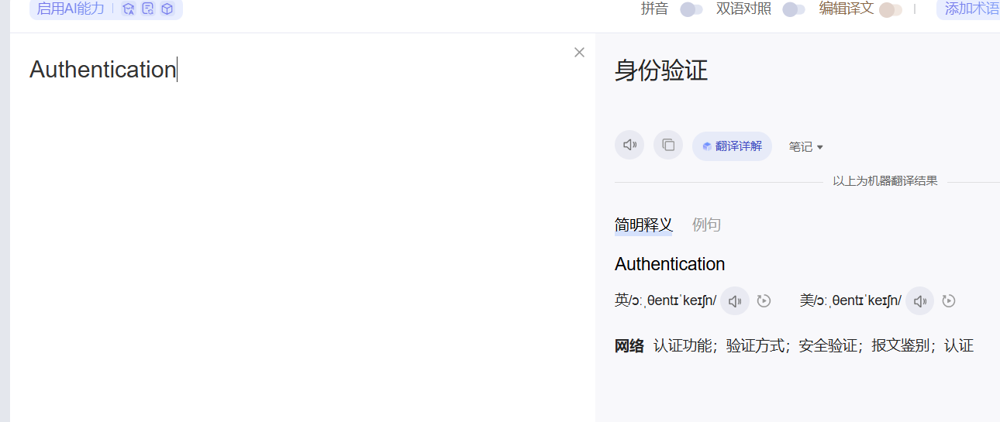
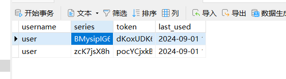

# UsernamePasswordAuthenticationFilter



英文叫做认证，也差不多是这个意思

发现单纯是个接口

```java
public interface Authentication extends Principal, Serializable {
    Collection<? extends GrantedAuthority> getAuthorities();
    Object getCredentials();
    Object getDetails();
    Object getPrincipal();
    boolean isAuthenticated();
    void setAuthenticated(boolean isAuthenticated) throws IllegalArgumentException;
}
```

## UsernamePasswordAuthenticationToken的构建流程

看看其中一个重要实现**UsernamePasswordAuthenticationToken**

### UsernamePasswordAuthenticationFilter

先看一看Security中的一个关键过滤器 UsernamePasswordAuthenticationFilter

```java
   private void doFilter(HttpServletRequest request, HttpServletResponse response, FilterChain chain) throws IOException, ServletException {
       //如果不是登录请求直接走下一个security过滤器
       //这个你点进去看,打个断点啥的就知道
       //就是匹配是不是post,路径是不是/表单提交的路径(如果自定义了表单,就是conf.loginProcessingUrl("/doLogin");的这个)
       //这个匹配的就是不是/doLogin
        if (!this.requiresAuthentication(request, response)) {
            chain.doFilter(request, response);
        } else {
            try {
                //关键，这个Authentication就是UsernamePasswordAuthenticationToken
                //这里就把认证信息弄好了，账号密码正不正确也都搞好了(之后详细说)
                Authentication authenticationResult = this.attemptAuthentication(request, response);
                if (authenticationResult == null) {
                    return;
                }

                this.sessionStrategy.onAuthentication(authenticationResult, request, response);
                if (this.continueChainBeforeSuccessfulAuthentication) {
                    chain.doFilter(request, response);
                }
                //这里面也可以进去看看,就是创建一个空的securitycontext
                //然后把刚刚设置好的Authentication(UsernamePasswordAuthenticationToken类型)设置到securitycontext中
                //最后也就是把securitycontext设置到SecurityContextHolder里(当然实际上写是设置到securityContextHolderStrategy里,那当然是因为securityContextHolderStrategy在SecurityContextHolder里,实际上取securitycontext也是从securityContextHolderStrategy取，这个是基础啊)
                //当然还得执行成功之后的函数
                this.successfulAuthentication(request, response, chain, authenticationResult);
            } catch (InternalAuthenticationServiceException var5) {
                this.logger.error("An internal error occurred while trying to authenticate the user.", var5);
                this.unsuccessfulAuthentication(request, response, var5);
            } catch (AuthenticationException var6) {
                this.unsuccessfulAuthentication(request, response, var6);
            }

        }
    }
```

看一看attemptAuthentication内部

```java
public Authentication attemptAuthentication(HttpServletRequest request, HttpServletResponse response) throws AuthenticationException {
    if (this.postOnly && !request.getMethod().equals("POST")) {
        throw new AuthenticationServiceException("Authentication method not supported: " + request.getMethod());
    } else {
        //这个username，password，就是真的是去获取表单中的username，password的值,可以点进去看看，就是套娃
        String username = this.obtainUsername(request);
        username = username != null ? username.trim() : "";
        String password = this.obtainPassword(request);
        password = password != null ? password : "";
        //单纯给UsernamePasswordAuthenticationToken赋值
        UsernamePasswordAuthenticationToken authRequest = UsernamePasswordAuthenticationToken.unauthenticated(username, password);
        //设置Authentication的Detail
        this.setDetails(request, authRequest);
        //返回的就是UsernamePasswordAuthenticationToken
	   //但是注意，是修饰过的!,怎么说呢，我待会认真说
        return this.getAuthenticationManager().authenticate(authRequest);
    }
}
```

一个有意思的地方刚刚上面代码中，UsernamePasswordAuthenticationToken.unauthenticated(username, password);这个设置UsernamePasswordAuthenticationToken代码里，点进去看，会发现username传给**principal**，password传给**credentials**

命名改变了，credentials改名可以就是高大上点，但是principal确实是要改名的，后面principal不再是单纯的String类型的用户名，而是一个UserDetails，用继续使用username命名明显不正确

```java
public UsernamePasswordAuthenticationToken(Object principal, Object credentials) {
    super(null);
    this.principal = principal;
    this.credentials = credentials;
    setAuthenticated(false);
}
```

**解释一下this.setDetails(request, authRequest);做的内容**

点进去看先

```java
protected void setDetails(HttpServletRequest request, UsernamePasswordAuthenticationToken authRequest) {
    //这一部分很简单，你打个断点，就会发现authenticationDetailsSource的类型是WebAuthenticationDetailsSource
    authRequest.setDetails(this.authenticationDetailsSource.buildDetails(request));
}
```

```java
//先看看UsernamePasswordAuthenticationToken内部这个setDetails，其实就是赋值。details也就是Object类型
public void setDetails(Object details) {
    this.details = details;
}
```

```java
//看看这个Object类型到底是什么?
//那么看看WebAuthenticationDetailsSource的buildDetails，发现就是返回了WebAuthenticationDetails
//也就是说这个setDetails的参数类型就是WebAuthenticationDetails
public WebAuthenticationDetails buildDetails(HttpServletRequest context) {
    return new WebAuthenticationDetails(context);
}
```

```java
//最后看看WebAuthenticationDetails内部，发现就是赋值啊，就是把ip地址，sessionId绑定到UsernamePasswordAuthenticationToken认证上
public WebAuthenticationDetails(HttpServletRequest request) {
    this(request.getRemoteAddr(), extractSessionId(request));
}

public WebAuthenticationDetails(String remoteAddress, String sessionId) {
    //测试的时候如果打断点会发现IP是0:0:0:0:0:0:0:1，这个就是127.0.0.1,只是这个是IPv6表示法中的环回地址
    this.remoteAddress = remoteAddress;
    this.sessionId = sessionId;
}
```

**重要解释刚刚的this.getAuthenticationManager().authenticate(authRequest);**

- 如果你尝试打过断点，你会发现在this.getAuthenticationManager().authenticate(authRequest);执行之前的UsernamePasswordAuthenticationToken中的principal就是个String类型，也就是我们的用户名，但是在执行之后，你再尝试打断点
- 会发现principal变成了一个UserDetails类型！而且credentials变成了空，而在这之前credentials里是有密码的。
- 显而易见的，this.getAuthenticationManager().authenticate(authRequest);就是造成这个的原因


### ProviderManager

断点会发现this.getAuthenticationManager()的类型是**ProviderManager**（懒得搞了，就把代码都复制过来了）

```java
@Override
public Authentication authenticate(Authentication authentication) throws AuthenticationException {
    Class<? extends Authentication> toTest = authentication.getClass();
    AuthenticationException lastException = null;
    AuthenticationException parentException = null;
    Authentication result = null;
    Authentication parentResult = null;
    int currentPosition = 0;
    int size = this.providers.size();
    //这里挺有意思的分了自己和父亲
    //首先自己的getProviders()有两个分别是AnonymousAuthenticationProvider和RememberMeAuthenticationProvider两个
    //然后在第一句话!provider.supports(toTest),两个provider都是真，直接就根本没走循环
    //你自己点进去看就知道supports内部其实就是调用class类的isAssignableFrom方法，分别调用RememberMeAuthenticationToken.class.isAssignableFrom(authentication)和AnonymousAuthenticationToken.class.isAssignableFrom(authentication),都是返回false，所有自己的的两个providers根本没走for循环,直接continue了)
 	//下面简单说下isAssignableFrom
    //你先往下看,会发现回调父亲的authenticate()方法重新进去
    //父亲的getProviders()就只有一个provider就是DaoAuthenticationProvider!
    for (AuthenticationProvider provider : getProviders()) {
       if (!provider.supports(toTest)) {
          continue;
       }
       if (logger.isTraceEnabled()) {
          logger.trace(LogMessage.format("Authenticating request with %s (%d/%d)",
                provider.getClass().getSimpleName(), ++currentPosition, size));
       }
       try {
           //实际上只走了父亲的provider的DaoAuthenticationProvider
          result = provider.authenticate(authentication);
          if (result != null) {
             copyDetails(authentication, result);
             break;
          }
       }
       catch (AccountStatusException | InternalAuthenticationServiceException ex) {
          prepareException(ex, authentication);
          // SEC-546: Avoid polling additional providers if auth failure is due to
          // invalid account status
          throw ex;
       }
       catch (AuthenticationException ex) {
          lastException = ex;
       }
    }
    
    if (result == null && this.parent != null) {
       // Allow the parent to try.
       try {
          //自己根本没走for循环，让父亲去走for循环拿到result,父亲也是个ProviderManager,但是他的provider跟自己的不一样
          parentResult = this.parent.authenticate(authentication);
          result = parentResult;
       }
       catch (ProviderNotFoundException ex) {
          // ignore as we will throw below if no other exception occurred prior to
          // calling parent and the parent
          // may throw ProviderNotFound even though a provider in the child already
          // handled the request
       }
       catch (AuthenticationException ex) {
          parentException = ex;
          lastException = ex;
       }
    }
    if (result != null) {
       if (this.eraseCredentialsAfterAuthentication && (result instanceof CredentialsContainer)) {
          // Authentication is complete. Remove credentials and other secret data
          // from authentication
          //获得完重新封装好的UsernamePasswordAuthenticationToken后,要把密码也就是credentials设置为空(保护)
          ((CredentialsContainer) result).eraseCredentials();
       }
       // If the parent AuthenticationManager was attempted and successful then it
       // will publish an AuthenticationSuccessEvent
       // This check prevents a duplicate AuthenticationSuccessEvent if the parent
       // AuthenticationManager already published it
       if (parentResult == null) {
          this.eventPublisher.publishAuthenticationSuccess(result);
       }

       return result;
    }

    // Parent was null, or didn't authenticate (or throw an exception).
    if (lastException == null) {
       lastException = new ProviderNotFoundException(this.messages.getMessage("ProviderManager.providerNotFound",
             new Object[] { toTest.getName() }, "No AuthenticationProvider found for {0}"));
    }
    // If the parent AuthenticationManager was attempted and failed then it will
    // publish an AbstractAuthenticationFailureEvent
    // This check prevents a duplicate AbstractAuthenticationFailureEvent if the
    // parent AuthenticationManager already published it
    if (parentException == null) {
       prepareException(lastException, authentication);
    }
    throw lastException;
}
```

### **Class类的isAssignableFrom方法**

​	有两个Class类型的类象，一个是调用isAssignableFrom方法的类对象（后称对象A），以及方法中作为参数的这个类对象（称之为对象B），这两个对象如果满足以下条件则返回true，否则返回false：

- A对象所对应类信息是B对象所对应的类信息的父类或者是父接口，简单理解即A是B的父类或接口

- A对象所对应类信息与B对象所对应的类信息相同，简单理解即A和B为同一个类或同一个接口
  如下测试代码示例：

  ```java
      Class clazz1 = Map.class;
      Class clazz2 = HashMap.class;
      Class clazz3 = List.class;
      boolean f = clazz1.isAssignableFrom(clazz2);
      System.out.println(f);//TRUE
      boolean f1 = clazz1.isAssignableFrom(clazz1);
      System.out.println(f1);//TRUE
      boolean f3 = clazz1.isAssignableFrom(clazz3);
      System.out.println(f3);//FALSE
  ```

因此RememberMeAuthenticationToken.class.isAssignableFrom(authentication)和AnonymousAuthenticationToken.class.isAssignableFrom(authentication)也能够理解，这三个类(UsernamePasswordAuthenticationToken)都直接实现AbstractAuthenticationToken接口

都是兄弟关系，但按照刚刚的规定，则都返回false

### DaoAuthenticationProvider

接下来看看父亲的DaoAuthenticationProvider里authenticate到底是怎么重新封装我们的UsernamePasswordAuthenticationToken

```java
@Override
public Authentication authenticate(Authentication authentication) throws AuthenticationException {
    Assert.isInstanceOf(UsernamePasswordAuthenticationToken.class, authentication,
          () -> this.messages.getMessage("AbstractUserDetailsAuthenticationProvider.onlySupports",
                "Only UsernamePasswordAuthenticationToken is supported"));
    //拿到用户名
    String username = determineUsername(authentication);
    boolean cacheWasUsed = true;
    //看看缓存里有没有真正数据库里的UserDetails
    UserDetails user = this.userCache.getUserFromCache(username);
    if (user == null) {
       cacheWasUsed = false;	
       try {
           //真正获得我们的UserDetails,(最后也就是用UserDetails代替我们原始的String类型的principal(username))
          user = retrieveUser(username, (UsernamePasswordAuthenticationToken) authentication);
       }
        //这里可以提前先捕获一次，但是如果你想在这里捕获，你就需要在你自定义的UserDetailsService里抛出
       catch (UsernameNotFoundException ex) {
          this.logger.debug("Failed to find user '" + username + "'");
          if (!this.hideUserNotFoundExceptions) {
             throw ex;
          }
          throw new BadCredentialsException(this.messages
             .getMessage("AbstractUserDetailsAuthenticationProvider.badCredentials", "Bad credentials"));
       }
       Assert.notNull(user, "retrieveUser returned null - a violation of the interface contract");
    }
    try {
       this.preAuthenticationChecks.check(user);
        //真正的检验密码是否正确!
        //我们的user,其实就是真正的,对的用户信息UserDetails(通过UsernamePasswordAuthenticationToken里的用户名获得,更具体点就是使用UserDetailsService中的loadUserByUsername获得密码,权限等等(通过数据库,而loadUserByUsername的参数当然就是UsernamePasswordAuthenticationToken中的principal也就是用户名)来封装对的UserDetails)
        //但是呢我们不清楚UsernamePasswordAuthenticationToken中的密码是不是正确，那肯定就是要检验，也就是在这里检验
        //如果不对就抛出BadCredentialsException
        //下面再具体说说additionalAuthenticationChecks
       additionalAuthenticationChecks(user, (UsernamePasswordAuthenticationToken) authentication);
    }
    catch (AuthenticationException ex) {
       if (!cacheWasUsed) {
          throw ex;
       }
       // There was a problem, so try again after checking
       // we're using latest data (i.e. not from the cache)
       cacheWasUsed = false;
       user = retrieveUser(username, (UsernamePasswordAuthenticationToken) authentication);
       this.preAuthenticationChecks.check(user);
       additionalAuthenticationChecks(user, (UsernamePasswordAuthenticationToken) authentication);
    }
    this.postAuthenticationChecks.check(user);
    if (!cacheWasUsed) {
        //放到缓存中
       this.userCache.putUserInCache(user);
    }
    Object principalToReturn = user;
    //最后再判断你是否要强制就用String类型的username作为你的Principal
    if (this.forcePrincipalAsString) {
       principalToReturn = user.getUsername();
    }
    //最后的封装结束(这里之所以还传进user,你点进去看，其实是为了获得他的权限Authorities)
    return createSuccessAuthentication(principalToReturn, authentication, user);
}
```

**看看retrieveUser里到底怎么获得封装的UserDetails**

```java
@Override
protected final UserDetails retrieveUser(String username, UsernamePasswordAuthenticationToken authentication)
       throws AuthenticationException {
    prepareTimingAttackProtection();
    try {
        //如果你自定义了UserDetailsService,这时候你会惊奇的发现this.getUserDetailsService()就是你自定义的UserDetailsService!
        //没有自定义,默认就是InMemoryUserDetailsManager
       UserDetails loadedUser = this.getUserDetailsService().loadUserByUsername(username);
       if (loadedUser == null) {
          throw new InternalAuthenticationServiceException(
                "UserDetailsService returned null, which is an interface contract violation");
       }
       return loadedUser;
    }
    catch (UsernameNotFoundException ex) {
       mitigateAgainstTimingAttack(authentication);
       throw ex;
    }
    catch (InternalAuthenticationServiceException ex) {
       throw ex;
    }
    catch (Exception ex) {
       throw new InternalAuthenticationServiceException(ex.getMessage(), ex);
    }
}
```

### additionalAuthenticationChecks

最后再看下additionalAuthenticationChecks是怎么检验密码是否正确的	

很简单

```java
@Override
@SuppressWarnings("deprecation")
protected void additionalAuthenticationChecks(UserDetails userDetails,
       UsernamePasswordAuthenticationToken authentication) throws AuthenticationException {
    //判断密码是否为空
    if (authentication.getCredentials() == null) {
       this.logger.debug("Failed to authenticate since no credentials provided");
       throw new BadCredentialsException(this.messages
          .getMessage("AbstractUserDetailsAuthenticationProvider.badCredentials", "Bad credentials"));
    }
    //就是对比了
    //但是注意,很容易知道authentication里的密码是没加密过的(因为你都是从页面上表单里获得的啊，谁会在表单里填加密过的密码啊)
    //而UserDetails里的就是真的密码,是放在数据库里的，那肯定是加密过的啊
    String presentedPassword = authentication.getCredentials().toString();
    //内部其实只会再对第一个参数加密
    if (!this.passwordEncoder.matches(presentedPassword, userDetails.getPassword())) {
       this.logger.debug("Failed to authenticate since password does not match stored value");
       throw new BadCredentialsException(this.messages
          .getMessage("AbstractUserDetailsAuthenticationProvider.badCredentials", "Bad credentials"));
    }
}
```

### User(实现了UserDetails接口的那个)中的authorities(权限)

说一下这个，其实是很基础的东西

平常我们基本都写基于角色的授权

```java
.authorizeHttpRequests(auth -> {
    //静态资源依然全部可以访问
    auth.requestMatchers("/static/**").permitAll();
    //只有具有以下角色的用户才能访问路径"/"
    auth.requestMatchers("/").hasAnyRole("user", "admin");
    //其他所有路径必须角色为admin才能访问
    auth.anyRequest().hasRole("admin");
})
```

也可以基于authorities(权限)的授权

就是那种"ROLE_********"的，比如"ROLE_USER","ROLE_ADMIN"这些都是

```java
.authorizeHttpRequests(auth -> {
    //静态资源依然全部可以访问
    auth.requestMatchers("/static/**").permitAll();
    //基于权限和基于角色其实差别并不大，使用方式是相同的
    auth.anyRequest().hasAnyAuthority("page:index");
})
```

```java
//某处的一段代码
return User.withUsername(account.getUsername())
        .password(account.getPassword())
    //这个表面上看是设置roles,实际上其实设置就是权限authorities
        .roles("user")
        .build();

//实际上User内部
//内部类UserBuilder
public static final class UserBuilder {
	....
    private List<GrantedAuthority> authorities = new ArrayList<>();
    ....
}
public UserBuilder roles(String... roles) {
    List<GrantedAuthority> authorities = new ArrayList<>(roles.length);
    for (String role : roles) {
        Assert.isTrue(!role.startsWith("ROLE_"),
                      () -> role + " cannot start with ROLE_ (it is automatically added)");
        //
        authorities.add(new SimpleGrantedAuthority("ROLE_" + role));
    }
    return authorities(authorities);
}
public UserBuilder authorities(Collection<? extends GrantedAuthority> authorities) {
    Assert.notNull(authorities, "authorities cannot be null");
    this.authorities = new ArrayList<>(authorities);
    return this;
}
```


## securitycontext设置到session和request里（一个感觉的重点）

[session, sessionId, cookie, JSESSIONID区别和联系_jsessionid和sessionid-CSDN博客](https://blog.csdn.net/wuyujin1997/article/details/102962131)

这一段是后面加的，在UsernamePasswordAuthenticationFilter成功最后的successfulAuthentication里

还会把securitycontext设置到session和request里。

设置到session里很好理解,因为在SecurityContextHolderFilter(去白马官网看就行)里会从session里取securitycontext进行设置到securityContextHolderStrategy等,过滤器是先走SecurityContextHolderFilter再走UsernamePasswordAuthenticationFilter。

为什么设置到session里其实很简单:如果不是登录操作不会走UsernamePasswordAuthenticationFilter,但是会走SecurityContextHolderFilter,服务器根据JSESSIONID拿到对应的session，SecurityContextHolderFilter从session里取出securitycontext(里面就有你的登录认证，很简单的点SecurityContext里有方法getAuthentication)。换而言之可以推理出，如果不做cookie的持久化,退出浏览器就要重新登录,因为没有JSESSIONID这个cookid了,也就找不到对应的session以及里面的SecurityContext。

那么好，就来看看this.securityContextRepository.saveContext(context, request, response);这句话是如何把securitycontext设置到session和request里的

```java
protected void successfulAuthentication(HttpServletRequest request, HttpServletResponse response, FilterChain chain, Authentication authResult) throws IOException, ServletException {
    SecurityContext context = this.securityContextHolderStrategy.createEmptyContext();
    context.setAuthentication(authResult);
    this.securityContextHolderStrategy.setContext(context);
    //只关注这句话就行
    this.securityContextRepository.saveContext(context, request, response);
    
    if (this.logger.isDebugEnabled()) {
        this.logger.debug(LogMessage.format("Set SecurityContextHolder to %s", authResult));
    }

    this.rememberMeServices.loginSuccess(request, response, authResult);
    if (this.eventPublisher != null) {
        this.eventPublisher.publishEvent(new InteractiveAuthenticationSuccessEvent(authResult, this.getClass()));
    }

    this.successHandler.onAuthenticationSuccess(request, response, authResult);
}
```

断点可以看到SecurityContextRepository的实现为DelegatingSecurityContextRepository

看到名字就很熟了，肯定又是委派给别的SecurityContextRepository实现去做事

```java
public void saveContext(SecurityContext context, HttpServletRequest request, HttpServletResponse response) {
    //this.delegates有两个SecurityContextRepository实现分别是
    //HttpSessionSecurityContextRepository和RequestAttributeSecurityContextRepository
    Iterator var4 = this.delegates.iterator();

    while(var4.hasNext()) {
        SecurityContextRepository delegate = (SecurityContextRepository)var4.next();
        delegate.saveContext(context, request, response);
    }

}
```

```java
//HttpSessionSecurityContextRepository把securitycontext设置到session里
//我就不点进去看了,其实你打断点很容易就看懂
//具体操作就是判断securitycontext是不是空的,是就移除原来的session里的securitycontext
//如果不是空,就把securitycontext设置到session里
//随便说一下securitycontext在session里的属性名叫做SPRING_SECURITY_CONTEXT
public void saveContext(SecurityContext context, HttpServletRequest request, HttpServletResponse response) {
    SaveContextOnUpdateOrErrorResponseWrapper responseWrapper = (SaveContextOnUpdateOrErrorResponseWrapper)WebUtils.getNativeResponse(response, SaveContextOnUpdateOrErrorResponseWrapper.class);
    if (responseWrapper == null) {
        this.saveContextInHttpSession(context, request);
    } else {
        responseWrapper.saveContext(context);
    }
}
```

```java
//RequestAttributeSecurityContextRepository把securitycontext设置到http请求中
//很简洁明了
//在http请求中设置了securitycontext属性
//因为http是非持久连接,也就是说就只有这一次http请求有用
public void saveContext(SecurityContext context, HttpServletRequest request, HttpServletResponse response) {
    request.setAttribute(this.requestAttributeName, context);
}
```


## UsernamePasswordAuthenticationFilter总结

- 那就来梳理来,先说security是啥，security实际上单纯只注册一个过滤器，但是这个过滤器内部维护了一个虚拟过滤器链
  而其中，有一个虚拟过滤器叫做**UsernamePasswordAuthenticationFilter**
- 这个过滤器里会生成一个重要的认证叫做UsernamePasswordAuthenticationToken
- 如何生成的呢？会根据request获得username，password,先简单封装成UsernamePasswordAuthenticationToken,并且设置detail来绑定IP和sessionId
- 之后通过ProviderManager生成真正的UsernamePasswordAuthenticationToken,有何区别呢，首先原始的UsernamePasswordAuthenticationToken内的principal是单纯的String类型的username，密码就是单纯的密码。而真正封装完成的UsernamePasswordAuthenticationToken内的principal是进一步封装完成的UserDetails。而密码，换句话说凭据是被擦除的，credentials是空的，以及增加了权限authorities
- ProviderManager怎么做的呢，是通过它内部维护的一个Provider，实现类为DaoAuthenticationProvider实现的
  先通过UserDetailsService和UsernamePasswordAuthenticationToken中的原始的principal得到真正在数据库中的UserDetails(当前你没写自定义的UserDetailsService，那它就在内存中),然后用UserDetails中的username,UsernamePasswordAuthenticationToken中的principal,
- 以及密码加密器，建议密码是否正确，不正确即抛出异常。最后用真正的UserDetails作为UsernamePasswordAuthenticationToken中的principal,以及UsernamePasswordAuthenticationToken维护了UserDetails中的权限authorities。
- 经过Provider处理完后的UsernamePasswordAuthenticationToken再经过凭据擦除后，即完成了UsernamePasswordAuthenticationToken的所有内容
- 最后你得到了UsernamePasswordAuthenticationToken，最后创建一个新的SecurityContext,设置刚刚创建的UsernamePasswordAuthenticationToken。把新创建的SecurityContext塞到SecurityContextHolder里。并且把SecurityContext放到session和request里，对remember-me的设置，之后执行successHandler结束


# RememberMeAuthenticationFilter

## 引出问题

先回忆之前的UsernamePasswordAuthenticationFilter，看看最后的successfulAuthentication处理

只看关键的地方，也就是this.rememberMeServices.loginSuccess(request, response, authResult);

先说下，如果使用数据库保存认证信息那么this.rememberMeServices的实现为PersistentTokenBasedRememberMeServices

这里就说PersistentTokenBasedRememberMeServices

```java
protected void successfulAuthentication(HttpServletRequest request, HttpServletResponse response, FilterChain chain, Authentication authResult) throws IOException, ServletException {
    SecurityContext context = this.securityContextHolderStrategy.createEmptyContext();
    context.setAuthentication(authResult);
    this.securityContextHolderStrategy.setContext(context);
    this.securityContextRepository.saveContext(context, request, response);
    if (this.logger.isDebugEnabled()) {
        this.logger.debug(LogMessage.format("Set SecurityContextHolder to %s", authResult));
    }
	//实现记住我功能
    this.rememberMeServices.loginSuccess(request, response, authResult);
    if (this.eventPublisher != null) {
        this.eventPublisher.publishEvent(new InteractiveAuthenticationSuccessEvent(authResult, this.getClass()));
    }

    this.successHandler.onAuthenticationSuccess(request, response, authResult);
}
```

loginSuccess最后索引到PersistentTokenBasedRememberMeServices里的onLoginSuccess方法

```java
protected void onLoginSuccess(HttpServletRequest request, HttpServletResponse response, Authentication successfulAuthentication) {
    String username = successfulAuthentication.getName();
    this.logger.debug(LogMessage.format("Creating new persistent login for user %s", username));
    PersistentRememberMeToken persistentToken = new PersistentRememberMeToken(username, this.generateSeriesData(), this.generateTokenData(), new Date());

    try {
        //this.tokenRepository就是你token存放的位置，默认是InMemoryTokenRepositoryImpl,一般会设置成JdbcTokenRepositoryImpl,也就是保存到数据库里
        //createNewToken也就是执行数据库的插入操作了
        this.tokenRepository.createNewToken(persistentToken);
        //往respond里设置remember-me这个cookie了
        this.addCookie(persistentToken, request, response);
    } catch (Exception var7) {
        this.logger.error("Failed to save persistent token ", var7);
    }

}
```

就是分别对应我们数据库里存储的username，series，token，last_used

```java
public PersistentRememberMeToken(String username, String series, String tokenValue, Date date) {
    this.username = username;
    this.series = series;
    this.tokenValue = tokenValue;
    this.date = date;
}
```



这里重要看看this.addCookie，这里给setCookie的**第一个参数注意**，这个String[]长度为2，就是我们数据库里存储的series和token

```java
private void addCookie(PersistentRememberMeToken token, HttpServletRequest request, HttpServletResponse response) {
    this.setCookie(new String[]{token.getSeries(), token.getTokenValue()}, this.getTokenValiditySeconds(), request, response);
}
```

**这里我总结下，待会需要用，PersistentRememberMeToken就包含了数据库里那所有的4个项(username，series，token，last_used)**

**而String[]就是单纯只是包含了series,token**


那么问题来了,为什么我携带remember-me这个cookie就可以实现不用登录就可以通过security

关键就是RememberMeAuthenticationFilter,同样也是security的虚拟过滤器

## RememberMeAuthenticationFilter流程

**先说一点RememberMeAuthenticationFilter是在UsernamePasswordAuthenticationFilter之后的**

```java
private void doFilter(HttpServletRequest request, HttpServletResponse response, FilterChain chain) throws IOException, ServletException {
    if (this.securityContextHolderStrategy.getContext().getAuthentication() != null) {
        this.logger.debug(LogMessage.of(() -> {
            return "SecurityContextHolder not populated with remember-me token, as it already contained: '" + this.securityContextHolderStrategy.getContext().getAuthentication() + "'";
        }));
        //都有认证了，直接放行
        chain.doFilter(request, response);
    } else {
        //这里获得的Authentication不再是UsernamePasswordAuthenticationToken,而是RememberMeAuthenticationToken
        //待会仔细说
        Authentication rememberMeAuth = this.rememberMeServices.autoLogin(request, response);
        if (rememberMeAuth != null) {
            try {
                //authenticationManager老熟人了，就是ProviderManager
        	   //之前的原始的UsernamePasswordAuthenticationToken就是用ProviderManager进行加工的
                rememberMeAuth = this.authenticationManager.authenticate(rememberMeAuth);
                //设置到securityContextHolder里，剩下的都是常规操作了
                SecurityContext context = this.securityContextHolderStrategy.createEmptyContext();
                context.setAuthentication(rememberMeAuth);
                this.securityContextHolderStrategy.setContext(context);
                this.onSuccessfulAuthentication(request, response, rememberMeAuth);
                this.logger.debug(LogMessage.of(() -> {
                    return "SecurityContextHolder populated with remember-me token: '" + this.securityContextHolderStrategy.getContext().getAuthentication() + "'";
                }));
                this.securityContextRepository.saveContext(context, request, response);
                if (this.eventPublisher != null) {
                    this.eventPublisher.publishEvent(new InteractiveAuthenticationSuccessEvent(this.securityContextHolderStrategy.getContext().getAuthentication(), this.getClass()));
                }

                if (this.successHandler != null) {
                    this.successHandler.onAuthenticationSuccess(request, response, rememberMeAuth);
                    return;
                }
            } catch (AuthenticationException var6) {
                this.logger.debug(LogMessage.format("SecurityContextHolder not populated with remember-me token, as AuthenticationManager rejected Authentication returned by RememberMeServices: '%s'; invalidating remember-me token", rememberMeAuth), var6);
                this.rememberMeServices.loginFail(request, response);
                this.onUnsuccessfulAuthentication(request, response, var6);
            }
        }

        chain.doFilter(request, response);
    }
}
```

## 重新看ProviderManager

```JAVA
@Override
public Authentication authenticate(Authentication authentication) throws AuthenticationException {
    Class<? extends Authentication> toTest = authentication.getClass();
    AuthenticationException lastException = null;
    AuthenticationException parentException = null;
    Authentication result = null;
    Authentication parentResult = null;
    int currentPosition = 0;
    int size = this.providers.size();
    
 	//以前说过吧，我们自己的provider有两个，分别是AnonymousAuthenticationProvider和RememberMeAuthenticationProvider,父亲的是处理UsernamePasswordAuthenticationToken的DaoAuthenticationProvider
    //这时候呢，我们这回我们的authentication是RememberMeAuthenticationToken类型了
    //第一个AnonymousAuthenticationProvider当然还是continue,毕竟他们3个authentication都是兄弟
    //第二个RememberMeAuthenticationProvider当前就进入了，然后执行它的authenticate
    for (AuthenticationProvider provider : getProviders()) {
       if (!provider.supports(toTest)) {
          continue;
       }
       if (logger.isTraceEnabled()) {
          logger.trace(LogMessage.format("Authenticating request with %s (%d/%d)",
                provider.getClass().getSimpleName(), ++currentPosition, size));
       }
       try {
           //执行RememberMeAuthenticationProvider的authenticate
          result = provider.authenticate(authentication);
          if (result != null) {
             copyDetails(authentication, result);
             break;
          }
       }
       catch (AccountStatusException | InternalAuthenticationServiceException ex) {
          prepareException(ex, authentication);
          // SEC-546: Avoid polling additional providers if auth failure is due to
          // invalid account status
          throw ex;
       }
       catch (AuthenticationException ex) {
          lastException = ex;
       }
    }
    .......
```

## RememberMeAuthenticationProvider

```java
@Override
public Authentication authenticate(Authentication authentication) throws AuthenticationException {
    if (!supports(authentication.getClass())) {
       return null;
    }
    //判断凭证是否有异常
    if (this.key.hashCode() != ((RememberMeAuthenticationToken) authentication).getKeyHash()) {
       throw new BadCredentialsException(this.messages.getMessage("RememberMeAuthenticationProvider.incorrectKey",
             "The presented RememberMeAuthenticationToken does not contain the expected key"));
    }
    //就返回了，不像DaoAuthenticationProvider会继续进一步修饰
    return authentication;
}
```

## PersistentTokenBasedRememberMeServices生成RememberMeAuthenticationToken

在回到最初的doFilter中是如何remember-me这个cookie来生成RememberMeAuthenticationToken。

this.rememberMeServices求值后会发现是PersistentTokenBasedRememberMeServices

是不是很熟，在看它的autoLogin方法前，你可能已经忘了，这个PersistentTokenBasedRememberMeServices就是在

UsernamePasswordAuthenticationFilter最后面设置remember的啊，不记得了回去看**引出问题**

来看看它的autoLogin方法

```java
public Authentication autoLogin(HttpServletRequest request, HttpServletResponse response) {
    //点进去看就知道就是简单的for循环找到remember-me这个cookie
    String rememberMeCookie = this.extractRememberMeCookie(request);
    if (rememberMeCookie == null) {
        return null;
    } else {
        this.logger.debug("Remember-me cookie detected");
        if (rememberMeCookie.length() == 0) {
            this.logger.debug("Cookie was empty");
            this.cancelCookie(request, response);
            return null;
        } else {
            try {
                //是不是对这个String[]很眼熟，没错，就是引出问题里说的,就是放的数据库里的series和token
                String[] cookieTokens = this.decodeCookie(rememberMeCookie);
                //获得UserDetails，这个不用说了，必须的，不然你怎么封装Authentication
                //待会仔细说
                UserDetails user = this.processAutoLoginCookie(cookieTokens, request, response);
                this.userDetailsChecker.check(user);
                this.logger.debug("Remember-me cookie accepted");
                //得到最后的RememberMeAuthenticationToken
                return this.createSuccessfulAuthentication(request, user);
            } catch (CookieTheftException var6) {
                this.cancelCookie(request, response);
                throw var6;
            } catch (UsernameNotFoundException var7) {
                this.logger.debug("Remember-me login was valid but corresponding user not found.", var7);
            } catch (InvalidCookieException var8) {
                this.logger.debug("Invalid remember-me cookie: " + var8.getMessage());
            } catch (AccountStatusException var9) {
                this.logger.debug("Invalid UserDetails: " + var9.getMessage());
            } catch (RememberMeAuthenticationException var10) {
                this.logger.debug(var10.getMessage());
            }

            this.cancelCookie(request, response);
            return null;
        }
    }
}
```

**processAutoLoginCookie内部**

```java
protected UserDetails processAutoLoginCookie(String[] cookieTokens, HttpServletRequest request, HttpServletResponse response) {
    if (cookieTokens.length != 2) {
        throw new InvalidCookieException("Cookie token did not contain 2 tokens, but contained '" + Arrays.asList(cookieTokens) + "'");
    } else {
        String presentedSeries = cookieTokens[0];
        String presentedToken = cookieTokens[1];
        //你看到this.tokenRepository,就别想了，就是调用数据库方法了(select,insert那些)
        //只通过presentedSeries获得数据库里的PersistentRememberMeToken
        //毕竟PersistentRememberMeToken包含了数据库里所有的4个项(username，series，token，last_used)
        PersistentRememberMeToken token = this.tokenRepository.getTokenForSeries(presentedSeries);
        //一系列的判断
        if (token == null) {
            throw new RememberMeAuthenticationException("No persistent token found for series id: " + presentedSeries);
            //cookie里获得的token跟数据库里的token不一致
            //说明cookie可能被篡改或窃取
        } else if (!presentedToken.equals(token.getTokenValue())) {
            this.tokenRepository.removeUserTokens(token.getUsername());
            //Theft就是偷窃的意思
            throw new CookieTheftException(this.messages.getMessage("PersistentTokenBasedRememberMeServices.cookieStolen", "Invalid remember-me token (Series/token) mismatch. Implies previous cookie theft attack."));
            //cookie过期
            //其实这个判断就可以发现，就是放的是你cookie最后更新的时间，过期是根据多少时间过后的
        } else if (token.getDate().getTime() + (long)this.getTokenValiditySeconds() * 1000L < System.currentTimeMillis()) {
            throw new RememberMeAuthenticationException("Remember-me login has expired");
        } else {
            //都不是，那么刷新cookie
            this.logger.debug(LogMessage.format("Refreshing persistent login token for user '%s', series '%s'", token.getUsername(), token.getSeries()));
            //重新封装PersistentRememberMeToken
            //重新更新token和当前时间
            PersistentRememberMeToken newToken = new PersistentRememberMeToken(token.getUsername(), token.getSeries(), this.generateTokenData(), new Date());

            try {
                //把新的PersistentRememberMeToken更新到数据库里
                this.tokenRepository.updateToken(newToken.getSeries(), newToken.getTokenValue(), newToken.getDate());
                //回写cookie
                //token都变了，肯定要回写给客服啊
                this.addCookie(newToken, request, response);
            } catch (Exception var9) {
                this.logger.error("Failed to update token: ", var9);
                throw new RememberMeAuthenticationException("Autologin failed due to data access problem");
            }
			//老朋友了,有自定义的UserDetailsService就用自己的
             //可能你第一感觉就是你以为会用数据库里的那个PersistentRememberMeToken封装UserDetails
             //但是你想想你那个PersistentRememberMeToken有Credential密码吗，有authorities权限的内容吗,都没啊
             //肯定最后还是靠自己写的UserDetailsService到特定的表上去找
            return this.getUserDetailsService().loadUserByUsername(token.getUsername());
        }
    }
}
```

## **总结RememberMeAuthenticationFilter**

- 假设你已经登录过了，而且使用了记住我功能(使用数据库持久化保存)
- 这时候数据库里就会保存PersistentRememberMeToken，有**username**，**serial**(这个列存储了一个唯一的序列号)，**token**(这个列存储了一个令牌,用于验证`remember-me` cookie的有效性)，**last_used**(这个列存储了一个时间戳，表示用户上一次使用`remember-me`功能的时间)
- 这时候你访问页面，会走RememberMeAuthenticationFilter这个security里的一个虚拟过滤器
- 接着使用PersistentTokenBasedRememberMeServices的autoLogin，通过对请求中携带的remember-me这个cookie进行解码，获得serial，以及token
- 通过PersistentTokenBasedRememberMeServices内部维护的PersistentTokenRepository(数据库实现为JdbcTokenRepositoryImpl)进行一系列的数据库操作
- 用刚刚cookie中获得的serial，来检索数据库获得数据库中保存的PersistentRememberMeToken
- 用cookie中的token和PersistentRememberMeToken中的token进行判断token是否被篡改或窃取，以及通过PersistentRememberMeToken中的last_used判断是否过期
- 一切通过的话，重新更新数据库中的PersistentRememberMeToken，并且回写给客服新的cookie
- 使用UserDetailService，通过用户名获得UserDetail
- 通过获得的UserDetail封装RememberMeAuthenticationToken
- 使用ProviderManager中的RememberMeAuthenticationProvider对刚刚获得的RememberMeAuthenticationToken进行凭证判断，返回最后的RememberMeAuthenticationToken
- 把RememberMeAuthenticationToken设置到securityContextHolder里，再进行一系列常规操作，结束

