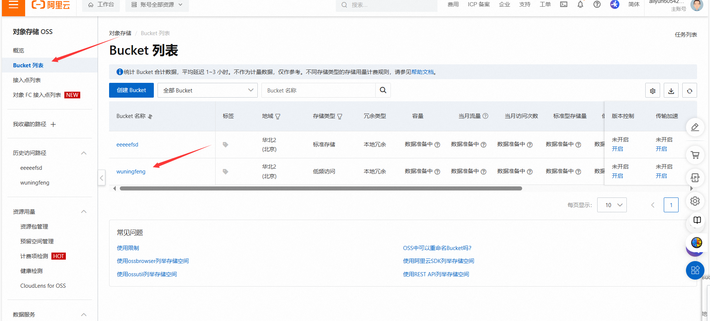

## 前言


为什么需要这个


比如这里有一个上传图片的功能，我们点击了图片然后上传，但是我们页面这个框框里也要显示吧。

这时候后端需要返回给前端一个访问这个图片的地址，才可以展示

而这个图片的地址就是存储图片的服务器上的地址，我们用的是阿里云

可以看看这个文章，虽然有点省略

[阿里云OSS实现图片上传（后端接口）_oss上传图片-CSDN博客](https://blog.csdn.net/m0_51963973/article/details/131067432?spm=1001.2014.3001.5506)

## 申请阿里云

要钱的[2024阿里云-超值优选 上云必选-阿里云 (aliyun.com)](https://www.aliyun.com/benefit/select/promo?utm_content=se_1018947303)


免费的[阿里云免费试用 - 阿里云 (aliyun.com)](https://free.aliyun.com/?spm=5176.28536895.J_1wU4IPW2fZDoAeEjaKAq6.4.6dae586cXiShP1)


## 配置

先点击**右上角的控制台**


再点左上角的**三个横杆**

再点**对象存储**


### 配置Bucket

再点创建Bucket


按这样差不多配置就行，**注意这个Bucket名称要记住**,还有这个华北2(北京)也是，关系待会写代码的endpoint,


点击Bucket列表，再点你的Bucket名称



这里你就可以自己手动上传文件了


### 配置AccessKey


看着配置就行，这个无所谓，注意OpenAPI要打勾，登录名称可以记下，删除的话需要登录名称


到这一步别走，一定要复制AccessKey和AccessKey Secret，然后记住，或者你下载CSV文件，因为好像是回不到这个界面了的


添加权限，一定要添加AliyunOSSFullAccess权限，其他加也没事，我也看不懂


## java代码实现上传图片

导入依赖

```xml
<properties>
    ...省略其他的
    <aliyun.sdk.oss>3.10.2</aliyun.sdk.oss>
</properties>
<dependency>
    <groupId>com.aliyun.oss</groupId>
    <artifactId>aliyun-sdk-oss</artifactId>
    <version>${aliyun.sdk.oss}</version>
</dependency>
```


```java
@Data
@AllArgsConstructor
@Slf4j
public class AliOssUtil {

    //不用管我的值是哪里来的
    //bucketName就是配置Bucket时候让你记住的那个name
    //accessKeyId和accessKeySecret不用说了吧,就是我说你一定要复制的那两个东西,要不就把那个csv下载了
    //这个endpoint下面说
    private String endpoint;
    private String accessKeyId;
    private String accessKeySecret;
    private String bucketName;

    /**
     * 文件上传
     *
     * @param bytes
     * @param objectName
     * @return
     */
    //bytes图片的二进制数据,objectName图片在服务器上的名称
    public String upload(byte[] bytes, String objectName) {

        // 创建OSSClient实例。
        OSS ossClient = new OSSClientBuilder().build(endpoint, accessKeyId, accessKeySecret);

        try {
            // 创建PutObject请求。
            // 发送图片到服务器上了
            ossClient.putObject(bucketName, objectName, new ByteArrayInputStream(bytes));
        } catch (OSSException oe) {
            System.out.println("Caught an OSSException, which means your request made it to OSS, "
                    + "but was rejected with an error response for some reason.");
            System.out.println("Error Message:" + oe.getErrorMessage());
            System.out.println("Error Code:" + oe.getErrorCode());
            System.out.println("Request ID:" + oe.getRequestId());
            System.out.println("Host ID:" + oe.getHostId());
        } catch (ClientException ce) {
            System.out.println("Caught an ClientException, which means the client encountered "
                    + "a serious internal problem while trying to communicate with OSS, "
                    + "such as not being able to access the network.");
            System.out.println("Error Message:" + ce.getMessage());
        } finally {
            if (ossClient != null) {
                ossClient.shutdown();
            }
        }

        
        //文件访问路径规则 https://BucketName.Endpoint/ObjectName
        StringBuilder stringBuilder = new StringBuilder("https://");
        stringBuilder
                .append(bucketName)
                .append(".")
                .append(endpoint)
                .append("/")
                .append(objectName);

        log.info("文件上传到:{}", stringBuilder.toString());
		//前端访问stringBuilder.toString()即可拿到图片
        return stringBuilder.toString();
    }
}

```

### endpoint

​	endpoint就是配置bucket时指定的地域

[OSS访问域名和数据中心_对象存储(OSS)-阿里云帮助中心 (aliyun.com)](https://help.aliyun.com/zh/oss/user-guide/regions-and-endpoints?spm=a2c6h.13066369.question.4.11381fd1KGz93b)

截了一小部分图,自己对照看就可以了,注意要填外网的啊


## MultipartFile接收前端二进制数据

这里再简单说下controller如何接收二进制

前端情况


```java
@Resource
private AliOssUtil aliOssUtil;

@PostMapping("/upload")
@ApiOperation("文件上传")
//前端穿来二进制的图片,用MultipartFile接收,注意这里要写成file,因为我们前端发过来的二进制数据的key这个例子就叫file,看上图
public Result<String> upload(MultipartFile file){
    log.info("文件上传: {}",file);

    try {
        String originalFileName = file.getOriginalFilename();
        //获得文件扩展名
        String extension = originalFileName.substring(originalFileName.lastIndexOf("."));
        //构造新文件名称防止阿里云上有重名文件导致覆盖
        String newName = UUID.randomUUID().toString() + extension;

        //这个aliOssUtil就是刚刚写的AliOssUtil
        String filePath = aliOssUtil.upload(file.getBytes(),newName);
        return Result.success(filePath);
    } catch (IOException e) {
        log.error("文件上传失败");
    }
    return null;
}
```


## Minio

这个也是可以用来存储图片的(对象存储服务)

不用钱

docker安装Minio

MINIO_ACCESS_KEY就是用户名

MINIO_SECRET_KEY就是密码

```shell
docker run -d \-p 9000:9000 \-p 9001:9001 \--name minio1 \-v /home/minio/data:/data \-e "MINIO_ROOT_USER=minio" \-e "MINIO_ROOT_PASSWORD=minio123" \minio/minio server /data --console-address ":9001" 
```

我这里的linux服务器的ip是192.168.169.3

这时候我们访问192.168.169.3:9001，即可访问控制台,然后9000是我们之后用的api端口

输入刚刚的用户名和密码即可进入


记住这个名字,我这里是创建过了同名的，所以爆红


这里就可以看到自己创建的bucket了,bucket就是用来放东西的


所需依赖

```xml
<dependency>
    <groupId>io.minio</groupId>
    <artifactId>minio</artifactId>
    <version>7.1.0</version>
</dependency>
```


结合springboot使用,可以看看我这个模板的结构

你会发现这个模块是没有启动类的,也就是要被其他模板依赖使用


```java
//配置类
@Data
@Configuration
//这个应该用过吧,其实就是让ConfigurationProperties生效
//具体可以看看https://www.cnblogs.com/xiaomaomao/p/13934688.html
//简单来说ConfigurationProperties要生效需要是个Bean,但是下面我的MinIOConfigProperties没有写@Component注解也就需要了
//其实我感觉也不是这个意思这里,这里这个项目是没有启动类的,是不会扫描的啊,待会下面是用的配置spring.factories文件的
@EnableConfigurationProperties({MinIOConfigProperties.class})
//当有FileStorageService接口时,Configuration才会生效
@ConditionalOnClass(FileStorageService.class)
public class MinIOConfig {

    @Autowired
    private MinIOConfigProperties minIOConfigProperties;

    @Bean
    public MinioClient buildMinioClient() {
        return MinioClient
                .builder()
                .credentials(minIOConfigProperties.getAccessKey(), minIOConfigProperties.getSecretKey())
                .endpoint(minIOConfigProperties.getEndpoint())
                .build();
    }
}
```

在spring.factories里写这个,使用springboot的自动配置,因为我们这个项目没有启动类扫描不到

然后别的项目引入了后，我们包名也不一样,也扫不到啊，也就用springboot的自动配置了,把配置类加进去就行

```java
org.springframework.boot.autoconfigure.EnableAutoConfiguration=\
  com.heima.file.service.impl.MinIOFileStorageService
```


```java
@Data
@ConfigurationProperties(prefix = "minio")  // 文件上传 配置前缀file.oss
public class MinIOConfigProperties implements Serializable {

    private String accessKey;
    private String secretKey;
    private String bucket;
    private String endpoint;
    private String readPath;
}
```

配置文件

```yaml
minio:
#用户名和密码
  accessKey: minio
  secretKey: minio123
#上面bucket的名字
  bucket: leadnews
#填api的端口就行
  endpoint: http://192.168.169.3:9000
  readPath: http://192.168.169.3:9000
```


```java
@Slf4j
@EnableConfigurationProperties(MinIOConfigProperties.class)
// TODO 自动配置,看下结构 以及Properties
@Import(MinIOConfig.class)
public class MinIOFileStorageService implements FileStorageService {

    @Autowired
    private MinioClient minioClient;

    @Autowired
    private MinIOConfigProperties minIOConfigProperties;

    private final static String separator = "/";

    /**
     * @param dirPath
     * @param filename  yyyy/mm/dd/file.jpg
     * @return
     */
    public String builderFilePath(String dirPath,String filename) {
        StringBuilder stringBuilder = new StringBuilder(50);
        if(!StringUtils.isEmpty(dirPath)){
            stringBuilder.append(dirPath).append(separator);
        }
        SimpleDateFormat sdf = new SimpleDateFormat("yyyy/MM/dd");
        String todayStr = sdf.format(new Date());
        stringBuilder.append(todayStr).append(separator);
        stringBuilder.append(filename);
        return stringBuilder.toString();
    }

    /**
     *  上传图片文件
     * @param prefix  文件前缀
     * @param filename  文件名
     * @param inputStream 文件流
     * @return  文件全路径
     */
    @Override
    public String uploadImgFile(String prefix, String filename,InputStream inputStream) {
        //通过传来的文件名和前缀生成文件的路径
        String filePath = builderFilePath(prefix, filename);
        try {
            PutObjectArgs putObjectArgs = PutObjectArgs.builder()
                    .object(filePath)
                    .contentType("image/jpg")
                    .bucket(minIOConfigProperties.getBucket()).stream(inputStream,inputStream.available(),-1)
                    .build();
            //上传到minio
            minioClient.putObject(putObjectArgs);
            //这里组合urlPath,这个urlPath就是给前端访问到minio上对应图片的
            StringBuilder urlPath = new StringBuilder(minIOConfigProperties.getReadPath());
            urlPath.append(separator+minIOConfigProperties.getBucket());
            urlPath.append(separator);
            urlPath.append(filePath);
            return urlPath.toString();
        }catch (Exception ex){
            log.error("minio put file error.",ex);
            throw new RuntimeException("上传文件失败");
        }
    }
	//下面就都大同小异了
    
    /**
     *  上传html文件
     * @param prefix  文件前缀
     * @param filename   文件名
     * @param inputStream  文件流
     * @return  文件全路径
     */
    @Override
    public String uploadHtmlFile(String prefix, String filename,InputStream inputStream) {
        String filePath = builderFilePath(prefix, filename);
        try {
            PutObjectArgs putObjectArgs = PutObjectArgs.builder()
                    .object(filePath)
                    .contentType("text/html")
                    .bucket(minIOConfigProperties.getBucket())
                    .stream(inputStream,inputStream.available(),-1)
                    .build();
            minioClient.putObject(putObjectArgs);
            StringBuilder urlPath = new StringBuilder(minIOConfigProperties.getReadPath());
            urlPath.append(separator+minIOConfigProperties.getBucket());
            urlPath.append(separator);
            urlPath.append(filePath);
            return urlPath.toString();
        }catch (Exception ex){
            log.error("minio put file error.",ex);
            ex.printStackTrace();
            throw new RuntimeException("上传文件失败");
        }
    }

    /**
     * 删除文件
     * @param pathUrl  文件全路径
     */
    @Override
    public void delete(String pathUrl) {
        String key = pathUrl.replace(minIOConfigProperties.getEndpoint()+"/","");
        int index = key.indexOf(separator);
        String bucket = key.substring(0,index);
        String filePath = key.substring(index+1);
        // 删除Objects
        RemoveObjectArgs removeObjectArgs = RemoveObjectArgs
                .builder()
                .bucket(bucket)
                .object(filePath).build();
        try {
            minioClient.removeObject(removeObjectArgs);
        } catch (Exception e) {
            log.error("minio remove file error.  pathUrl:{}",pathUrl);
            e.printStackTrace();
        }
    }


    /**
     * 下载文件
     * @param pathUrl  文件全路径
     * @return  文件流
     *
     */
    @Override
    public byte[] downLoadFile(String pathUrl)  {
        String key = pathUrl.replace(minIOConfigProperties.getEndpoint()+"/","");
        int index = key.indexOf(separator);
        String bucket = key.substring(0,index);
        String filePath = key.substring(index+1);
        InputStream inputStream = null;
        try {
            inputStream = minioClient.getObject(GetObjectArgs.builder().bucket(minIOConfigProperties.getBucket()).object(filePath).build());
        } catch (Exception e) {
            log.error("minio down file error.  pathUrl:{}",pathUrl);
            e.printStackTrace();
        }

        ByteArrayOutputStream byteArrayOutputStream = new ByteArrayOutputStream();
        byte[] buff = new byte[100];
        int rc = 0;
        while (true) {
            try {
                if (!((rc = inputStream.read(buff, 0, 100)) > 0)) break;
            } catch (IOException e) {
                e.printStackTrace();
            }
            byteArrayOutputStream.write(buff, 0, rc);
        }
        return byteArrayOutputStream.toByteArray();
    }
}
```

