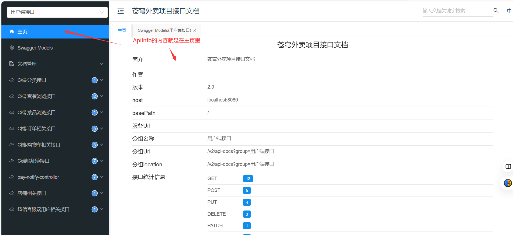

## **Knife4j**

就是差不多是swagger的升级版

官方文档： https://doc.xiaominfo.com/

```xml
引入的依赖
<dependency>
    <groupId>com.github.xiaoymin</groupId>
    <artifactId>knife4j-spring-boot-starter</artifactId>
    <version>2.0.8</version>
</dependency>
```

```java
@Configuration
@Slf4j
public class WebMvcConfiguration extends WebMvcConfigurationSupport {
    /**
     * 通过knife4j生成接口文档
     * @return
     */
    @Bean
    public Docket docket1() {
        //这个ApiInfo就是主页的信息,下面看图对照就知道了
        ApiInfo apiInfo = new ApiInfoBuilder()
                .title("苍穹外卖项目接口文档")
                .version("2.0")
                .description("苍穹外卖项目接口文档")
                .build();
        Docket docket = new Docket(DocumentationType.SWAGGER_2)
                .groupName("管理端接口")
                .apiInfo(apiInfo)
                .select()
                //这个项目分成两个部分的Controller,admin和user
            	//这里扫描admin下的controller
                .apis(RequestHandlerSelectors.basePackage("com.sky.controller.admin"))
                .paths(PathSelectors.any())
                .build();
        return docket;
    }

    /**
     * 通过knife4j生成接口文档
     * @return
     */
    @Bean
    public Docket docket2() {
        ApiInfo apiInfo = new ApiInfoBuilder()
                .title("苍穹外卖项目接口文档")
                .version("2.0")
                .description("苍穹外卖项目接口文档")
                .build();
        Docket docket = new Docket(DocumentationType.SWAGGER_2)
            	//你的docker名字
                .groupName("用户端接口")
                .apiInfo(apiInfo)
                .select()
                 //这个项目分成两个部分的Controller,admin和user
            	//这里扫描admin下的controller
                .apis(RequestHandlerSelectors.basePackage("com.sky.controller.user"))
                .paths(PathSelectors.any())
                .build();
        return docket;
    }

    /**
     * 设置静态资源映射
     * @param registry
     */
    protected void addResourceHandlers(ResourceHandlerRegistry registry) {
        ///META-INF/resources/,我看项目里是没有,估计是运行之后生成的,照着写就行
        registry.addResourceHandler("/doc.html").addResourceLocations("classpath:/META-INF/resources/");
        registry.addResourceHandler("/webjars/**").addResourceLocations("classpath:/META-INF/resources/webjars/");
    }
}
```

访问localhost: 8080 (你自己后端运行的地方) /doc.html就可以访问接口文档工具了




```java
//具体的
@RestController("adminCategoryController")
@RequestMapping("/admin/category")
//Controller的描述
@Api(tags = "分类相关接口")
@Slf4j
public class CategoryController {

    @Autowired
    private CategoryService categoryService;

    /**
     * 新增分类
     * @param categoryDTO
     * @return
     */
    @PostMapping
    //handle的描述
    @ApiOperation("新增分类")
    public Result<String> save(@RequestBody CategoryDTO categoryDTO){
        log.info("新增分类：{}", categoryDTO);
        categoryService.save(categoryDTO);
        return Result.success();
    }
```

## Spring Cache

 使用缓存更加简单

```xml
<!--具体的缓存实现依赖-->
<!--也可以不用redis,就有点像是jdbc框架,可以有很多具体的数据库驱动实现-->
<dependency>
    <groupId>org.springframework.boot</groupId>
    <artifactId>spring-boot-starter-data-redis</artifactId>
</dependency>

<!--Spring Cache依赖-->
<dependency>
    <groupId>org.springframework.boot</groupId>
    <artifactId>spring-boot-starter-cache</artifactId>
</dependency>
```

```java
@SpringBootApplication
@EnableCaching//开启Spring cache的缓存注解功能
@Slf4j
public class SkyApplication {
    public static void main(String[] args) {
        SpringApplication.run(SkyApplication.class, args);
        log.info("server started");
    }
}
```

```java
@GetMapping("/list")
@ApiOperation("根据分类id查询套餐")
//在缓存中的键就是cacheNames::key
//这里键就是setmealCache::categoryId了,key属性可以用SpEL表达式(这里就是这个#,拿到形参上的categoryId)
//开启缓存Cacheable作用就是先在进入方法前看看缓存了有没有,有就直接返回,不进入方法(就是用代理实现的,你在第一句话打断点试试,如果有缓存是直接返回的,不进入)
//没有就把返回值放到redis里
//然后:有点意思,就是建立了分层,具体你可以用navicat看看
//就是相当于windows资源管理器的/a/b/c 啊,或者就是idea的com.sky.controller的分层
//但是它这个有两个::,也就是有个空白的分层,具体还是去navicat看看
@Cacheable(cacheNames = "setmealCache",key = "#categoryId")
public Result<List<Setmeal>> list(Long categoryId) {
    log.info("查询套餐 根据分类id{}",categoryId);
    Setmeal setmeal = new Setmeal();
    setmeal.setCategoryId(categoryId);
    setmeal.setStatus(StatusConstant.ENABLE);

    List<Setmeal> list = setmealService.list(setmeal);
    return Result.success(list);
}
```

```java
@PostMapping
@ApiOperation("新增套餐")
//删除setmealCache::分类id缓存
//这个一样,redis里的键就是cacheNames::key
//然后这个SpEL表达式就是拿到形参上的setmealDTO.categoryId
@CacheEvict(cacheNames = "setmealCache",key = "#setmealDTO.categoryId")
public Result addSetmeal(@RequestBody SetmealDTO setmealDTO){
    log.info("新增套餐 {}",setmealDTO);
    setmealService.addSetmeal(setmealDTO);
    return Result.success();
}
```

## HttpClient

```xml
<!--所需依赖-->
<dependency>
  <groupId>org.apache.httpcomponents</groupId>
  <artifactId>httpclient</artifactId>
  <version>4.5.13</version>
</dependency>

<!--一般其实可能都会被项目中的其他依赖包裹-->
<!--比如微信支付的依赖就会包含-->
<dependency>
    <groupId>com.github.wechatpay-apiv3</groupId>
    <artifactId>wechatpay-apache-httpclient</artifactId>
    <version>0.4.8</version>
</dependency>
```

就是用来方便在后端再次发起请求的东西

```JAVA
//还是比较容易理解的
public class First {  
    public static void main(String[] args) throws Exception{  
        //设置请求体
        List<NameValuePair> formparams = new ArrayList<NameValuePair>();  
        formparams.add(new BasicNameValuePair("account", ""));  
        formparams.add(new BasicNameValuePair("password", "")); 
        //设置成application/x-www-form-urlencoded格式
        HttpEntity reqEntity = new UrlEncodedFormEntity(formparams, "utf-8");  
    
        RequestConfig requestConfig = RequestConfig.custom()  
        .setConnectTimeout(5000)//一、连接超时：connectionTimeout-->指的是连接一个url的连接等待时间  
                .setSocketTimeout(5000)// 二、读取数据超时：SocketTimeout-->指的是连接上一个url，获取response的返回等待时间  
                .setConnectionRequestTimeout(5000)  
                .build();  
    	//创建默认的HttpClient
        HttpClient client = new DefaultHttpClient();  
        HttpPost post = new HttpPost("http://cnivi.com.cn/login");  
        //把刚刚设置好的请求体设置进去
        post.setEntity(reqEntity);  
        //设置请求参数
        post.setConfig(requestConfig);  
        //发起请求
        HttpResponse response = client.execute(post);  
    
        if (response.getStatusLine().getStatusCode() == 200) {
            //获得响应体
            HttpEntity resEntity = response.getEntity();  
            String message = EntityUtils.toString(resEntity, "utf-8");  
            System.out.println(message);  
        } else {  
            System.out.println("请求失败");  
        }  
    }  
   
}  
```

这个是黑马那个项目封装的HttpClient(正常肯定我们自己还要再封装一次,才可以比较好用)

```JAVA
public class HttpClientUtil {

    static final  int TIMEOUT_MSEC = 5 * 1000;

    /**
     * 发送GET方式请求
     * @param url
     * @param paramMap
     * @return
     */
    public static String doGet(String url,Map<String,String> paramMap){
        // 创建Httpclient对象
        CloseableHttpClient httpClient = HttpClients.createDefault();

        String result = "";
        CloseableHttpResponse response = null;

        try{
            URIBuilder builder = new URIBuilder(url);
            if(paramMap != null){
                for (String key : paramMap.keySet()) {
                    //添加到查询参数上
                    builder.addParameter(key,paramMap.get(key));
                }
            }
            URI uri = builder.build();

            //创建GET请求
            HttpGet httpGet = new HttpGet(uri);

            //发送请求
            response = httpClient.execute(httpGet);

            //判断响应状态
            if(response.getStatusLine().getStatusCode() == 200){
                result = EntityUtils.toString(response.getEntity(),"UTF-8");
            }
        }catch (Exception e){
            e.printStackTrace();
        }finally {
            try {
                response.close();
                httpClient.close();
            } catch (IOException e) {
                e.printStackTrace();
            }
        }

        return result;
    }

    /**
     * 发送POST方式请求
     * @param url
     * @param paramMap
     * @return
     * @throws IOException
     */
    public static String doPost(String url, Map<String, String> paramMap) throws IOException {
        // 创建Httpclient对象
        CloseableHttpClient httpClient = HttpClients.createDefault();
        CloseableHttpResponse response = null;
        String resultString = "";

        try {
            // 创建Http Post请求
            HttpPost httpPost = new HttpPost(url);

            // 创建参数列表
            if (paramMap != null) {
                List<NameValuePair> paramList = new ArrayList();
                for (Map.Entry<String, String> param : paramMap.entrySet()) {
                    paramList.add(new BasicNameValuePair(param.getKey(), param.getValue()));
                }
                // 模拟表单
                // 设置成application/x-www-form-urlencoded格式
                UrlEncodedFormEntity entity = new UrlEncodedFormEntity(paramList);
                httpPost.setEntity(entity);
            }
			//设置上面说过的那些参数
            httpPost.setConfig(builderRequestConfig());

            // 执行http请求
            response = httpClient.execute(httpPost);

            resultString = EntityUtils.toString(response.getEntity(), "UTF-8");
        } catch (Exception e) {
            throw e;
        } finally {
            try {
                response.close();
            } catch (IOException e) {
                e.printStackTrace();
            }
        }

        return resultString;
    }

    /**
     * 发送POST方式请求
     * @param url
     * @param paramMap
     * @return
     * @throws IOException
     */
    public static String doPost4Json(String url, Map<String, String> paramMap) throws IOException {
        // 创建Httpclient对象
        CloseableHttpClient httpClient = HttpClients.createDefault();
        CloseableHttpResponse response = null;
        String resultString = "";

        try {
            // 创建Http Post请求
            HttpPost httpPost = new HttpPost(url);

            if (paramMap != null) {
                //构造json格式数据
                JSONObject jsonObject = new JSONObject();
                for (Map.Entry<String, String> param : paramMap.entrySet()) {
                    jsonObject.put(param.getKey(),param.getValue());
                }
                StringEntity entity = new StringEntity(jsonObject.toString(),"utf-8");
                //设置请求编码
                entity.setContentEncoding("utf-8");
                //设置数据类型
                //设置成application/json,不是之前的表单了
                entity.setContentType("application/json");
                httpPost.setEntity(entity);
            }

            httpPost.setConfig(builderRequestConfig());

            // 执行http请求
            response = httpClient.execute(httpPost);

            resultString = EntityUtils.toString(response.getEntity(), "UTF-8");
        } catch (Exception e) {
            throw e;
        } finally {
            try {
                response.close();
            } catch (IOException e) {
                e.printStackTrace();
            }
        }

        return resultString;
    }
    private static RequestConfig builderRequestConfig() {
        return RequestConfig.custom()
                .setConnectTimeout(TIMEOUT_MSEC)
                .setConnectionRequestTimeout(TIMEOUT_MSEC)
                .setSocketTimeout(TIMEOUT_MSEC).build();
    }

}
```

## Spring Task

如果项目中需要某项功能在某个时间点就要执行(类型定时器),那么就可以使用Spring Task

比如信息卡每月还款的提醒,比如你的快递在驿站里2天没取了,来一次提醒

不需要引入啥依赖,Spring Task是包含在:spring-context下的

```java
@SpringBootApplication
@EnableScheduling//开启任务调度(定时任务)
@Slf4j
public class SkyApplication {
    public static void main(String[] args) {
        SpringApplication.run(SkyApplication.class, args);
        log.info("server started");
    }
}
```

cron表达式可以看看这个

https://blog.csdn.net/shenhaiyushitiaoyu/article/details/117467116

```java
//需要注册成bean
@Component
@Slf4j
public class OrderTask {

    @Resource
    private OrderMapper orderMapper;

    /**
     * 处理订单超时的(就是用户点击了去支付,却一直不支付)
     */
    //cron表达式可以晚上查,也有在线的生成器
    //其实也很简单的0就代表0才执行,1,2不会执行,*代码就是你这个单位上的每一个点都会执行,比如*在分钟上,就是每分都会执行
    @Scheduled(cron = "0 * * * * ? ")//cron表达式,每分钟触发一次
//    @Scheduled(cron = "0/5 * * * * ? ")
    public void processTimeoutOrder(){
		....
    }

    /**
     * 处理一直处于派送中的订单
     * 一天执行一次,每天的凌晨1点执行
     */
    @Scheduled(cron = "0 0 1 * * ? ")//cron表达式,每天凌晨一点触发一次
//    @Scheduled(cron = "1/5 * * * * ? ")
    public void processDeliveryOrder(){
		....
    }
}
```

## WebSocket

刚刚不是说了HttpClient,但那种是只发一次http的,http是短连接

//想长连接的话不就要tcp协议吗,而WebSocket就是基于tcp封装的工具

```xml
<!--引入依赖,springboot的话只用这个就行-->
<dependency>
    <groupId>org.springframework.boot</groupId>
    <artifactId>spring-boot-starter-websocket</artifactId>
</dependency>
<!--引入依赖,不是springboot用这个-->
<dependency>
    <groupId>javax.websocket</groupId>
    <artifactId>javax.websocket-api</artifactId>
    <version>1.1</version>
</dependency>
```

```java
/**
 * WebSocket配置类，用于注册WebSocket的Bean
 */
@Configuration
public class WebSocketConfiguration {

    @Bean
    public ServerEndpointExporter serverEndpointExporter() {
        return new ServerEndpointExporter();
    }
}
```

```java
/**
 * WebSocket服务
 */
@Component
//我们这个项目前端发送过来的就是ws://localhost:8080/ws/前端的id,注意不是http了,而是ws
@ServerEndpoint("/ws/{sid}")
public class WebSocketServer {

    //存放会话对象
    //注意这个不是我们以前的那个类,就是不是以前的HttpSession,不是HttpServletRequest,getSession拿到的啊
    //这个是javax.websocket包下的Session
    private static Map<String, Session> sessionMap = new HashMap();

    /**
     * 连接建立成功调用的方法
     */
    //@PathParam("sid")可以拿请求中的{sid},有点像以前的路径参数
    @OnOpen
    public void onOpen(Session session, @PathParam("sid") String sid) {
        System.out.println("客户端：" + sid + "建立连接");
        sessionMap.put(sid, session);
    }

    /**
     * 收到客户端消息后调用的方法
     *
     * @param message 客户端发送过来的消息
     */
    @OnMessage
    public void onMessage(String message, @PathParam("sid") String sid) {
        System.out.println("收到来自客户端：" + sid + "的信息:" + message);
    }

    /**
     * 连接关闭调用的方法
     *
     * @param sid
     */
    @OnClose
    public void onClose(@PathParam("sid") String sid) {
        System.out.println("连接断开:" + sid);
        sessionMap.remove(sid);
    }

    /**
     * 群发
     *
     * @param message
     */
    public void sendToAllClient(String message) {
        Collection<Session> sessions = sessionMap.values();
        for (Session session : sessions) {
            try {
                //服务器向客户端发送消息
                session.getBasicRemote().sendText(message);
            } catch (Exception e) {
                e.printStackTrace();
            }
        }
    }

}
```

## Apache POI

Apache POl 是一个处理Miscrosoft Ofice各种文件格式的开源项目。简单来说就是，我们可以使用 POI在Java 程
序中对Miscrosoft Office各种文件进行读写操作。一般情况下，POI都是用于操作 Excel 文件

```xml
<!--        Apache POI 处理Microsoft文件的,比如xlsx,doc啥的-->
<dependency>
    <groupId>org.apache.poi</groupId>
    <artifactId>poi</artifactId>
</dependency>
<dependency>
    <groupId>org.apache.poi</groupId>
    <artifactId>poi-ooxml</artifactId>
</dependency>
```

就是你可以读取excel,也可以导出excel了

更详细的可以去网上

```java
/**
 * 导出excel数据表格
 * @param httpServletResponse
 */
//我这里直接看项目里的代码了
//具体数据库的那些操作不管
public void exportBussinessData(HttpServletResponse httpServletResponse) throws IOException {

    //查数据库
    LocalDate end = LocalDate.now().minusDays(1);
    LocalDate begin = LocalDate.now().minusDays(30);
    BusinessDataVO businessData = workspaceService.getBusinessData(LocalDateTime.of(begin, LocalTime.MIN),
            LocalDateTime.of(end, LocalTime.MAX));
    //读取Excel
    //这个项目有个模板的excel文件,我们一般都先读取模板文件,然后再写入模板文件
    InputStream inputStream =  this.getClass().getClassLoader().getResourceAsStream("template/运营数据报表模板.xlsx");
    if(inputStream == null){
        throw new ExcelTemplateNotFountException(MessageConstant.EXCEL_TEMPLATE_NOT_FOUND);
    }
    inputStream = null;
    XSSFWorkbook excel = new XSSFWorkbook(inputStream);
    //获得excel的表
    //excel文件是很很多张表的啊,别忘了,具体你创建一个excel表就知道了
    XSSFSheet sheet = excel.getSheet("Sheet1");
    //填充数据
    //获得第二行(java里是从0开始的)的第2个单元格,然后填充数据
    //然后下面就一样的套路了
    sheet.getRow(1).getCell(1).setCellValue("时间:" + begin + "到" + end);

    XSSFRow row = sheet.getRow(3);
    row.getCell(2).setCellValue(businessData.getTurnover());
    row.getCell(4).setCellValue(businessData.getOrderCompletionRate());
    row.getCell(6).setCellValue(businessData.getNewUsers());

    row = sheet.getRow(4);
    row.getCell(2).setCellValue(businessData.getValidOrderCount());
    row.getCell(4).setCellValue(businessData.getUnitPrice());

    //填充明细数据
    for(int i = 0; i < 30; i++) {
        //查询每天的
        LocalDate localDate = begin.plusDays(i);
        businessData = workspaceService.getBusinessData(LocalDateTime.of(localDate, LocalTime.MIN),
                LocalDateTime.of(localDate, LocalTime.MAX));
        row = sheet.getRow(7 + i);
        row.getCell(1).setCellValue(localDate.toString());
        row.getCell(2).setCellValue(businessData.getTurnover());
        row.getCell(3).setCellValue(businessData.getValidOrderCount());
        row.getCell(4).setCellValue(businessData.getOrderCompletionRate());
        row.getCell(5).setCellValue(businessData.getUnitPrice());
        row.getCell(6).setCellValue(businessData.getNewUsers());
    }


    //写入response
    try(ServletOutputStream outputStream = httpServletResponse.getOutputStream()){
        //excel写出
        excel.write(outputStream);
    }
    inputStream.close();
    excel.close();

}
```

## 时间类

### LocalDateTime

​	最详细的,有年月日时分秒

由LocalDate和LocalTime构成

创建一般用of

```java
//LocalDateTime.of(具体太多了,可以自己去看)
//用的比较多的
//这就引出了一个问题LocalDate和LocalTime
public static LocalDateTime of(LocalDate date, LocalTime time);
```

### LocalDate

​	都是用of来创建

​	只有年月日

### LocalTime

​	都是用of来创建

​	只有时分秒(纳秒)


## 微服务的配置文件

具体可以看看[‍⁠‬⁠‍‌‌‍‬‍‬‍‌‍‌⁠‌‬‌‍‍‌‍‌day04-微服务02 - 飞书云文档 (feishu.cn)](https://b11et3un53m.feishu.cn/wiki/UMgpwmmQKisWBIkaABbcwAPonVf)

```XML
  <!--nacos配置管理-->
  <dependency>
      <groupId>com.alibaba.cloud</groupId>
      <artifactId>spring-cloud-starter-alibaba-nacos-config</artifactId>
  </dependency>
  <!--读取bootstrap文件-->
  <dependency>
      <groupId>org.springframework.cloud</groupId>
      <artifactId>spring-cloud-starter-bootstrap</artifactId>
  </dependency>
```


```yaml
#项目里的
server:
  port: 51803
spring:
  application:
  #这里你nacos也叫这个名字,那么就会自动拉取那个配置文件
    name: leadnews-wemedia
  cloud:
    nacos:
      discovery:
        server-addr: 192.168.169.3:8848
      config:
        server-addr: 192.168.169.3:8848
        file-extension: yml

```


```yaml
spring:
  kafka:
    bootstrap-servers: 192.168.169.3:9092
    producer:
      retries: 10
      key-serializer: org.apache.kafka.common.serialization.StringSerializer
      value-serializer: org.apache.kafka.common.serialization.StringSerializer
  redis:
    host: 192.168.169.3
    port: 6379
    password: 123456
  datasource:
    driver-class-name: com.mysql.jdbc.Driver
    url: jdbc:mysql://192.168.169.3:3306/leadnews_wemedia?useUnicode=true&characterEncoding=UTF-8&serverTimezone=UTC
    username: root
    password: 123456
# 设置Mapper接口所对应的XML文件位置，如果你在Mapper接口中有自定义方法，需要进行该配置
mybatis-plus:
  mapper-locations: classpath*:mapper/*.xml
  # 设置别名包扫描路径，通过该属性可以给包中的类注册别名
  # 我这个试了下,就是不用完全就在这个包,就是比如可以是com.heima.model.wemedia.pojos.类,也可以是com.heima.model.wemedia.dtos.类,不是说就完全只可以一级
  type-aliases-package: com.heima.model.wemedia
minio:
  accessKey: minio
  secretKey: minio123
  bucket: leadnews
  endpoint: http://192.168.169.3:9000
  readPath: http://192.168.169.3:9000
aliyun:
 accessKeyId: LTAI5tHf1dKqbjw3geedxsfV
 secret: vWOPO4aLUnlbX5JfAUWJduY9KEs6kK
#aliyun.scenes=porn,terrorism,ad,qrcode,live,logo
 scenes: terrorism
feign:
  # 开启feign对hystrix熔断降级的支持
  hystrix:
    enabled: true
  # 修改调用超时时间
  client:
    config:
      default:
        connectTimeout: 2000
        readTimeout: 2000

```


## 使用Redis实现延迟任务

通常我们会取使用消息队列,但是也可以使用redis


这里稍微说一下feign的结构

我们可以把feign接口都写到一个微服务下

然后把各自具体的内容都写到各自的微服务下的fegin包下


下面是黑马头条项目的一小部分

```java
@Service
@Slf4j
public class WmNewsTaskServiceImpl  implements WmNewsTaskService {


    @Autowired
    private IScheduleClient scheduleClient;

    /**
     * 添加任务到延迟队列中
     * @param id          文章的id
     * @param publishTime 发布的时间  可以做为任务的执行时间
     */
    @Override
    @Async
    public void addNewsToTask(Integer id, Date publishTime) {

        log.info("添加任务到延迟服务中----begin");

        Task task = new Task();
        task.setExecuteTime(publishTime.getTime());
        task.setTaskType(TaskTypeEnum.NEWS_SCAN_TIME.getTaskType());
        task.setPriority(TaskTypeEnum.NEWS_SCAN_TIME.getPriority());
        WmNews wmNews = new WmNews();
        wmNews.setId(id);
        task.setParameters(ProtostuffUtil.serialize(wmNews));
		//上面就是把任务封装好了,可以不用看
        //我们此时是有两个微服务的,schedule微服务里就是各种redis了,我们现在是在wmmedia的微服务
        //现在是用feign取调用schedule的接口
        scheduleClient.addTask(task);

        log.info("添加任务到延迟服务中----end");

    }


    @Autowired
    private WmNewsAutoScanServiceImpl wmNewsAutoScanService;

    /**
     * 先看下面schedule微服务下的,再看下面
     * 消费延迟队列数据 每一秒拉取一次任务,每一秒审核一次
     * 很明显就是从redis的list中取任务了
     */
    @Scheduled(fixedRate = 1000)
    @Override
    @SneakyThrows
    public void scanNewsByTask() {

        log.info("文章审核---消费任务执行---begin---");

        ResponseResult responseResult = scheduleClient.poll(TaskTypeEnum.NEWS_SCAN_TIME.getTaskType(), TaskTypeEnum.NEWS_SCAN_TIME.getPriority());
        //TODO 这个我感觉挺重要的
        //可以调试看看,你会发现我们responseResult.getData()返回的是一个HashMap
        //如果我们直接强转是不可以的,HashMap强转不了到Task
        //这时候的方法就可以把HashMap转成Json字符串,然后Json字符串再转成对象
        if(responseResult.getCode().equals(200) && responseResult.getData() != null){
            String json_str = JSON.toJSONString(responseResult.getData());
            Task task = JSON.parseObject(json_str, Task.class);
            byte[] parameters = task.getParameters();
            WmNews wmNews = ProtostuffUtil.deserialize(parameters, WmNews.class);
            System.out.println(wmNews.getId()+"-----------");
            wmNewsAutoScanService.autoScanWmNews(wmNews.getId());
        }
        log.info("文章审核---消费任务执行---end---");
    }
    
}
```

```JAVA
//schedule微服务
@RestController
public class ScheduleClient {

    @Autowired
    private TaskService taskService;

    /**
     * 添加任务
     * @param task 任务对象
     * @return 任务id
     */
    @PostMapping("/api/v1/task/add")
    public ResponseResult addTask(@RequestBody Task task) {
        return ResponseResult.okResult(taskService.addTask(task));
    }

    /**
     * 取消任务
     * @param taskId 任务id
     * @return 取消结果
     */
    @GetMapping("/api/v1/task/cancel/{taskId}")
    public ResponseResult cancelTask(@PathVariable("taskId") long taskId) {
        return ResponseResult.okResult(taskService.cancelTask(taskId));
    }

    /**
     * 按照类型和优先级来拉取任务
     * @param type
     * @param priority
     * @return
     */
    @GetMapping("/api/v1/task/poll/{type}/{priority}")
    public ResponseResult poll(@PathVariable("type") int type, @PathVariable("priority") int priority) {
        return ResponseResult.okResult(taskService.poll(type,priority));
    }
}
```

```java
//具体过程都不用太在意
//大概逻辑就是这样
//把所有任务都会放到mysql里下取存储
//已经到时间的要执行的任务放到redis的list,在5分钟之内即将执行的任务就放到redis的zset里,(那些几个小时之后才执行的不用管,因为我们都放到mysql里了,执行到时间了,我们就从mysql里取,放到对应的redis的地方)
@Service
@Transactional
@Slf4j
public class TaskServiceImpl implements TaskService {
    @Autowired
    private CacheService cacheService;

    /**
     * 添加延迟任务
     *
     * @param task
     * @return
     */
    @Override
    public long addTask(Task task) {
        //1.添加任务到数据库中

        boolean success = addTaskToDb(task);

        if (success) {
            //2.添加任务到redis
            addTaskToCache(task);
        }


        return task.getTaskId();
    }


    /**
     * 把任务添加到redis中
     *
     * @param task
     */
    private void addTaskToCache(Task task) {

        String key = task.getTaskType() + "_" + task.getPriority();

        //获取5分钟之后的时间  毫秒值
        Calendar calendar = Calendar.getInstance();
        calendar.add(Calendar.MINUTE, 5);
        long nextScheduleTime = calendar.getTimeInMillis();

        //2.1 如果任务的执行时间小于等于当前时间，存入list
        if (task.getExecuteTime() <= System.currentTimeMillis()) {
            cacheService.lLeftPush(ScheduleConstants.TOPIC + key, JSON.toJSONString(task));
        } else if (task.getExecuteTime() <= nextScheduleTime) {
            //2.2 如果任务的执行时间大于当前时间 && 小于等于预设时间（未来5分钟） 存入zset中
            cacheService.zAdd(ScheduleConstants.FUTURE + key, JSON.toJSONString(task), task.getExecuteTime());
        }


    }

    @Autowired
    private TaskinfoMapper taskinfoMapper;

    @Autowired
    private TaskinfoLogsMapper taskinfoLogsMapper;

    /**
     * 添加任务到数据库中
     *
     * @param task
     * @return
     */
    private boolean addTaskToDb(Task task) {

        boolean flag = false;

        try {
            //保存任务表
            Taskinfo taskinfo = new Taskinfo();
            BeanUtils.copyProperties(task, taskinfo);
            taskinfo.setExecuteTime(new Date(task.getExecuteTime()));
            taskinfoMapper.insert(taskinfo);

            //设置taskID
            task.setTaskId(taskinfo.getTaskId());

            //保存任务日志数据
            TaskinfoLogs taskinfoLogs = new TaskinfoLogs();
            BeanUtils.copyProperties(taskinfo, taskinfoLogs);
            taskinfoLogs.setVersion(1);
            taskinfoLogs.setStatus(ScheduleConstants.SCHEDULED);
            taskinfoLogsMapper.insert(taskinfoLogs);

            flag = true;
        } catch (Exception e) {
            e.printStackTrace();
        }

        return flag;
    }


    /**
     * 取消任务
     * @param taskId
     * @return
     */
    @Override
    public boolean cancelTask(long taskId) {

        boolean flag = false;

        //删除任务，更新日志
        Task task = updateDb(taskId,ScheduleConstants.CANCELLED);

        //删除redis的数据
        if(task != null){
            removeTaskFromCache(task);
            flag = true;
        }

        return flag;
    }

    /**
     * 删除redis中的任务数据
     * @param task
     */
    private void removeTaskFromCache(Task task) {

        String key = task.getTaskType()+"_"+task.getPriority();

        if(task.getExecuteTime()<=System.currentTimeMillis()){
            cacheService.lRemove(ScheduleConstants.TOPIC+key,0,JSON.toJSONString(task));
        }else {
            cacheService.zRemove(ScheduleConstants.FUTURE+key, JSON.toJSONString(task));
        }
    }

    /**
     * 删除任务，更新任务日志状态
     * @param taskId
     * @param status
     * @return
     */
    private Task updateDb(long taskId, int status) {
        Task task = null;
        try {
            //删除任务
            taskinfoMapper.deleteById(taskId);

            TaskinfoLogs taskinfoLogs = taskinfoLogsMapper.selectById(taskId);
            taskinfoLogs.setStatus(status);
            taskinfoLogsMapper.updateById(taskinfoLogs);

            task = new Task();
            BeanUtils.copyProperties(taskinfoLogs,task);
            task.setExecuteTime(taskinfoLogs.getExecuteTime().getTime());
        }catch (Exception e){
            log.error("task cancel exception taskid={}",taskId);
        }

        return task;

    }

    /**
     * 按照类型和优先级拉取任务
     * @return
     */
    @Override
    public Task poll(int type,int priority) {
        Task task = null;
        try {
            String key = type+"_"+priority;
            String task_json = cacheService.lRightPop(ScheduleConstants.TOPIC + key);
            if(StringUtils.isNotBlank(task_json)){
                task = JSON.parseObject(task_json, Task.class);
                //更新数据库信息
                updateDb(task.getTaskId(),ScheduleConstants.EXECUTED);
            }
        }catch (Exception e){
            e.printStackTrace();
            log.error("poll task exception");
        }

        return task;
    }

    /**
     * 每分钟执行一次 未来数据定时刷新
     * 这里就是把redis中zset里达到时间的任务，转移到redis的list中
     * 这里的cacheService是封装过的
     */
    @Scheduled(cron = "0 */1 * * * ?")
    public void refresh(){
        // 加锁,因为可能多个会启动多个schedule微服务
        // redis的分布式锁,之后说
        // 好想我看这个锁是30秒后过期释放的,好想不是手动的,反正我的定时任务也是1分钟才1次
        String token = cacheService.tryLock("FUTURE_TASK_SYNC", 1000 * 30);
        if(StringUtils.isNotBlank(token)){
            log.info("未来数据定时刷新---定时任务");

            //获取所有未来数据(5分钟之内的)的集合key
            Set<String> futureKeys = cacheService.scan(ScheduleConstants.FUTURE + "*");
            for (String futureKey : futureKeys) {//future_100_50

                //获取当前数据的key  topic
                String topicKey = ScheduleConstants.TOPIC+futureKey.split(ScheduleConstants.FUTURE)[1];

                //按照key和分值查询符合条件的数据
                Set<String> tasks = cacheService.zRangeByScore(futureKey, 0, System.currentTimeMillis());

                //同步数据
                //删除zset中的,添加到list里
                if(!tasks.isEmpty()){
                    cacheService.refreshWithPipeline(futureKey,topicKey,tasks);
                    log.info("成功的将"+futureKey+"刷新到了"+topicKey);
                }
            }
        }
    }


    /**
     * 5分钟1次
     */
    @Scheduled(cron = "0 */5 * * * ?")
    @PostConstruct
    public void reloadData() {
        clearCache();
        log.info("数据库数据同步到缓存");
        Calendar calendar = Calendar.getInstance();
        calendar.add(Calendar.MINUTE, 5);

        //查看小于未来5分钟的所有任务
        List<Taskinfo> allTasks = taskinfoMapper.selectList(Wrappers.<Taskinfo>lambdaQuery().lt(Taskinfo::getExecuteTime,calendar.getTime()));
        if(allTasks != null && allTasks.size() > 0){
            for (Taskinfo taskinfo : allTasks) {
                Task task = new Task();
                BeanUtils.copyProperties(taskinfo,task);
                task.setExecuteTime(taskinfo.getExecuteTime().getTime());
                addTaskToCache(task);
            }
        }
    }

    private void clearCache(){
        // 删除缓存中未来数据集合和当前消费者队列的所有key
        // topic_中没执行完的也没事,因为数据库里还有,会同步到redis里
        Set<String> futurekeys = cacheService.scan(ScheduleConstants.FUTURE + "*");// future_
        Set<String> topickeys = cacheService.scan(ScheduleConstants.TOPIC + "*");// topic_
        cacheService.delete(futurekeys);
        cacheService.delete(topickeys);
    }
}
```

### redis的分布式锁

sexnx （SET if Not eXists） 命令在指定的 key 不存在时，为 key 设置指定的值。


这种加锁的思路是，如果 key 不存在则为 key 设置 value，如果 key 已存在则 SETNX 命令不做任何操作

- 客户端A请求服务器设置key的值，如果设置成功就表示加锁成功
- 客户端B也去请求服务器设置key的值，如果返回失败，那么就代表加锁失败
- 客户端A执行代码完成，删除锁
- 客户端B在等待一段时间后再去请求设置key的值，设置成功
- 客户端B执行代码完成，删除锁

刚刚上面的内容

```java
/**
 * 每分钟执行一次 未来数据定时刷新
 * 这里就是把redis中zset里达到时间的任务，转移到redis的list中
 * 这里的cacheService是封装过的
 */
@Scheduled(cron = "0 */1 * * * ?")
public void refresh(){
    // 加锁,因为可能多个会启动多个schedule微服务
    // redis的分布式锁
    // 因为我们多个schedule微服务操作共享数据,所以需要加锁
    // 这个也是封装过的
    String token = cacheService.tryLock("FUTURE_TASK_SYNC", 1000 * 30);
    if(StringUtils.isNotBlank(token)){
        log.info("未来数据定时刷新---定时任务");

        //获取所有未来数据(5分钟之内的)的集合key
        Set<String> futureKeys = cacheService.scan(ScheduleConstants.FUTURE + "*");
        for (String futureKey : futureKeys) {//future_100_50

            //获取当前数据的key  topic
            String topicKey = ScheduleConstants.TOPIC+futureKey.split(ScheduleConstants.FUTURE)[1];

            //按照key和分值查询符合条件的数据
            Set<String> tasks = cacheService.zRangeByScore(futureKey, 0, System.currentTimeMillis());

            //同步数据
            //删除zset中的,添加到list里
            if(!tasks.isEmpty()){
                cacheService.refreshWithPipeline(futureKey,topicKey,tasks);
                log.info("成功的将"+futureKey+"刷新到了"+topicKey);
            }
        }
    }
}
```

```java

@Component
public class CacheService extends CachingConfigurerSupport {
    @Autowired
    private StringRedisTemplate stringRedisTemplate;
    //其他方法都省略了
    /**
     * 加锁
     *
     * @param name
     * @param expire
     * @return
     */
    public String tryLock(String name, long expire) {
        name = name + "_lock";
        String token = UUID.randomUUID().toString();
        RedisConnectionFactory factory = stringRedisTemplate.getConnectionFactory();
        RedisConnection conn = factory.getConnection();
        try {

            //参考redis命令：
            //set key value [EX seconds] [PX milliseconds] [NX|XX]
            Boolean result = conn.set(
                name.getBytes(),
                token.getBytes(),
                Expiration.from(expire, TimeUnit.MILLISECONDS),
                RedisStringCommands.SetOption.SET_IF_ABSENT //NX
            );
            if (result != null && result)
                return token;
        } finally {
            RedisConnectionUtils.releaseConnection(conn, factory,false);
        }
        return null;
    }
}

```

### 乐观锁支持

这个是上面的任务日志数据的表对应的实体类

这里你会发现version属性用的是@Version注解

这个注解的作用是每次更新,它都会自动++，不用我们手动操作

```java
package com.heima.model.schedule.pojos;

import com.baomidou.mybatisplus.annotation.*;
import lombok.Data;

import java.io.Serializable;
import java.util.Date;

/**
 * <p>
 * 
 * </p>
 *
 * @author itheima
 */
@Data
@TableName("taskinfo_logs")
public class TaskinfoLogs implements Serializable {

    private static final long serialVersionUID = 1L;

    /**
     * 任务id
     */
    @TableId(type = IdType.ID_WORKER)
    private Long taskId;

    /**
     * 执行时间
     */
    @TableField("execute_time")
    private Date executeTime;

    /**
     * 参数
     */
    @TableField("parameters")
    private byte[] parameters;

    /**
     * 优先级
     */
    @TableField("priority")
    private Integer priority;

    /**
     * 任务类型
     */
    @TableField("task_type")
    private Integer taskType;

    /**
     * 版本号,用乐观锁
     */
    @Version
    private Integer version;

    /**
     * 状态 0=int 1=EXECUTED 2=CANCELLED
     */
    @TableField("status")
    private Integer status;


}
```

乐观锁支持：

```java
/**
     * mybatis-plus乐观锁支持
     * @return
     */
@Bean
public MybatisPlusInterceptor optimisticLockerInterceptor(){
    MybatisPlusInterceptor interceptor = new MybatisPlusInterceptor();
    interceptor.addInnerInterceptor(new OptimisticLockerInnerInterceptor());
    return interceptor;
}
```


## 服务降级处理(Feign)


- 服务降级是服务自我保护的一种方式，或者保护下游服务的一种方式，用于确保服务不会受请求突增影响变得不可用，确保服务不会崩溃
- 服务降级虽然会导致请求失败，但是不会导致阻塞。
- 

```java
@FeignClient(value = "leadnews-article",fallback = IArticleClientFallback.class)
public interface IArticleClient {

    @PostMapping("/api/v1/article/save")
    public ResponseResult saveArticle(@RequestBody ArticleDto dto) ;
}
```

```java
/**
 * feign失败配置
 * @author itheima
 */
@Component
public class IArticleClientFallback implements IArticleClient {
    //TODO 就是如果真正的处理逻辑处理了很久都没返回结果,就会走这个
    @Override
    public ResponseResult saveArticle(ArticleDto dto)  {
        return ResponseResult.errorResult(AppHttpCodeEnum.SERVER_ERROR,"获取数据失败");
    }
}
```

需要在配置文件里添加

```yaml
feign:
  # 开启feign对hystrix熔断降级的支持
  hystrix:
    enabled: true
  # 修改调用超时时间
  client:
    config:
      default:
        connectTimeout: 2000
        readTimeout: 2000
```


## 
